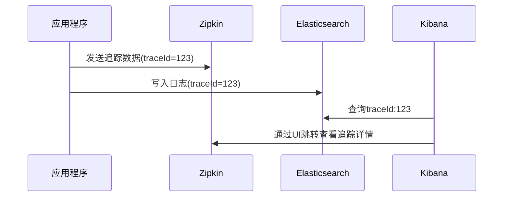
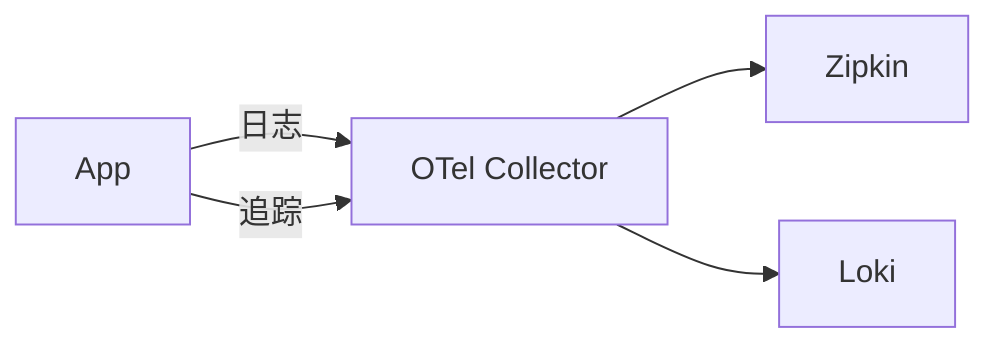

## 介绍

在分布式系统中，Zipkin作为分布式追踪工具可以帮助开发者理解请求在微服务间的流转路径。然而，单纯依赖追踪数据可能不足以全面诊断问题，这时就需要与日志系统集成。通过将Zipkin的追踪ID（Trace ID）注入到应用日志中，开发者可以轻松关联追踪数据和日志条目，实现端到端的故障排查。

:::tip 为什么需要集成？
- **上下文关联**：通过Trace ID将分散的日志串联成完整故事
- **效率提升**：避免在多个系统间手动交叉查询
- **全栈观测**：结合追踪的时间序列数据和日志的详细内容
:::

## 基础集成原理

### 1. Trace ID 注入日志

Zipkin为每个请求分配唯一的Trace ID，我们需要将这个ID注入到应用日志中。主流日志框架都支持MDC（Mapped Diagnostic Context）功能：

```java
// SLF4J + Logback 示例
import org.slf4j.MDC;
import brave.Tracing;

// 在请求处理开始时
Tracing tracing = Tracing.current();
MDC.put("traceId", tracing.tracer().currentSpan().context().traceIdString());

// 日志格式配置示例(logback.xml)
// %X{traceId} 会输出注入的Trace ID
<pattern>%d{yyyy-MM-dd HH:mm:ss} [%thread] %-5level %logger{36} [traceId=%X{traceId}] - %msg%n</pattern>
```

### 2. 日志收集与关联

当日志系统收集到带有Trace ID的日志后，可以通过以下方式建立关联：



## 实际集成方案

### 方案1：直接日志关联

**适用场景**：已有ELK/EFK等日志系统

1. 配置日志格式包含Trace ID
2. 在Kibana/Grafana等工具中：
   - 添加Trace ID字段为可搜索字段
   - 创建从日志到Zipkin的链接（需自定义）

```javascript
// Kibana 控制台脚本示例
input {
  file {
    path => "/var/log/app/*.log"
    codec => json {
      target => "[log]"
    }
  }
}

filter {
  if [log][traceId] {
    mutate {
      add_field => {
        "zipkin_link" => "http://zipkin:9411/traces/%{[log][traceId]}"
      }
    }
  }
}
```

### 方案2：通过OpenTelemetry Collector

**适用场景**：需要统一处理遥测数据



配置示例：
```yaml
# otel-collector-config.yaml
receivers:
  otlp:
    protocols:
      grpc:
      http:

processors:
  batch:

exporters:
  zipkin:
    endpoint: "http://zipkin:9411/api/v2/spans"
  loki:
    endpoint: "http://loki:3100/loki/api/v1/push"

service:
  pipelines:
    traces:
      receivers: [otlp]
      processors: [batch]
      exporters: [zipkin]
    logs:
      receivers: [otlp]
      processors: [batch]
      exporters: [loki]
```

## 真实案例：电商订单问题排查

**场景**：用户投诉订单支付成功但状态未更新

1. 通过Zipkin发现支付服务到订单服务的调用耗时异常（traceId=abc123）
2. 在Kibana中搜索 `traceId:abc123`
3. 发现订单服务的错误日志：
   ```
   2023-05-20 14:30:45 [http-nio-8080-exec-2] ERROR c.e.o.OrderService [traceId=abc123] - 数据库乐观锁更新失败
   ```
4. 确认是并发更新导致的业务逻辑问题

:::caution 注意
确保所有相关服务：
1. 使用相同的Trace ID传播方式（通常通过HTTP头 `X-B3-TraceId`）
2. 日志系统时钟同步（NTP服务）
:::

## 总结与进阶

### 关键收获
- Trace ID是连接追踪系统和日志系统的纽带
- 集成后可以实现：
  - 从追踪跳转到相关日志
  - 从日志反查完整调用链
- 主流方案包括直接集成和通过Collector中转

### 练习建议
1. 在本地启动Zipkin和ELK的Docker容器
2. 修改一个Spring Boot应用的日志配置，注入Trace ID
3. 在Kibana中创建包含Zipkin链接的仪表板

### 扩展阅读
- [Zipkin Brave文档](https://github.com/openzipkin/brave)
- [OpenTelemetry日志规范](https://opentelemetry.io/docs/reference/specification/logs/)
- [ELK+Zipkin集成博客](https://medium.com/distributed-tracing-tales)