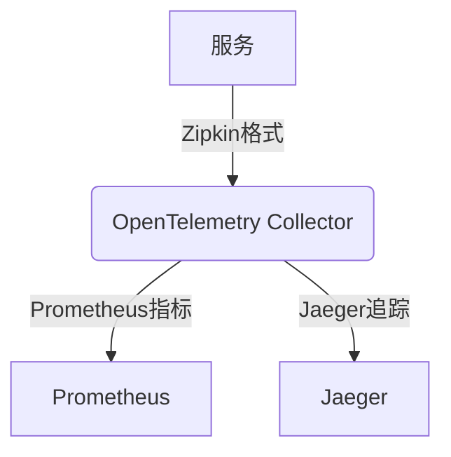

# Zipkin 与指标系统集成

## 介绍

在微服务架构中，**分布式追踪**（Zipkin）和**指标监控**（如Prometheus）是两种核心的可观测性工具。虽然Zipkin擅长记录请求的调用链路，但缺乏对系统整体健康状态的量化指标（如QPS、错误率）。通过将Zipkin与指标系统集成，开发者可以：

- 将追踪数据转化为可计算的指标
- 在单一面板中同时查看链路与指标
- 建立更全面的告警机制

## 基础集成原理

Zipkin通过暴露以下数据供指标系统采集：

1. **Span元数据**：服务名、耗时、状态码等
2. **依赖关系**：服务调用拓扑
3. **直方图数据**：延迟分布统计


## 实战：Zipkin + Prometheus集成

### 步骤1：配置Zipkin暴露指标

默认情况下，Zipkin Server已内置Spring Boot Actuator，只需在`application.properties`中添加：

```properties
# 启用Prometheus指标端点
management.endpoints.web.exposure.include=prometheus,metrics
management.metrics.tags.application=zipkin-server
```

### 步骤2：Prometheus抓取配置

在`prometheus.yml`中添加作业：

```yaml
scrape_configs:
  - job_name: 'zipkin'
    metrics_path: '/actuator/prometheus'
    static_configs:
      - targets: ['zipkin-host:9411']
```

### 示例指标解析

采集到的典型指标示例：

```
# HELP zipkin_collector_spans_total Total spans received
# TYPE zipkin_collector_spans_total counter
zipkin_collector_spans_total{transport="http",} 1842.0

# HELP zipkin_collector_spans_duration_seconds  
# TYPE zipkin_collector_spans_duration_seconds summary
zipkin_collector_spans_duration_seconds_count 1842.0
zipkin_collector_spans_duration_seconds_sum 12.345
```

:::tip 指标类型说明
- `counter`：单调递增的计数器（如请求总数）
- `gauge`：可增减的瞬时值（如内存使用量）
- `histogram`：带有分位数的采样数据
:::

## 高级集成方案

### 方案1：OpenTelemetry Collector

使用OTel作为中间层统一处理数据：



配置示例：

```yaml
# otel-collector-config.yaml
receivers:
  zipkin:
    endpoint: "0.0.0.0:9411"

exporters:
  prometheus:
    endpoint: "0.0.0.0:8889"

service:
  pipelines:
    metrics:
      receivers: [zipkin]
      exporters: [prometheus]
```

### 方案2：自定义指标导出

通过Zipkin的`SpanHandler`接口实现自定义指标收集：

```java
@Bean
SpanHandler prometheusMetrics() {
  return new SpanHandler() {
    private final Counter spanCounter = Counter.build()
      .name("custom_spans_total")
      .help("Total processed spans")
      .register();

    @Override
    public boolean end(TraceContext traceContext, MutableSpan span, SpanConsumer handler) {
      spanCounter.inc();
      return true;
    }
  };
}
```

## 实际应用场景

**电商系统监控案例**：

1. **异常检测**：当`zipkin_spans_errors_total`突增时触发告警
2. **性能优化**：通过`zipkin_spans_duration_seconds_bucket`识别慢调用
3. **容量规划**：根据`zipkin_spans_total`预测服务负载

:::note 最佳实践
- 为关键服务添加特定标签：`service=payment-gateway`
- 设置合理的指标采样率（高频服务可采样10%-20%）
- 结合Grafana的`$service`变量实现动态过滤
:::

## 总结与扩展

通过集成Zipkin与指标系统，您可以：

✓ 实现追踪数据与系统指标的关联分析  
✓ 构建更完整的可观测性体系  
✓ 利用现有监控基础设施  

**推荐练习**：
1. 在本地使用Docker Compose搭建Zipkin+Prometheus+Grafana环境
2. 创建包含P99延迟和错误率的仪表盘
3. 尝试通过指标自动发现拓扑图中的异常节点

**延伸阅读**：
- [Zipkin Metrics Exporters 官方文档](https://zipkin.io/pages/existing_instrumentation.html)
- [Prometheus 指标类型详解](https://prometheus.io/docs/concepts/metric_types/)
- [OpenTelemetry Collector 架构](https://opentelemetry.io/docs/collector/)