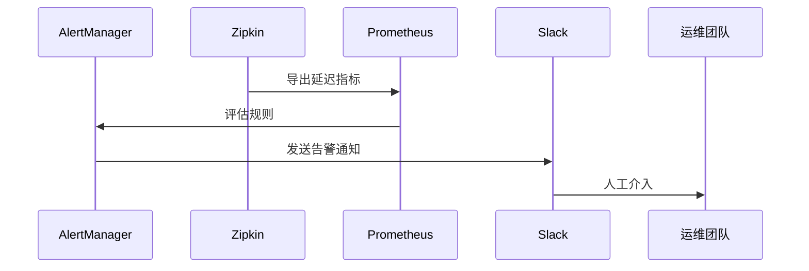

# 告警系统集成

## 介绍

在分布式系统中，Zipkin作为链路追踪工具，可以帮助开发者可视化请求的调用链。但仅靠可视化并不足以快速响应潜在问题。告警系统集成允许您基于Zipkin收集的追踪数据（如延迟、错误率等）设置阈值规则，并在异常发生时通过邮件、Slack或PagerDuty等渠道通知团队。这种集成是构建完整可观测性体系的关键环节。

:::note
告警系统通常与指标监控工具（如Prometheus）配合使用，但Zipkin的追踪数据也能提供独特的上下文信息（如特定服务的调用路径异常）。
:::

---

## 核心概念

### 1. 告警触发条件
Zipkin的告警通常基于以下数据类型：
- **延迟阈值**：当某服务的P99延迟超过设定值（如500ms）时触发。
- **错误率**：当HTTP 5xx错误比例超过设定百分比（如1%）时触发。
- **调用量突降/突增**：检测服务流量的异常波动。

### 2. 集成方式
Zipkin本身不内置告警功能，但可以通过以下方式实现集成：
- **导出数据到Prometheus**：将Span数据转换为指标，再利用Alertmanager告警。
- **自定义脚本轮询Zipkin API**：定期查询并分析数据。
- **商业工具集成**：如Datadog、New Relic等支持直接消费Zipkin数据。

---

## 实战示例

### 示例1：通过Prometheus实现基础告警

#### 步骤1：将Zipkin数据导出为Prometheus指标
使用`zipkin-to-prometheus`工具转换数据：
```bash
docker run -p 9412:9412 openzipkin/zipkin-prometheus-exporter
```

#### 步骤2：配置Prometheus抓取
在`prometheus.yml`中添加：
```yaml
scrape_configs:
  - job_name: 'zipkin'
    static_configs:
      - targets: ['zipkin-prometheus-exporter:9412']
```

#### 步骤3：设置告警规则
在Prometheus的告警规则文件（如`alerts.rules`）中定义：
```yaml
groups:
- name: zipkin-alerts
  rules:
  - alert: HighLatency
    expr: zipkin_latency_percentile{percentile="99"} > 500
    for: 5m
    labels:
      severity: critical
    annotations:
      summary: "High latency detected in {{ $labels.serviceName }}"
```

### 示例2：自定义Python告警脚本
以下脚本每10分钟检查错误率：
```python
import requests
from datetime import datetime, timedelta

ZIPKIN_API = "http://localhost:9411"
THRESHOLD = 0.01  # 1%错误率

def check_error_rate():
    end_time = datetime.now()
    start_time = end_time - timedelta(minutes=10)
    params = {
        "serviceName": "payment-service",
        "startTs": int(start_time.timestamp() * 1000),
        "endTs": int(end_time.timestamp() * 1000)
    }
    response = requests.get(f"{ZIPKIN_API}/api/v2/traces", params=params)
    traces = response.json()
    
    total = len(traces)
    errors = sum(1 for trace in traces if any(span.get("tags", {}).get("error") for span in trace)
    
    if total > 0 and (errors / total) > THRESHOLD:
        send_alert(f"High error rate: {errors/total:.2%}")

if __name__ == "__main__":
    check_error_rate()
```

---

## 实际应用场景

### 电商平台案例
某电商在"双11"期间发现支付服务延迟飙升：
1. Zipkin显示`payment-service`的P99延迟从200ms升至1200ms。
2. Prometheus触发告警，通知运维团队。
3. 团队通过Zipkin的调用链发现是Redis连接池耗尽导致。
4. 扩容Redis后，延迟恢复正常。



---

## 总结与扩展

### 关键点回顾
- Zipkin需借助外部系统（如Prometheus）实现告警。
- 常见的告警触发条件包括延迟、错误率和流量异常。
- 商业APM工具通常提供开箱即用的集成方案。

### 延伸练习
1. 使用Docker Compose部署Zipkin + Prometheus + Alertmanager的完整栈。
2. 为您的服务编写一个自定义告警规则，检测`http.path=/api/orders`的延迟。
3. 尝试将告警通知发送到您常用的协作工具（如企业微信或钉钉）。

### 附加资源
- [Zipkin官方文档](https://zipkin.io/)
- [Prometheus告警配置指南](https://prometheus.io/docs/alerting/latest/configuration/)
- 《分布式系统观测性实践》第5章（机械工业出版社）