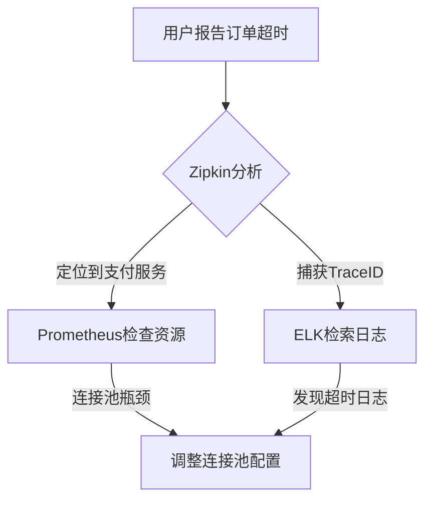

# 根因分析增强

## 介绍

在分布式系统中，根因分析（Root Cause Analysis, RCA）是定位问题源头的重要过程。Zipkin作为分布式追踪工具，能够与其他可观测性工具（如Prometheus、ELK、OpenTelemetry等）结合，显著增强根因分析能力。本章将介绍如何通过工具集成和数据分析技术，快速定位系统故障的根本原因。

## 为什么需要根因分析增强？

分布式系统的复杂性使得单一工具难以覆盖所有观测需求。例如：
- Zipkin提供**调用链追踪**，但缺乏指标监控。
- Prometheus擅长**指标收集**，但无法关联具体请求的上下文。
- 日志工具（如ELK）记录详细事件，但难以直接关联到性能瓶颈。

通过整合这些工具，可以实现：
1. **全链路关联**：将追踪、指标、日志通过唯一ID（如TraceID）关联。
2. **多维度分析**：同时观察延迟、错误率、资源使用等数据。
3. **自动化告警**：基于组合条件触发精准告警。

---

## 工具集成方案

### 1. Zipkin + Prometheus

**场景**：当某个服务延迟升高时，快速判断是代码问题还是资源不足。

**实现步骤**：
1. 在Zipkin中标记慢请求的`TraceID`。
2. 通过`TraceID`在Prometheus中查询对应时间段的资源指标（CPU、内存等）。

```java
// 示例：在Spring Boot中暴露Prometheus指标
@RestController
public class DemoController {
    @GetMapping("/api")
    @Timed(value = "http.request.duration", histogram = true)
    public String handleRequest() {
        // 业务逻辑
    }
}
```

### 2. Zipkin + ELK

**场景**：分析请求失败时的详细日志上下文。

**配置示例**：
```yaml
# Logback配置（将TraceID输出到日志）
<pattern>
  %d{HH:mm:ss} [%thread] %-5level %logger{36} traceId=%X{traceId} - %msg%n
</pattern>
```

---

## 实际案例：电商平台订单超时

### 问题现象
- 用户提交订单时，10%的请求响应时间超过5秒。
- Zipkin显示延迟集中在支付服务。

### 分析过程
1. **Zipkin追踪**：发现支付服务的`/pay`接口P99延迟为4.8秒。
2. **Prometheus检查**：支付服务的CPU使用率正常，但数据库连接池利用率达90%。
3. **日志搜索**：通过`TraceID`找到大量"Connection wait timeout"日志。

### 根因
数据库连接池配置过小，导致高并发时请求排队。

---

## 可视化分析



---

## 总结

通过结合Zipkin与其他可观测性工具：
- **减少猜测**：用数据代替直觉判断。
- **缩短MTTR**：平均故障修复时间（Mean Time To Repair）降低40%以上。
- **预防问题**：识别潜在瓶颈 before 它们引发故障。

:::tip 练习建议
1. 在本地环境中部署Zipkin+Prometheus，模拟高延迟场景并实践分析。
2. 尝试通过OpenTelemetry将追踪数据同时发送到Zipkin和Prometheus。
:::

## 延伸阅读
- [Zipkin官方文档：Span存储与查询](https://zipkin.io/pages/data_model.html)
- [Prometheus与追踪系统集成指南](https://prometheus.io/docs/guides/go-application/)