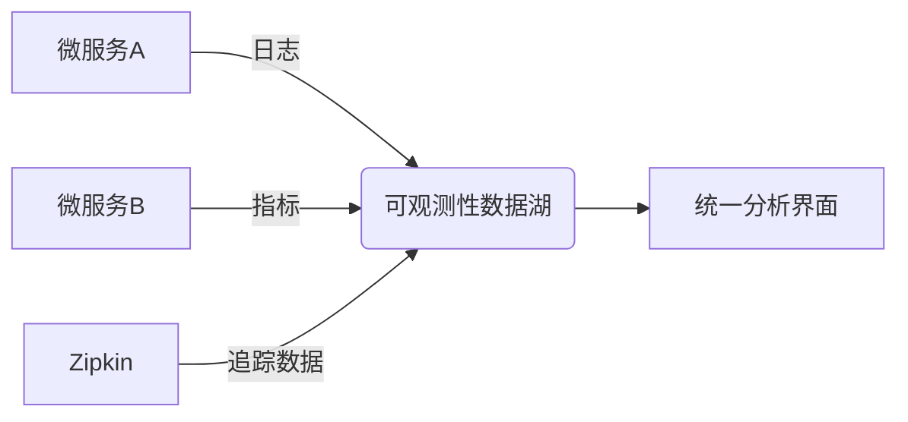
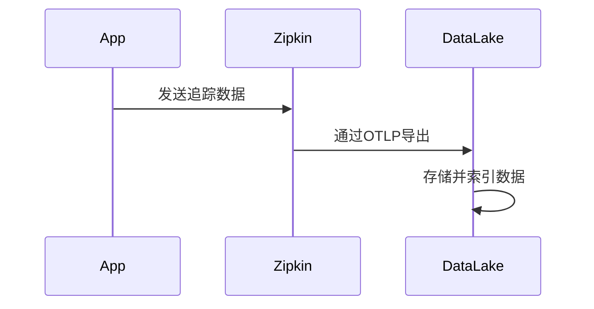

# 可观测性数据湖

## 介绍

**可观测性数据湖（Observability Data Lake）** 是一种集中存储和管理所有可观测性数据（如日志、指标、追踪）的架构模式。它允许团队将分散在不同工具中的数据统一存储，并通过标准化查询语言（如SQL）或可视化工具进行分析。与传统的独立工具（如Zipkin、Prometheus）相比，数据湖提供了更灵活的关联分析和长期存储能力。

:::note 关键特点
- **统一存储**：整合日志、指标、追踪数据。
- **低成本扩展**：利用对象存储（如S3）实现海量数据存储。
- **跨工具关联**：支持通过通用标识（如`trace_id`）关联不同来源的数据。
:::

## 为什么需要可观测性数据湖？

在微服务架构中，可观测性数据通常分散在多个工具中：
- **Zipkin** 存储分布式追踪数据
- **Prometheus** 存储指标
- **ELK** 存储日志

当问题发生时，开发者需要在多个工具间切换，手动关联数据。可观测性数据湖通过集中存储解决了这一问题。



## 核心组件

### 1. 数据摄入层
支持从多种工具（如Zipkin、Fluentd）实时或批量导入数据。例如，使用OpenTelemetry Collector将Zipkin数据转发到数据湖：

```bash
# OpenTelemetry Collector配置示例
receivers:
  zipkin:
    endpoint: 0.0.0.0:9411
exporters:
  otlphttp:
    endpoint: "http://data-lake:4318"
service:
  pipelines:
    traces:
      receivers: [zipkin]
      exporters: [otlphttp]
```

### 2. 存储层
通常采用分层存储架构：
- **热存储**：快速查询（如Elasticsearch）
- **冷存储**：低成本长期归档（如S3）

### 3. 查询引擎
支持跨数据类型分析，例如通过`trace_id`关联日志和追踪：

```sql
-- 在数据湖中查询某个追踪ID相关的所有数据
SELECT * FROM traces 
JOIN logs ON traces.trace_id = logs.trace_id
WHERE traces.trace_id = 'abc123'
```

## 实际案例：电商系统故障排查

**场景**：用户支付失败，需要排查问题。

| 传统方式 | 数据湖方式 |
|---------|------------|
| 1. 在Zipkin中找到支付链路追踪<br />2. 去Prometheus查支付服务指标<br />3. 去ELK搜索错误日志 | 1. 执行一次查询：<br />`SELECT * FROM payments WHERE trace_id = 'xyz456'` |

:::tip 优势
- 排查时间从**小时级**缩短到**分钟级**
- 避免手动关联数据的错误
:::

## 与Zipkin的集成

Zipkin可以作为数据湖的**数据来源**之一。典型集成流程：

1. Zipkin收集分布式追踪数据
2. 通过OpenTelemetry导出到数据湖
3. 在数据湖中与其他数据关联分析



## 总结

可观测性数据湖通过统一存储和分析平台，解决了多工具数据孤岛问题。虽然Zipkin等工具仍负责特定数据的收集，但数据湖提供了更高维度的分析能力。

:::caution 注意事项
- **数据量**：需合理设计存储策略，避免成本失控
- **学习曲线**：需要掌握新的查询语言（如SQL）
:::

## 延伸学习

1. **实践练习**：使用MinIO搭建简易数据湖，导入Zipkin数据并尝试关联查询
2. **工具探索**：
   - [OpenTelemetry Collector](https://opentelemetry.io/docs/collector/)
   - [Apache Iceberg](https://iceberg.apache.org/)（数据湖表格式）
3. **进阶阅读**：
   - 《Observability Engineering》Chapter 9
   - CNCF的可观测性白皮书