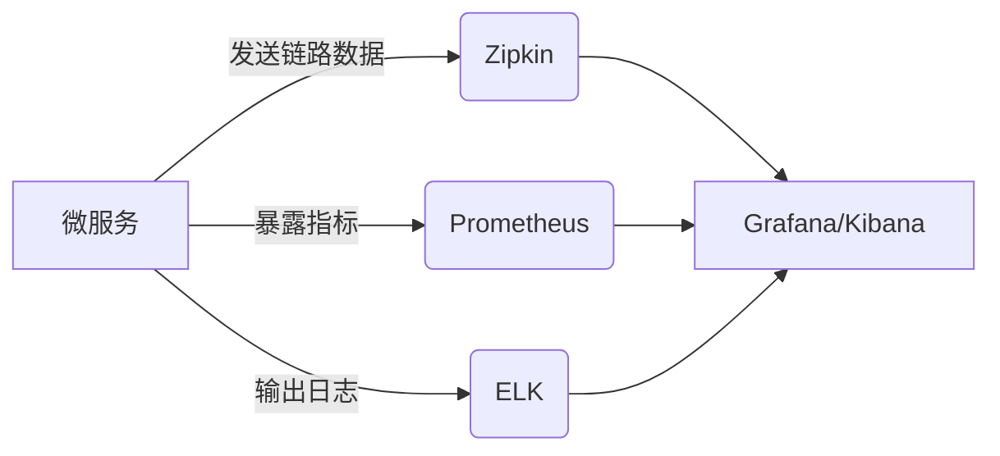

# 混合监控策略

## 引言

在现代分布式系统中，单一的监控工具往往难以满足所有可观测性需求。**混合监控策略**通过整合多种工具（如Zipkin、Prometheus、ELK等），实现链路追踪（Tracing）、指标监控（Metrics）和日志分析（Logging）的协同工作。这种策略能够提供更全面的系统洞察力，帮助开发者快速定位问题。

:::tip 关键概念
- **Zipkin**：专注于分布式链路追踪，可视化请求在微服务间的流转路径。
- **Prometheus**：擅长指标收集和告警，提供时间序列数据存储。
- **ELK Stack**（Elasticsearch、Logstash、Kibana）：用于日志的集中存储、分析和可视化。
:::

---

## 为什么需要混合监控？

1. **单一工具的局限性**  
   - Zipkin能追踪请求链路，但无法监控CPU/内存等资源指标。
   - Prometheus能收集指标，但缺乏请求级别的上下文。
   - ELK能分析日志，但难以关联到具体请求的链路。

2. **互补优势**  
   通过组合工具，可以实现：
   - 链路追踪 + 指标 = 定位性能瓶颈（如慢请求的CPU使用率）。
   - 链路追踪 + 日志 = 关联错误日志与具体请求。

---

## 实现混合监控的步骤

### 步骤1：集成Zipkin与Prometheus
使用OpenTelemetry等工具将Zipkin的追踪数据与Prometheus指标关联。

**示例：在Spring Boot中配置OpenTelemetry**
```java
// 添加依赖（build.gradle）
implementation 'io.opentelemetry:opentelemetry-api:1.30.0'
implementation 'io.opentelemetry:opentelemetry-exporter-zipkin:1.30.0'
implementation 'io.opentelemetry:opentelemetry-exporter-prometheus:1.30.0'

// 初始化OpenTelemetry
OpenTelemetrySdk openTelemetry = OpenTelemetrySdk.builder()
    .setTracerProvider(...)
    .setMeterProvider(...)
    .build();
```

### 步骤2：关联追踪与日志
在日志中注入Zipkin的Trace ID，便于后续在Kibana中筛选。

**示例：Logback日志配置**
```xml
<encoder class="ch.qos.logback.core.encoder.LayoutWrappingEncoder">
    <layout class="ch.qos.logback.contrib.json.classic.JsonLayout">
        <jsonFormatter class="ch.qos.logback.contrib.jackson.JacksonJsonFormatter"/>
        <appendLineSeparator>true</appendLineSeparator>
        <timestampFormat>yyyy-MM-dd'T'HH:mm:ss.SSSXXX</timestampFormat>
        <appendLineSeparator>true</appendLineSeparator>
        <includeContextName>false</includeContextName>
        <includeTraceId>true</includeTraceId> <!-- 注入Trace ID -->
    </layout>
</encoder>
```

### 步骤3：数据可视化
通过Grafana或Kibana创建仪表盘，整合Zipkin、Prometheus和ELK的数据。



---

## 实际案例：电商系统故障排查

**场景**：用户下单时出现500错误，但错误原因不明。

1. **通过Zipkin**发现请求在`支付服务`超时。
2. **通过Prometheus**发现`支付服务`的CPU使用率在超时时段达到100%。
3. **通过ELK**搜索相关Trace ID的日志，发现数据库连接池耗尽的错误。

**结论**：数据库连接池配置不足导致支付服务崩溃。

---

## 总结

混合监控策略通过结合Zipkin（Tracing）、Prometheus（Metrics）和ELK（Logging），提供了更强大的可观测性能力。关键步骤包括：
1. 工具集成（如OpenTelemetry）。
2. 数据关联（如日志注入Trace ID）。
3. 统一可视化（如Grafana仪表盘）。

:::note 练习建议
1. 在本地启动一个Spring Boot服务，集成Zipkin和Prometheus。
2. 尝试在日志中输出Trace ID，并在Kibana中过滤特定请求的日志。
:::

**进一步学习**：
- [OpenTelemetry官方文档](https://opentelemetry.io/)
- [Zipkin与Prometheus集成指南](https://zipkin.io/pages/integrations.html)