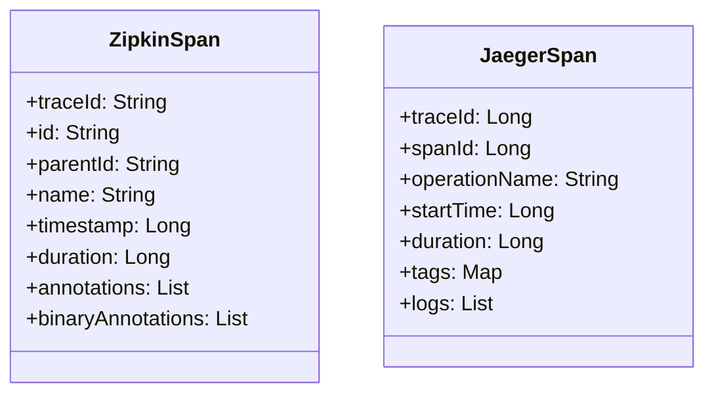

# Jaeger比较与互操作

## 介绍

在分布式系统的可观测性领域，[Zipkin](https://zipkin.io/)和[Jaeger](https://www.jaegertracing.io/)是两个最流行的分布式追踪工具。它们都基于Google的Dapper论文设计，但实现方式和功能特性存在差异。本节将深入比较两者，并演示如何在实际场景中实现互操作。

:::note 关键概念
**分布式追踪**：记录请求在微服务架构中的完整调用路径，帮助定位延迟和故障。
:::

## 核心架构对比

### 数据模型差异


### 组件对比表
| 特性               | Zipkin                      | Jaeger                     |
|--------------------|----------------------------|---------------------------|
| 存储后端           | ES, Cassandra, MySQL       | ES, Cassandra, Kafka      |
| 采样策略           | 客户端配置                 | 动态服务器端采样          |
| UI功能             | 基础时间线                 | 依赖分析图                |
| 协议支持           | HTTP/JSON, Thrift          | gRPC, HTTP/JSON           |
| 原生语言支持       | Java, Go, Python           | Java, Go, Node.js         |

## 互操作实现

### 通过OpenTelemetry桥接
两者可以通过[OpenTelemetry](https://opentelemetry.io/)实现数据互通：

```java
// 示例：使用OpenTelemetry导出到Zipkin和Jaeger
OpenTelemetrySdk sdk = OpenTelemetrySdk.builder()
    .addSpanProcessor(
        BatchSpanProcessor.builder(
            ZipkinSpanExporter.builder().setEndpoint("http://zipkin:9411/api/v2/spans").build()
        ).build())
    .addSpanProcessor(
        BatchSpanProcessor.builder(
            JaegerGrpcSpanExporter.builder().setEndpoint("jaeger:14250").build()
        ).build())
    .build();
```

### 数据格式转换
使用通用格式（如JSON）进行转换：

```python
# Zipkin 到Jaeger的格式转换示例
def convert_zipkin_to_jaeger(zipkin_span):
    return {
        "traceID": zipkin_span["traceId"],
        "spanID": zipkin_span["id"],
        "operationName": zipkin_span["name"],
        "startTime": zipkin_span["timestamp"],
        "duration": zipkin_span["duration"],
        "tags": {ann["key"]: ann["value"] for ann in zipkin_span["binaryAnnotations"]}
    }
```

## 实际应用场景

### 混合部署案例
某电商平台同时使用Zipkin（历史系统）和Jaeger（新服务）：
1. 通过OpenTelemetry Collector统一接收数据
2. 使用转换器将旧Zipkin数据转为Jaeger格式
3. 在Jaeger UI中查看全链路追踪

:::tip 迁移建议
- 新项目直接采用Jaeger
- 已有Zipkin系统逐步迁移
- 关键业务系统保持双写入
:::

## 总结

**选择建议**：
- 需要简单轻量级方案 → Zipkin
- 需要高级分析和动态采样 → Jaeger
- 混合环境 → 通过OpenTelemetry桥接

**附加资源**：
1. [Jaeger官方文档](https://www.jaegertracing.io/docs/)
2. [Zipkin与Jaeger基准测试](https://github.com/open-telemetry/opentelemetry-java-benchmarks)
3. [OpenTelemetry转换器示例](https://github.com/open-telemetry/opentelemetry-collector-contrib/tree/main/exporter/zipkinexporter)

**练习**：
1. 使用Docker同时部署Zipkin和Jaeger
2. 编写一个Python服务同时向两者发送追踪数据
3. 比较两者UI展示的差异