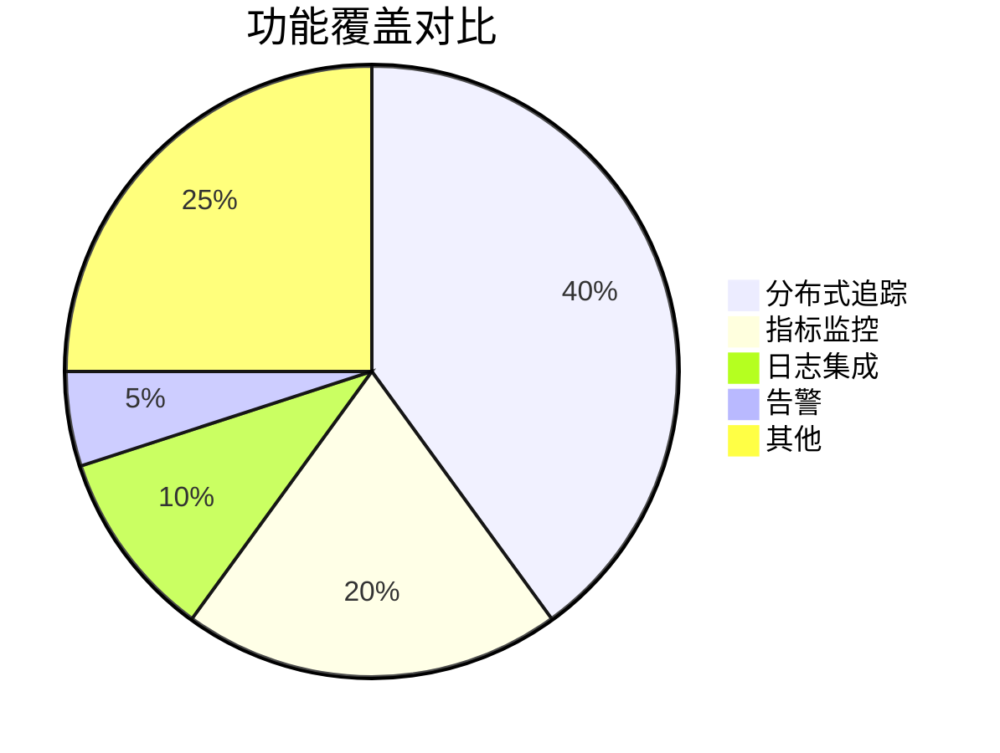

## 介绍

在分布式系统的可观测性领域，Zipkin和Skywalking都是流行的开源工具，但它们的架构、数据模型和功能侧重点有所不同。本章将对比两者的核心特性，并通过实际案例展示如何实现互操作。

:::note 关键概念
- **Zipkin**：专注于分布式追踪，轻量级，适合基础链路分析。
- **Skywalking**：提供全栈可观测性（追踪、指标、日志），支持服务拓扑和性能告警。
:::

---

## 核心差异对比

### 1. 数据模型
| 特性               | Zipkin                          | Skywalking                      |
|--------------------|---------------------------------|---------------------------------|
| **追踪粒度**       | 基于Span的简单树状结构          | 支持跨进程、跨服务的拓扑分析    |
| **附加数据**       | 标签（Tags）和注解（Annotations）| 丰富的指标（如JVM、HTTP吞吐量） |
| **存储后端**       | ES、MySQL等                     | ES、H2、TiDB等                 |

### 2. 功能范围


Zipkin更专注于追踪，而Skywalking提供更全面的APM能力。

---

## 互操作方案

### 1. 数据格式转换
两者均支持OpenTelemetry格式，可通过以下方式桥接：
```java
// 示例：将Zipkin Span转换为Skywalking格式
OpenTelemetry otel = OpenTelemetrySdk.builder().build();
ZipkinSpanExporter zipkinExporter = ZipkinSpanExporter.builder()
    .setEndpoint("http://zipkin:9411/api/v2/spans")
    .build();
SkywalkingAgent.startAsync("skywalking-oap:11800");
```

### 2. 混合部署场景
**案例**：在Kubernetes中同时部署Zipkin和Skywalking Collector，通过Sidecar模式转发数据：
```yaml
# k8s配置片段
containers:
- name: zipkin-sidecar
  image: openzipkin/zipkin
  ports:
    - containerPort: 9411
- name: skywalking-oap
  image: apache/skywalking-oap-server
  env:
    - name: SW_STORAGE
      value: elasticsearch
```

---

## 实际应用场景

### 场景：电商系统监控
1. **使用Zipkin**追踪订单服务的调用链路。
2. **通过Skywalking**监控支付服务的JVM指标和数据库慢查询。
3. **关联分析**：当Zipkin发现延迟高的Span时，通过TraceID在Skywalking中查询关联指标。

:::tip 最佳实践
- 对简单微服务，Zipkin足够轻量。
- 需要全栈监控时，优先选择Skywalking，并通过OTel协议兼容Zipkin数据。
:::

---

## 总结与资源

### 总结
- **选择依据**：根据团队规模（Zipkin更易维护）和监控需求（Skywalking功能更全）决定。
- **互操作关键**：利用OpenTelemetry或共享存储（如ES）实现数据关联。

### 延伸资源
1. [Skywalking官方文档](https://skywalking.apache.org/docs/)
2. [Zipkin与OpenTelemetry集成指南](https://zipkin.io/pages/instrumenting.html)
3. 练习：在本地Docker环境部署两者，并尝试通过TraceID关联数据。