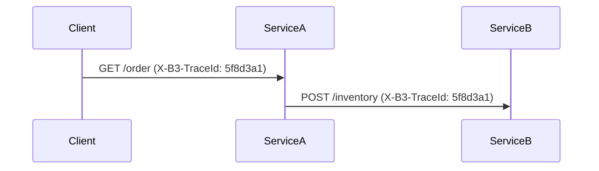

# 分布式日志关联

## 介绍

在分布式系统中，一个用户请求可能涉及多个微服务。当出现问题时，如何快速定位跨服务的日志？**分布式日志关联**（Distributed Log Correlation）通过唯一的跟踪标识（如Trace ID）将不同服务的日志串联起来，帮助开发者还原请求的完整路径。

:::tip 核心概念
- **Trace ID**：贯穿整个请求链的唯一标识。
- **Span ID**：单个服务内部操作的子标识。
- **上下文传播**：在服务间传递Trace ID的机制（如HTTP头）。
:::

## 为什么需要日志关联？

假设一个电商订单请求涉及以下服务：
1. 用户服务 → 2. 商品服务 → 3. 支付服务

如果没有日志关联，你需要手动拼接三个服务的日志。而通过Trace ID，你可以像这样快速过滤日志：
```bash
# 在所有服务日志中搜索同一个Trace ID
grep "traceId=5f8d3a1" user-service.log product-service.log payment-service.log
```

## 在Zipkin中实现日志关联

### 1. 注入Trace ID到日志
以下是一个Java Spring Boot示例，使用SLF4J的MDC（Mapped Diagnostic Context）：

```java
import brave.Tracer;
import org.slf4j.MDC;

// 在控制器中记录日志
@GetMapping("/order")
public String createOrder() {
    // 获取当前Trace ID
    String traceId = tracer.currentSpan().context().traceIdString();
    MDC.put("traceId", traceId);
    
    logger.info("订单创建请求开始"); // 日志自动包含Trace ID
    // 业务逻辑...
    return "Order Created";
}
```

日志输出示例：
```
2023-05-20 14:00:00 [user-service] INFO traceId=5f8d3a1 - 订单创建请求开始
```

### 2. 跨服务传递上下文
通过HTTP头传递Trace ID：



## 实际案例：错误诊断

**场景**：用户支付失败，需要排查哪个服务出现问题。

1. 在Zipkin UI中搜索失败的Trace ID `5f8d3a1`
2. 发现调用链中断在支付服务
3. 用该Trace ID过滤支付服务日志：
```bash
cat payment-service.log | grep "5f8d3a1" | grep ERROR
```
4. 发现错误日志：
```
ERROR [payment-service,,5f8d3a1] 信用卡校验失败：余额不足
```

## 与其他工具的集成

:::note 常见组合
- **Zipkin + ELK**：用Trace ID关联Zipkin追踪和Elasticsearch日志
- **Zipkin + Prometheus**：结合指标数据定位性能瓶颈
- **Zipkin + OpenTelemetry**：统一标准的上下文传播
:::

## 总结

分布式日志关联通过以下关键步骤解决问题：
1. **生成唯一Trace ID**：在请求入口处（如网关）
2. **上下文传播**：通过HTTP头/RPC上下文传递
3. **日志记录**：将Trace ID注入到所有日志中
4. **可视化分析**：通过Zipkin等工具还原完整请求流

## 扩展练习

1. 在本地Spring Boot项目中集成Sleuth和Zipkin，观察自动生成的Trace ID
2. 尝试用`curl`命令手动传递`X-B3-TraceId`头，模拟上下文传播
3. 配置Logback模式，在日志中自动打印Trace ID：
```xml
<pattern>%d{ISO8601} [%thread] %-5level [%service,%X{traceId}] - %msg%n</pattern>
```

## 附加资源

- [Zipkin官方文档 - 上下文传播](https://zipkin.io/pages/instrumenting.html)
- [Spring Cloud Sleuth日志集成指南](https://docs.spring.io/spring-cloud-sleuth/docs/current/reference/html/howto.html#how-to-add-log-correlation)