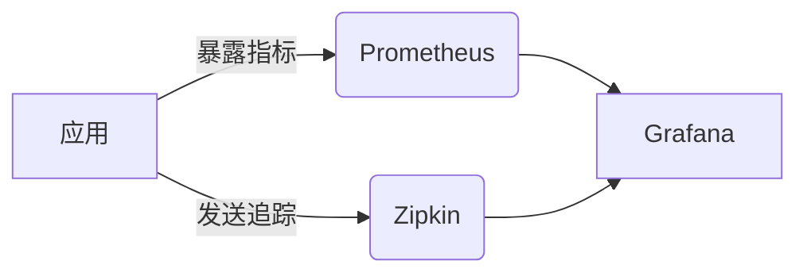
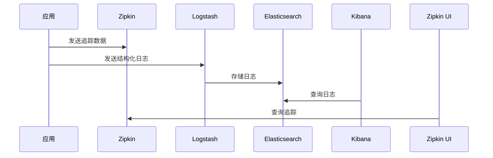
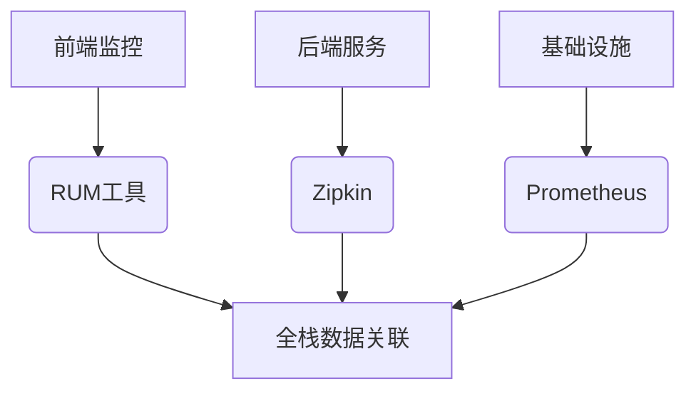

# 全栈监控解决方案

## 介绍

全栈监控（Full-Stack Observability）是现代分布式系统开发中的重要实践。它通过整合多种工具和技术，提供从用户界面到后端服务的完整可见性。Zipkin作为分布式追踪系统的代表，常与指标监控、日志聚合等工具配合使用，形成完整的可观测性解决方案。

:::tip 关键概念
全栈监控包含三大支柱：
1. **追踪（Tracing）** - 如Zipkin，展示请求在系统中的流转路径
2. **指标（Metrics）** - 如Prometheus，收集系统性能数据
3. **日志（Logging）** - 如ELK，存储和分析文本日志
:::

## Zipkin 与其他工具的集成

### 1. Zipkin + Prometheus（指标监控）



示例配置（Spring Boot应用）：
```java
// build.gradle
dependencies {
    implementation 'io.micrometer:micrometer-registry-prometheus'
    implementation 'org.springframework.cloud:spring-cloud-starter-zipkin'
}

// application.properties
management.endpoints.web.exposure.include=health,info,prometheus
spring.zipkin.base-url=http://localhost:9411
```

### 2. Zipkin + ELK（日志分析）



日志关联示例（使用Trace ID）：
```json
// 应用日志
{
  "timestamp": "2023-08-20T12:00:00Z",
  "level": "INFO",
  "message": "Processing request",
  "traceId": "a1b2c3d4e5f67890"
}
```

## 实际应用场景

### 电商平台故障排查

1. **现象**：用户支付超时
2. **排查步骤**：
   - 在Zipkin中搜索支付相关Trace
   - 发现某个微服务调用耗时异常
   - 通过Trace ID在Kibana中查找相关日志
   - 结合Prometheus指标确认该时段资源使用情况
   - 最终定位到数据库连接池耗尽问题

:::note 工具协作流程
1. 前端错误 → Sentry
2. API延迟 → Zipkin
3. 服务指标 → Prometheus
4. 系统日志 → ELK
:::

## 总结与最佳实践

**全栈监控的核心价值**：
- 端到端可见性
- 上下文关联（通过Trace ID）
- 快速故障定位

**推荐实践**：
1. 统一所有组件的Trace ID传递
2. 设置合理的采样率（生产环境建议10-20%）
3. 建立清晰的标签（tags）规范

## 扩展学习

1. **OpenTelemetry**：新一代可观测性标准，可替代Zipkin客户端
2. **服务网格集成**：如Istio，提供基础设施层的监控
3. **合成监控**：模拟用户行为进行主动测试



## 练习建议

1. 部署一个包含Zipkin+Prometheus+Grafana的本地环境
2. 尝试通过Trace ID在多个系统间跳转查询
3. 模拟一个跨服务错误，练习全链路排查

通过整合这些工具，您将获得远超单个工具的洞察力，真正实现"全栈可观测性"。