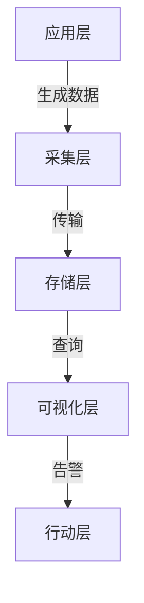
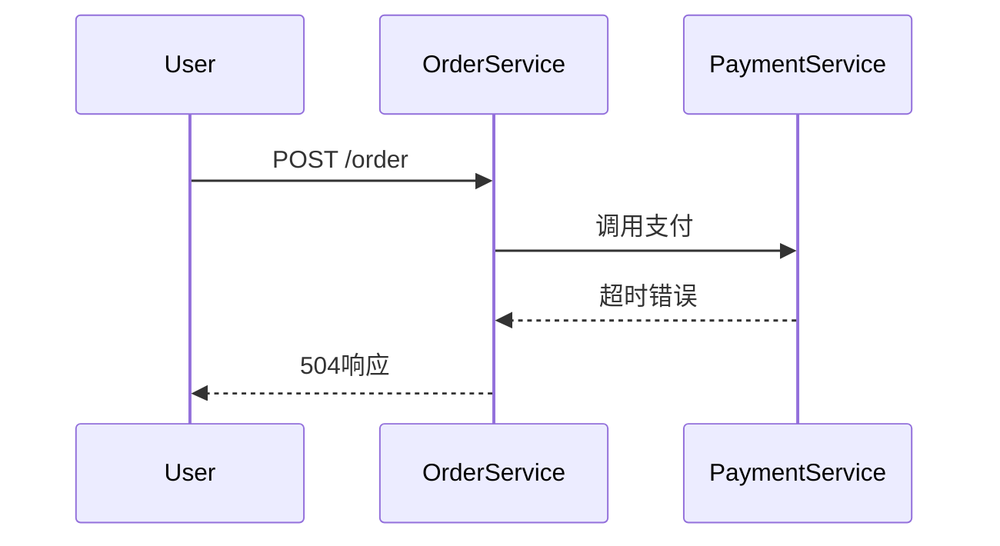

# 可观测性平台构建

## 介绍

可观测性（Observability）是现代分布式系统运维的核心能力，它通过**指标（Metrics）、日志（Logs）和追踪（Traces）**三大支柱，帮助开发者理解系统内部状态。本节将介绍如何以Zipkin为基础，整合其他工具（如Prometheus、ELK等）构建完整的可观测性平台。

:::tip 关键概念
- **Metrics**: 数值型监控数据（如CPU使用率）
- **Logs**: 系统事件的文本记录
- **Traces**: 请求在分布式系统中的调用链
:::

---

## 核心组件与架构

典型的可观测性平台包含以下层级：



### 1. 数据采集
- **Zipkin**: 分布式追踪数据
- **Prometheus**: 指标采集
- **Fluentd/Filebeat**: 日志收集

### 2. 存储方案
- **追踪**: Zipkin后端（支持Elasticsearch/Cassandra）
- **指标**: Prometheus + Thanos（长期存储）
- **日志**: Elasticsearch

---

## 集成示例：Zipkin + Prometheus

### 场景描述
同时监控服务延迟（Zipkin）和资源使用率（Prometheus）。

#### 步骤1：配置应用暴露指标
```java
// Spring Boot示例：启用Prometheus指标
@Bean
MeterRegistryCustomizer<MeterRegistry> metricsCommonTags() {
    return registry -> registry.config().commonTags("application", "my-service");
}
```

#### 步骤2：关联追踪与指标
通过`trace_id`在两种数据间建立联系：
```python
# Python Flask示例
from prometheus_client import Counter
requests_counter = Counter('http_requests', 'Track requests', ['trace_id'])
```

---

## 真实案例：电商平台监控

### 问题场景
用户投诉"下单接口变慢"，但无法定位是数据库、支付服务还是网络问题。

### 解决方案
1. **Zipkin**：分析请求在微服务间的流转耗时
2. **Prometheus**：检查下单时段的数据库CPU指标
3. **ELK**：搜索错误日志关键字`payment_timeout`



---

## 总结与进阶

### 关键收获
- 可观测性需要**多工具协同**
- Zipkin专注于追踪，需配合其他工具补全指标和日志能力
- 通过`trace_id`实现跨工具关联分析

### 推荐练习
1. 使用Docker Compose部署Zipkin+Prometheus+Grafana
2. 在示例应用中故意注入延迟，练习跨工具排查

### 延伸阅读
- [OpenTelemetry](https://opentelemetry.io/)：统一可观测性标准
- 《Distributed Systems Observability》- Cindy Sridharan