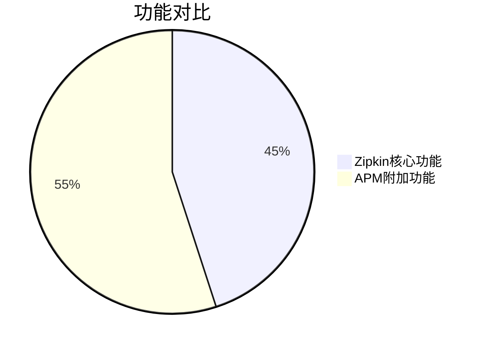
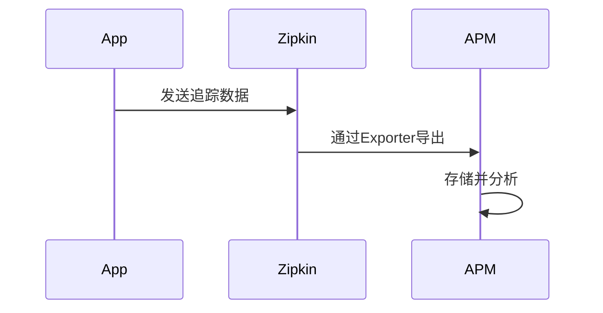
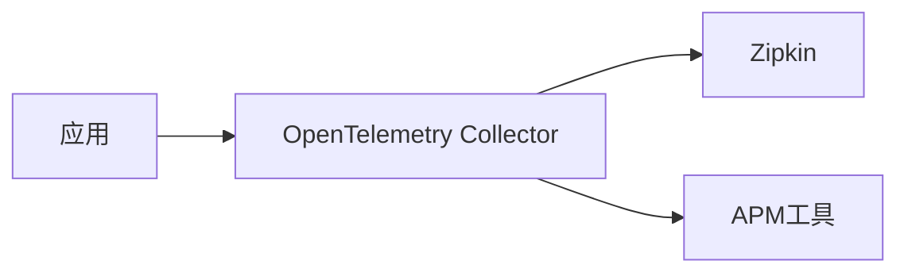

# APM工具集成

## 介绍

APM（Application Performance Monitoring，应用性能监控）工具是分布式系统可观测性的核心组件之一。它们帮助开发者监控应用性能、诊断问题并优化系统行为。Zipkin作为分布式追踪系统，可以与主流APM工具（如New Relic、Datadog、Elastic APM等）集成，实现更全面的监控能力。

本节将介绍：
1. 为什么需要APM工具集成
2. 常见的集成模式
3. 具体工具集成示例
4. 实际应用场景

:::note 关键概念
**APM工具**通常提供：
- 代码级性能分析
- 错误跟踪
- 基础设施监控
- 用户体验监控
- 告警功能
:::

## 为什么需要集成？

虽然Zipkin擅长分布式追踪，但APM工具提供更丰富的功能维度：



| Zipkin | APM工具 |
|--------|---------|
| 分布式追踪 | 代码级性能分析 |
| 服务依赖图 | 实时指标监控 |
| 延迟分析 | 自动化告警 |
|  | 日志关联 |

通过集成，您可以：
- 在APM界面中直接查看Zipkin追踪数据
- 将追踪数据与指标、日志关联
- 利用APM的告警功能监控追踪数据

## 常见集成模式

### 1. 数据导出模式
将Zipkin数据导出到APM工具：



### 2. 代理模式
通过代理同时发送数据到Zipkin和APM：



## 具体集成示例

### 示例1：与New Relic集成

1. 安装New Relic的Zipkin数据接收器：
```bash
# 使用Docker运行接收器
docker run -d --name newrelic-zipkin \
  -e LICENSE_KEY=your_license_key \
  -p 9411:9411 \
  newrelic/nri-zipkin
```

2. 配置应用指向New Relic：
```java
// Spring Boot示例
spring.zipkin.base-url=http://localhost:9411
```

3. 在New Relic界面查看数据：
```
New Relic UI > Distributed Tracing > 选择服务
```

### 示例2：与Datadog集成

1. 配置Datadog Agent接收Zipkin数据：
```yaml
# datadog.yaml
apm_config:
  enabled: true
  receiver_port: 9411
  zipkin_http_port: 9411
```

2. 重启Datadog Agent：
```bash
sudo systemctl restart datadog-agent
```

## 实际应用场景

**电商平台案例**：
1. 用户投诉"支付流程缓慢"
2. 在New Relic中收到延迟告警
3. 通过集成的Zipkin数据，发现：
   - 支付服务调用物流服务超时
   - 数据库查询耗时异常
4. 结合APM的代码分析功能定位到具体慢SQL

:::tip 最佳实践
- 保持一致的标签/标记（tags）命名规范
- 集成前确保时间戳同步（NTP服务）
- 对敏感数据实施适当的过滤
:::

## 总结

APM工具集成扩展了Zipkin的监控能力，使您能够：
- 在一个平台查看完整的可观测性数据
- 利用APM的高级分析功能
- 建立更有效的告警机制

## 延伸学习

1. 练习：尝试将示例应用同时发送数据到Zipkin和Datadog
2. 思考：如何设计标签体系使两种工具的数据能完美关联？
3. 资源：
   - [OpenTelemetry Collector文档](https://opentelemetry.io/docs/collector/)
   - [New Relic Zipkin集成指南](https://docs.newrelic.com/)
   - [Datadog APM配置](https://docs.datadoghq.com/)