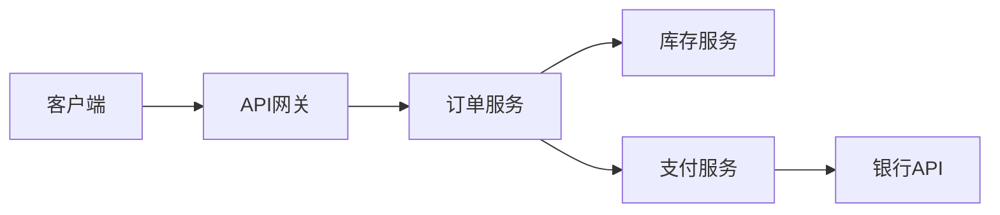
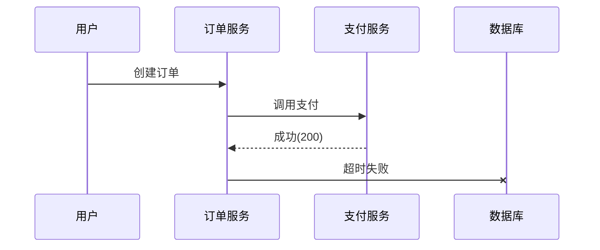

# 微服务架构追踪

## 什么是分布式追踪？

在微服务架构中，一个用户请求可能会经过多个服务的处理。例如，电商平台的“下单”操作可能涉及订单服务、库存服务、支付服务等。分布式追踪（Distributed Tracing）通过记录请求在系统中的完整流转路径，帮助开发者：

1. 可视化请求链路
2. 定位性能瓶颈
3. 分析跨服务错误
4. 优化系统依赖关系

Zipkin作为开源分布式追踪系统，通过收集各服务的时序数据（timing data），构建完整的调用链视图。



## Zipkin 核心概念

### 1. Trace与Span

- **Trace**：代表一个完整的请求链路（如上图的订单流程）
- **Span**：Trace中的单个工作单元（如订单服务处理请求的耗时）

```java
// Java示例：创建Span
try (Span span = tracer.nextSpan().name("processOrder").start()) {
    // 业务逻辑...
    span.tag("order.id", orderId);
}
```

### 2. 上下文传播

服务间通过HTTP头或消息头传递追踪上下文：

```
X-B3-TraceId: 80f198ee56343ba864fe8b2a57d3eff7
X-B3-ParentSpanId: 05e3ac9a4f6e3b90
X-B3-SpanId: e457b5a2e4d86bd1
```

## 实际应用案例

### 电商平台异常排查

**场景**：用户投诉“支付成功但订单状态未更新”

通过Zipkin可发现：
1. 支付服务调用成功（200 OK）
2. 但订单服务的更新操作因数据库连接超时失败
3. 快速定位到数据库连接池配置问题



## 集成示例（Spring Boot）

### 1. 添加依赖
```xml
<dependency>
    <groupId>org.springframework.cloud</groupId>
    <artifactId>spring-cloud-starter-zipkin</artifactId>
</dependency>
```

### 2. 配置应用
```yaml
spring:
  zipkin:
    base-url: http://localhost:9411
  sleuth:
    sampler:
      probability: 1.0 # 采样率100%
```

### 3. 查看追踪数据
访问 `http://localhost:9411` 可以看到：

```
Trace ID: 80f198ee56343ba8
Duration: 1.2s
Services: gateway, order-service, payment-service
```

## 最佳实践

:::tip 生产环境建议
1. 设置合理的采样率（如10%）
2. 为关键操作添加自定义tag
3. 与监控系统（如Prometheus）集成
4. 建立Span命名规范（serviceName.operation）
:::

## 总结

通过Zipkin实现微服务追踪能够：
- 减少跨团队调试时间
- 量化服务性能指标
- 快速定位故障点
- 优化系统架构

## 扩展学习

1. [Zipkin官方文档](https://zipkin.io/)
2. 尝试在本地启动Zipkin Server：
```bash
docker run -d -p 9411:9411 openzipkin/zipkin
```
3. 练习：为你的微服务项目添加追踪，分析一个完整请求链路