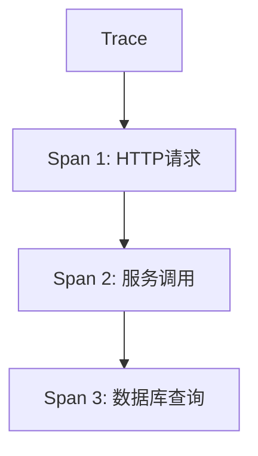

# 单体应用追踪

## 介绍

在分布式系统中，**单体应用追踪**（Monolithic Application Tracing）是指对单个服务内部的请求调用链路进行监控和分析的技术。尽管单体应用的所有功能模块通常运行在同一个进程中，但复杂的业务逻辑可能涉及多层调用（如控制器→服务层→数据库）。Zipkin可以帮助开发者可视化这些调用关系，定位性能瓶颈或错误源头。

:::note 为什么单体应用也需要追踪？
即使是非分布式架构，以下场景仍需要追踪：
1. 分析请求在应用内部的流转路径
2. 测量各模块的耗时分布
3. 诊断跨线程的调用问题
:::

## 核心概念

### 追踪模型
Zipkin的追踪模型基于以下几个关键组件：



- **Trace**：代表一个完整的请求链路（如图中的`A`）
- **Span**：链路中的单个工作单元（如图中的`B`,`C`,`D`），包含：
  - 开始/结束时间
  - 标签（如HTTP方法、状态码）
  - 父子关系

### 数据上报流程
1. 应用代码生成追踪数据
2. 通过`Brave`等库上报到Zipkin服务器
3. Zipkin存储并可视化数据

## 实战示例

### 基础配置
以Spring Boot应用为例，首先添加依赖：

```xml
<!-- pom.xml -->
<dependency>
    <groupId>io.zipkin.brave</groupId>
    <artifactId>brave-instrumentation-spring-web</artifactId>
    <version>5.13.2</version>
</dependency>
```

配置Zipkin上报：

```java
// Application.java
@Bean
public Tracing tracing() {
    return Tracing.newBuilder()
        .localServiceName("monolithic-app")
        .spanReporter(ZipkinSender.create("http://zipkin:9411/api/v2/spans"))
        .build();
}
```

### 代码级追踪
手动创建Span追踪业务方法：

```java
@RestController
public class OrderController {
    private final Tracer tracer;

    // 自动注入Tracer实例
    public OrderController(Tracer tracer) {
        this.tracer = tracer;
    }

    @GetMapping("/order/{id}")
    public String getOrder(@PathVariable String id) {
        // 创建新Span
        Span span = tracer.newTrace().name("getOrder").start();
        try (Scope scope = tracer.withSpanInScope(span)) {
            // 业务逻辑
            String result = orderService.findOrder(id);
            span.tag("order.id", id);
            return result;
        } finally {
            span.finish();
        }
    }
}
```

### 自动追踪日志
访问`/order/123`后，在Zipkin UI中可以看到：

```
Trace ID: 7a3b1c4d
Spans:
- [GET /order/{id}] (200ms)
  |- [orderService.findOrder] (150ms)
    |- [jdbc.query] (120ms)
```

:::tip 最佳实践
1. 为关键业务方法添加Span
2. 使用有意义的Span名称（如`service.method`格式）
3. 通过标签记录业务参数（注意脱敏敏感数据）
:::

## 实际案例

### 性能优化场景
某电商应用发现`/checkout`接口平均响应时间超过2秒：
1. 通过Zipkin发现耗时分布：
   - 支付服务调用：300ms
   - 库存锁定：1.5s
   - 日志记录：200ms
2. 定位到库存服务的SQL查询缺少索引
3. 优化后总时间降至400ms

### 错误诊断场景
用户报告"订单状态不一致"，但日志未显示异常：
1. 在Zipkin中过滤`order.update`相关Trace
2. 发现有两个并行的Span：
   - 用户操作触发更新（状态→PAID）
   - 定时任务触发更新（状态→CANCELLED）
3. 确认是并发写入问题，增加乐观锁解决

## 总结

关键要点：
- 单体应用追踪能揭示隐藏的调用关系和性能问题
- Zipkin通过Trace/Span模型提供可视化分析
- 结合手动和自动埋点可获得完整视角

扩展学习：
- [Zipkin官方文档 - 基础概念](https://zipkin.io/pages/instrumenting.html)
- 练习：为你的单体应用添加Zipkin追踪，分析一个核心接口的调用链路