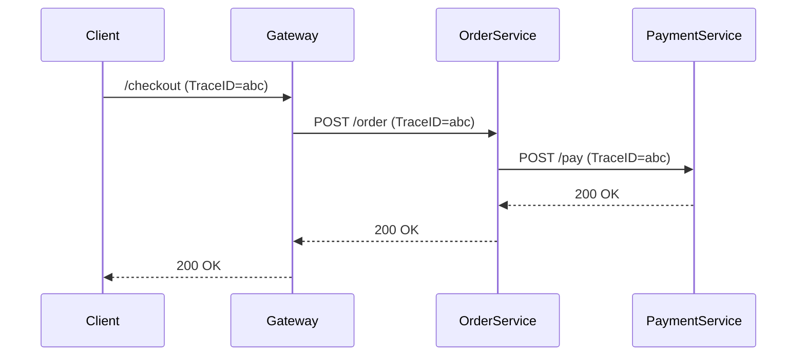

# 云原生应用追踪

## 介绍

在云原生架构中，应用通常由多个微服务组成，这些服务可能分布在不同的容器或节点上。当一个用户请求需要经过多个服务处理时，如何追踪请求的完整路径、分析延迟和故障点就变得至关重要。Zipkin作为一款开源的分布式追踪系统，能够帮助开发者可视化这些跨服务的调用链路。

:::tip 关键概念
- **Span**：代表一个独立的工作单元（如一次HTTP请求）。
- **Trace**：由一组Span组成的完整调用链，共享唯一的Trace ID。
- **Annotation**：用于记录事件时间点（如"请求开始"）。
:::

## 为什么需要云原生追踪？

1. **故障诊断**：快速定位超时或错误的服务节点。
2. **性能优化**：识别系统瓶颈（如高延迟的数据库调用）。
3. **依赖分析**：自动绘制服务依赖拓扑图。

## 基础实现示例

### 1. 服务端配置（Spring Boot）

```java
// 添加依赖到pom.xml
// io.zipkin.brave:brave-instrumentation-spring-webmvc
// io.zipkin.reporter2:zipkin-sender-okhttp3

@SpringBootApplication
@EnableZipkinServer // 启用Zipkin服务端
public class ZipkinServerApplication {
    public static void main(String[] args) {
        SpringApplication.run(ZipkinServerApplication.class, args);
    }
}
```

### 2. 客户端集成

```java
@RestController
public class OrderService {
    // 自动注入Tracer实例
    @Autowired 
    private Tracer tracer;

    @GetMapping("/order")
    public String createOrder() {
        // 创建自定义Span
        Span span = tracer.nextSpan().name("order_processing").start();
        try (var ws = tracer.withSpanInScope(span)) {
            // 业务逻辑...
            return "Order created";
        } finally {
            span.finish();
        }
    }
}
```

## 典型云原生场景

### 场景1：跨服务追踪



在Zipkin UI中可以看到：
1. 整个Trace的持续时间
2. 每个Span的独立耗时
3. 服务间的层级关系

### 场景2：错误传播追踪

当`PaymentService`返回500错误时，Zipkin会显示：
- 错误发生的精确位置
- 错误前后的调用上下文
- 受影响的上下游服务

## 高级功能

### 1. 采样率控制

通过配置降低非关键路径的追踪开销：
```yaml
# application.yml
spring:
  sleuth:
    sampler:
      probability: 0.5 # 50%的请求会被追踪
```

### 2. 标签过滤

添加业务自定义标签增强可搜索性：
```java
span.tag("user.id", userId);
span.tag("order.type", "premium");
```

## 真实案例：电商平台

某电商平台在黑色星期五期间遇到以下问题：
- 订单提交成功率下降30%
- 平均响应时间从200ms升至1500ms

通过Zipkin分析发现：
1. 支付服务调用第三方API存在400ms固定延迟
2. 库存服务的数据库查询占用了70%的请求时间
3. 10%的失败请求卡在推荐服务超时

优化后结果：
- 通过异步化支付调用提升吞吐量
- 为库存服务添加Redis缓存
- 对推荐服务实施熔断机制

## 总结

关键收获：
- Zipkin帮助理解服务间的复杂交互
- 可视化界面降低分布式系统调试难度
- 结合业务标签实现多维分析

## 延伸学习

1. 官方文档：[Zipkin Architecture](https://zipkin.io/pages/architecture.html)
2. 实践练习：
   - 在本地搭建Zipkin服务
   - 模拟包含3个微服务的调用链
   - 故意注入一个延迟故障并定位它
3. 相关技术：
   - OpenTelemetry标准
   - Jaeger追踪系统
   - Prometheus指标监控