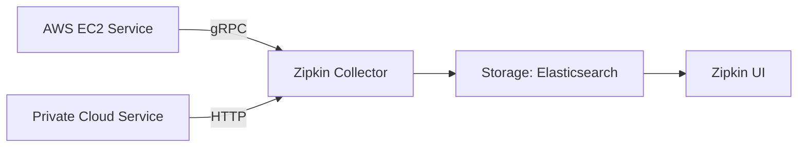

# 混合云环境追踪

## 介绍

混合云环境结合了公有云和私有云的优势，但复杂的服务调用链路使得性能监控和故障排查变得困难。Zipkin作为分布式追踪系统，能够可视化跨云服务的请求流转，帮助开发者快速定位延迟或错误问题。

:::note 关键概念
混合云追踪需要解决：
- 跨网络边界的上下文传递
- 统一的服务标识体系
- 异构系统的数据收集
:::

## 核心实现步骤

### 1. 配置跨云Trace上下文传播

在混合云中，确保`Trace ID`和`Span ID`能够穿透不同云平台的网络边界：

```java
// Spring Cloud Sleuth + Zipkin示例
@Bean
public Sampler alwaysSampler() {
    return Sampler.ALWAYS_SAMPLE; // 确保所有请求都被追踪
}

// 必须配置的HTTP头
headers.put("X-B3-TraceId", currentTraceContext.get().traceIdString());
headers.put("X-B3-SpanId", currentTraceContext.get().spanIdString());
```

### 2. 统一服务命名规范

不同云环境中的服务需采用一致的命名规则：

```yaml
# application.yml示例
spring:
  application:
    name: payment-service-aws  # 包含云平台标识
  zipkin:
    base-url: http://zipkin-collector:9411
```

### 3. 数据收集架构



## 实际应用案例

**电商订单处理流程**：
1. 用户请求进入公有云CDN
2. 转发至私有云的订单服务
3. 调用公有云支付服务
4. 返回私有云库存系统

:::tip 故障排查场景
当订单超时时，通过Zipkin可以：
1. 发现跨云调用的网络延迟
2. 识别出支付服务的重试操作
3. 验证上下文是否完整传递
:::

## 常见问题解决

```python
# Python服务出现上下文丢失时
from py_zipkin.zipkin import zipkin_span

@zipkin_span(service_name='analytics-service')
def process_data():
    # 确保在跨云调用时携带headers
    headers = create_http_headers_for_new_span()
    requests.post(url, headers=headers)
```

## 总结

混合云环境追踪的关键点：
- 使用`B3 Propagation`标准传递上下文
- 为服务添加云环境标识
- 选择兼容性好的传输协议（推荐gRPC）

## 扩展学习

1. 练习：在本地模拟混合云环境，使用Docker部署：
   ```bash
   docker run -d -p 9411:9411 openzipkin/zipkin
   ```
2. 推荐阅读：
   - Zipkin官方文档的`跨数据中心追踪`章节
   - OpenTelemetry混合云部署指南