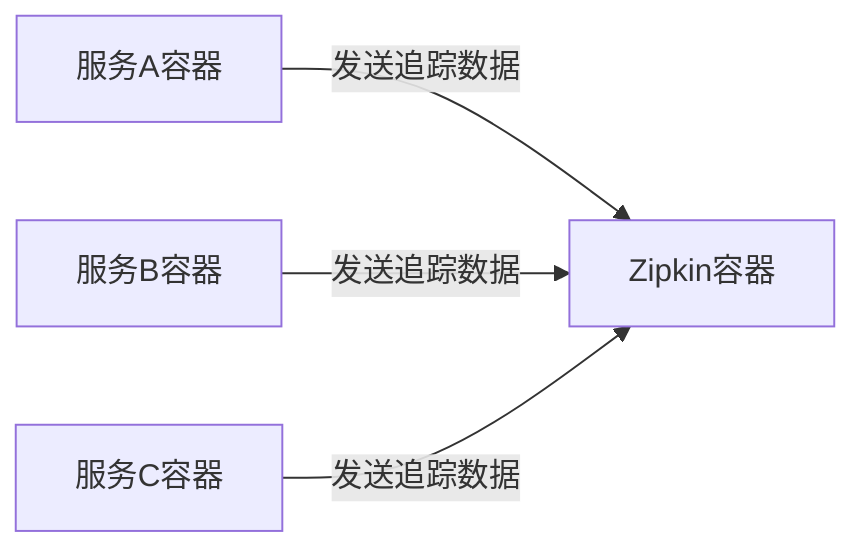
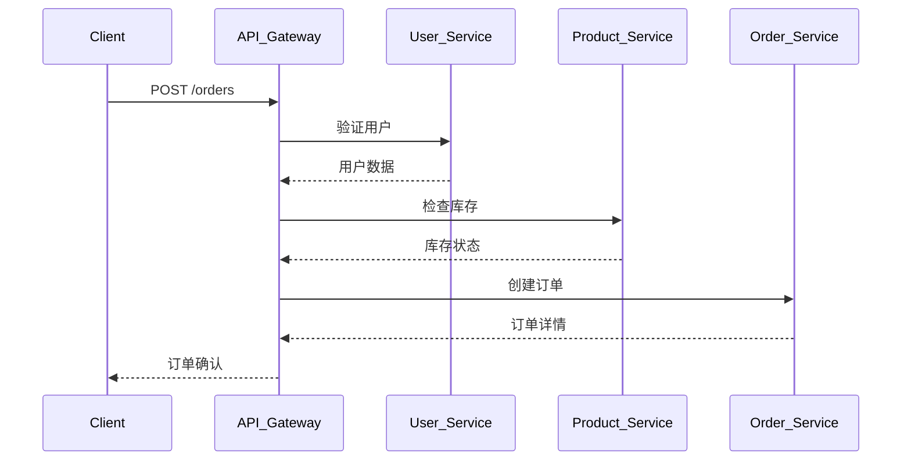

# 容器化环境追踪

## 介绍

在现代微服务架构中，应用程序通常被部署在容器化环境（如Docker、Kubernetes）中。这种架构虽然提高了灵活性和可扩展性，但也带来了调试和监控的复杂性。Zipkin作为一款分布式追踪系统，可以帮助开发者可视化容器化环境中的请求流程，定位延迟问题和依赖关系。

容器化环境追踪的核心目标是：
- 追踪跨多个容器的请求路径
- 分析服务间的延迟和性能瓶颈
- 可视化复杂的微服务交互

## 基础概念

### 1. 容器化环境的特点

容器化环境中的服务通常具有以下特征：
- 动态性：容器可以快速创建和销毁
- 多实例：同一服务可能有多个副本
- 网络隔离：容器间通过虚拟网络通信

### 2. Zipkin在容器中的角色

Zipkin在容器化环境中作为独立的服务运行，收集各个容器发送的追踪数据。典型的部署架构如下：



## 配置示例

### 1. 基本Docker部署

以下是一个简单的docker-compose.yml示例，包含Zipkin服务器和一个示例服务：

```yaml
version: '3'
services:
  zipkin:
    image: openzipkin/zipkin
    ports:
      - "9411:9411"
  
  service-a:
    image: your-service-image
    environment:
      - ZIPKIN_BASE_URL=http://zipkin:9411
    depends_on:
      - zipkin
```

### 2. 在应用中集成Zipkin

对于Spring Boot应用，添加以下依赖即可自动上报追踪数据：

```xml
<dependency>
    <groupId>org.springframework.cloud</groupId>
    <artifactId>spring-cloud-starter-zipkin</artifactId>
</dependency>
```

然后在application.properties中配置：

```properties
spring.zipkin.base-url=http://zipkin:9411
spring.sleuth.sampler.probability=1.0
```

## 实际案例

### 电商平台追踪示例

假设我们有一个简单的电商平台，包含以下服务：
1. 用户服务 (user-service)
2. 商品服务 (product-service)
3. 订单服务 (order-service)

一个"创建订单"的请求可能经过以下路径：



在Zipkin UI中，你可以看到这个请求的完整时间线和各服务间的依赖关系。

## 常见问题解决

:::tip 调试技巧
1. **跨容器通信问题**：确保所有容器都能访问Zipkin服务
2. **采样率设置**：开发环境可以设置为1.0(100%)，生产环境可以降低
3. **数据存储**：考虑使用持久化存储(如Elasticsearch)替代内存存储
:::

## 总结

容器化环境追踪是微服务监控的重要环节，Zipkin提供了简单而强大的工具来可视化复杂的服务交互。通过本文的学习，你应该能够：

1. 在容器化环境中部署Zipkin
2. 配置应用上报追踪数据
3. 分析Zipkin中的追踪信息

## 进阶练习

1. 尝试在Kubernetes集群中部署Zipkin
2. 为你的微服务应用添加自定义标签(tags)
3. 配置Zipkin使用持久化存储后端

## 附加资源

- [Zipkin官方Docker文档](https://github.com/openzipkin/docker-zipkin)
- [Spring Cloud Sleuth文档](https://spring.io/projects/spring-cloud-sleuth)
- [分布式追踪最佳实践](https://microservices.io/patterns/observability/distributed-tracing.html)