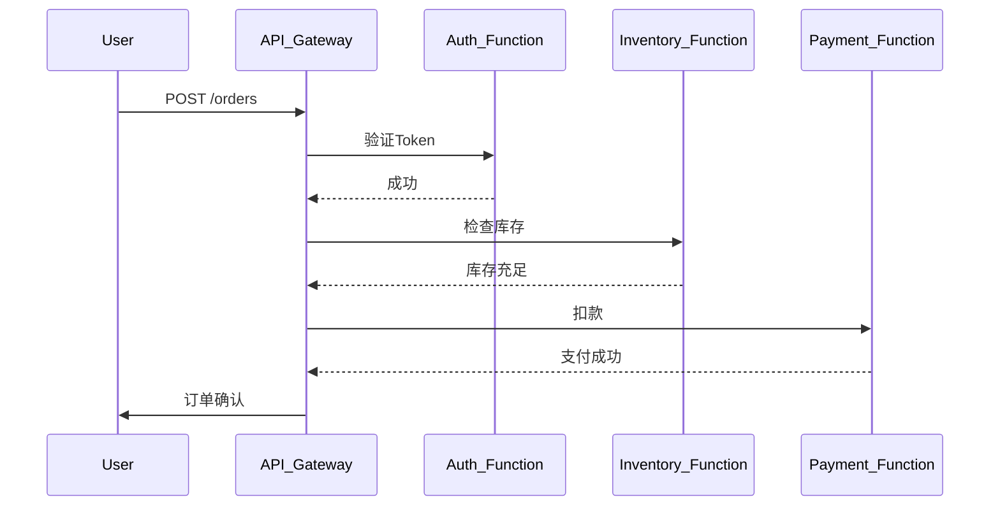

# 无服务器架构追踪

## 介绍

无服务器架构（Serverless）通过事件驱动的方式执行函数（如AWS Lambda、Azure Functions），但分布式环境下的调用链路追踪变得复杂。Zipkin通过收集跨函数的**Span数据**，帮助开发者可视化请求路径、诊断延迟问题。

:::note 关键概念
- **Span**：代表一个独立的工作单元（如函数调用）。
- **Trace**：由多个Span组成的完整调用链路。
- **无服务器挑战**：函数短暂生命周期、冷启动延迟、跨服务依赖。
:::

## 为什么需要Zipkin追踪？

1. **冷启动分析**：识别高延迟的函数初始化。
2. **依赖拓扑**：绘制函数间调用关系图。
3. **错误溯源**：快速定位失败请求的根因。

## 代码示例：Lambda函数集成Zipkin

以下示例展示如何在AWS Lambda中手动创建Span并上报至Zipkin：

```javascript
const { Tracer, ExplicitContext, ConsoleRecorder } = require('zipkin');
const zipkinMiddleware = require('zipkin-instrumentation-express').expressMiddleware;

// 初始化Zipkin Tracer
const tracer = new Tracer({
  ctxImpl: new ExplicitContext(),
  recorder: new ConsoleRecorder(), // 生产环境替换为HTTPRecorder
  localServiceName: 'order-service'
});

exports.handler = async (event) => {
  // 创建一个新的Span
  const spanId = tracer.createChildId();
  tracer.setId(spanId);
  tracer.recordServiceName('process-order');
  tracer.recordRpc('POST /orders');
  
  try {
    // 业务逻辑
    const result = await processOrder(event);
    tracer.recordBinary('http.status_code', '200');
    return result;
  } catch (error) {
    tracer.recordBinary('http.status_code', '500');
    tracer.recordBinary('error', error.message);
    throw error;
  }
};
```

**上报数据示例**（Zipkin格式）：
```json
{
  "traceId": "abc123",
  "id": "def456",
  "name": "process-order",
  "timestamp": 1620000000000,
  "duration": 150,
  "tags": {
    "http.status_code": "200",
    "rpc": "POST /orders"
  }
}
```

## 实际案例：电商订单流程

假设一个无服务器架构的订单处理流程：
1. **API Gateway** 接收用户请求
2. **Auth Function** 验证权限
3. **Inventory Function** 检查库存
4. **Payment Function** 处理支付



在Zipkin UI中，您将看到：
- 完整的Trace包含5个Span
- 每个Span显示执行时间和元数据（如函数版本、区域）
- 可识别Auth Function冷启动导致的额外延迟

## 最佳实践

1. **跨函数传递TraceID**：
   ```javascript
   // 在事件对象中传递上下文
   event.zipkinTraceId = tracer.id.traceId;
   ```

2. **采样策略**：生产环境中启用动态采样（如10%请求）。

3. **与云服务集成**：
   - AWS X-Ray与Zipkin数据转换
   - 使用`serverless-zipkin`插件自动化部署

:::warning 注意事项
- 避免在Span中记录敏感数据（如信用卡号）。
- 高并发场景下优先使用异步上报模式。
:::

## 总结

通过Zipkin追踪无服务器架构，您可以：
- 可视化函数间调用链路
- 量化冷启动对性能的影响
- 快速诊断跨服务问题

**扩展学习**：
- [Zipkin官方Serverless示例](https://zipkin.io/pages/tracers_instrumentation.html)
- 实验：部署两个Lambda函数，并在Zipkin中比较同步/异步调用模式耗时
``` 

（注：实际使用时请移除代码块外的