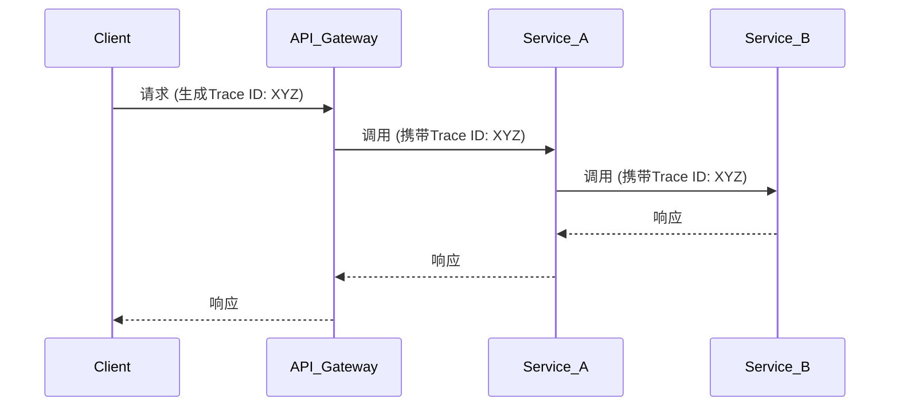

# API网关追踪

## 介绍

在现代微服务架构中，API网关作为所有外部请求的入口，承担着路由、认证、限流等重要职责。当请求通过网关进入系统后，可能经过多个微服务的调用链。使用Zipkin实现API网关追踪能帮助开发者：

1. 可视化整个请求的生命周期
2. 快速定位性能瓶颈
3. 分析跨服务调用的错误根源

## 核心概念

### 追踪上下文传播

API网关需要负责初始化追踪上下文（Trace Context）并将其传播到下游服务。主要包含三个关键ID：

- `Trace ID`：唯一标识整个调用链
- `Span ID`：标识单个服务的工作单元
- `Parent Span ID`：标识调用者的Span



### 网关集成示例

以下是使用Spring Cloud Gateway与Zipkin集成的配置示例：

```java
// 添加依赖
dependencies {
    implementation 'org.springframework.cloud:spring-cloud-starter-sleuth'
    implementation 'org.springframework.cloud:spring-cloud-starter-zipkin'
}

// 配置示例
spring:
  zipkin:
    base-url: http://localhost:9411
  sleuth:
    sampler:
      probability: 1.0 # 100%采样率(开发环境)
```

## 实际案例

### 电商平台订单流程追踪

假设一个电商平台的请求流程：

1. 用户通过网关提交订单
2. 网关路由到订单服务
3. 订单服务调用库存服务和支付服务

在Zipkin UI中可以看到完整的调用链：

```
Gateway (10ms)
├─ OrderService (50ms)
│  ├─ InventoryService (20ms)
│  └─ PaymentService (30ms)
```

:::tip 实践建议
1. 为网关设置合理的采样率（生产环境建议0.1-0.5）
2. 为关键路径添加自定义标签（如`user_id`、`request_type`）
3. 监控网关层的延迟百分位数（P99/P95）
:::

## 常见问题排查

当追踪数据缺失时，按以下步骤检查：

1. 确认网关是否正确注入HTTP头：
   - `X-B3-TraceId`
   - `X-B3-SpanId`
   - `X-B3-ParentSpanId`

2. 验证下游服务是否配置了追踪上下文传播

3. 检查Zipkin服务端是否正常运行

## 总结

API网关追踪是分布式系统可观测性的关键环节，通过Zipkin可以实现：

- 端到端的请求可视化
- 性能瓶颈分析
- 错误快速定位

## 延伸学习

1. 尝试在网关中添加自定义Span标签
2. 实验不同采样率对系统性能的影响
3. 结合Prometheus和Grafana构建完整监控体系

:::note 扩展阅读
- [Zipkin官方文档-Brave instrumentation](https://github.com/openzipkin/brave)
- [Spring Cloud Sleuth参考指南](https://spring.io/projects/spring-cloud-sleuth)
:::