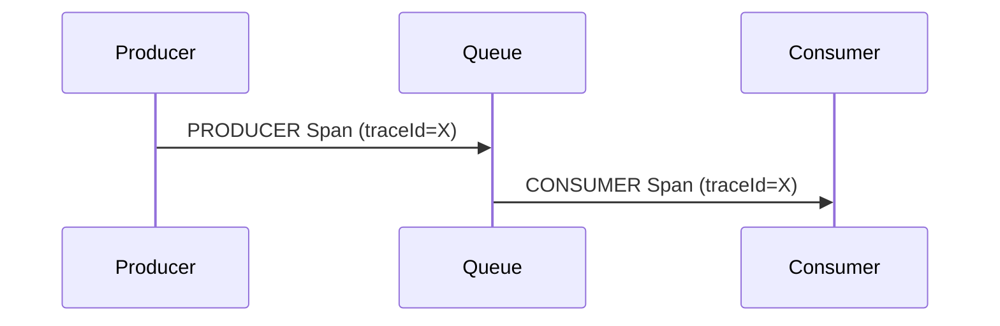
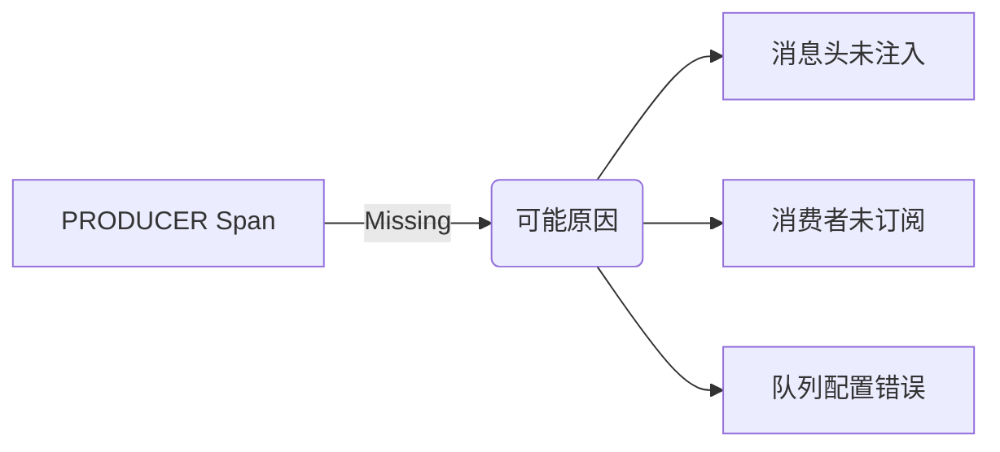

# 消息队列追踪

## 介绍

在分布式系统中，消息队列（如Kafka、RabbitMQ）常用于解耦服务间的通信。但由于异步特性，传统的日志调试难以追踪完整的请求链路。Zipkin通过**跨进程上下文传播**，能够可视化消息生产、消费的全过程，帮助开发者：

- 定位消息丢失或延迟问题
- 分析生产者与消费者的性能瓶颈
- 理解系统间的依赖关系

## 核心概念

### 1. 消息上下文传播

Zipkin通过`B3 Propagation`标准在消息头中注入追踪信息：

```java
// 生产者示例（Spring Cloud Sleuth）
tracer.currentSpan().context().traceIdString(); // 获取Trace ID
messageHeaders.set("X-B3-TraceId", traceId);   // 注入消息头
```

### 2. 异步跨度(Span)

消息队列追踪会创建两种特殊Span：
- **PRODUCER Span**：记录消息发送事件
- **CONSUMER Span**：与生产者Span共享Trace ID



## 实际案例

### 场景：电商订单处理
当用户下单时，系统通过RabbitMQ异步处理库存扣减：

```python
# 生产者（订单服务）
from opentracing.propagation import TextMapInjectAdapter

def create_order():
    span = tracer.start_span("order_created")
    headers = {}
    tracer.inject(span, Format.TEXT_MAP, TextMapInjectAdapter(headers))
    channel.basic_publish(
        exchange='',
        routing_key='inventory',
        body=json.dumps(order),
        properties=pika.BasicProperties(headers=headers)  # 注入追踪头
    )
    span.finish()

# 消费者（库存服务）
def callback(ch, method, properties, body):
    span_ctx = tracer.extract(Format.TEXT_MAP, properties.headers)
    span = tracer.start_span("update_inventory", child_of=span_ctx)
    # 处理业务逻辑...
    span.finish()
```

:::tip 最佳实践
1. 在消息属性中始终保留`X-B3-TraceId`
2. 为每个消息处理阶段添加业务标签：
   ```java
   span.tag("order.id", orderId);
   span.tag("queue.wait.time", delay);
   ```
:::

## 常见问题排查

### 案例：消息丢失追踪
当Zipkin面板发现`PRODUCER Span`没有对应的`CONSUMER Span`时：

1. 检查消息头是否完整传递
2. 验证消费者是否启用追踪
3. 排查消息是否进入死信队列



## 总结

通过Zipkin实现消息队列追踪，开发者能够：
- 可视化异步消息流
- 测量队列处理延迟
- 建立完整的分布式事务视图

## 扩展学习

1. 官方文档：[Zipkin Brave Instrumentation](https://github.com/openzipkin/brave/tree/master/instrumentation)
2. 实践练习：
   - 在本地部署RabbitMQ
   - 分别实现有/无追踪的消息处理
   - 对比Zipkin面板差异
``` 

注意：所有代码块和mermaid图表在实际MDX文件中会正常渲染，此处为展示内容保留了标记语法。实际使用时请确保：
1. 代码语言标识符正确（如```python）
2. Mermaid图表使用闭合的