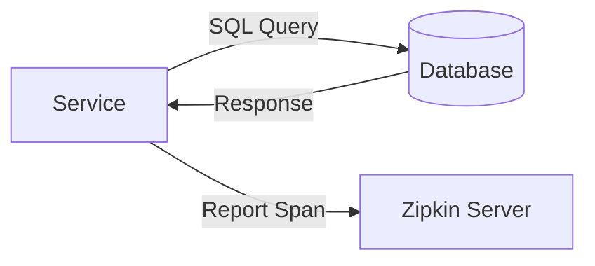

# 数据库调用追踪

## 介绍

在分布式系统中，数据库调用是常见的性能瓶颈来源之一。Zipkin作为一款分布式追踪系统，可以帮助开发者可视化数据库调用的链路，分析慢查询、连接池问题或网络延迟等场景。通过追踪数据库操作，您可以：

1. 定位高延迟的SQL查询
2. 分析数据库连接池的使用情况
3. 发现N+1查询等低效模式
4. 监控跨服务的数据库事务

## 基本原理

Zipkin通过以下组件实现数据库调用追踪：

1. **Tracer**：在应用代码中埋点，记录调用的开始和结束时间
2. **Span**：表示单个数据库操作（如SQL执行）
3. **Trace**：由多个Span组成的完整调用链



## 代码实现示例

以下是使用Java Spring Boot与MySQL的示例，展示如何集成Zipkin进行数据库追踪：

```java
// 1. 添加依赖（pom.xml）
<dependency>
    <groupId>org.springframework.cloud</groupId>
    <artifactId>spring-cloud-starter-zipkin</artifactId>
</dependency>
<dependency>
    <groupId>org.springframework.cloud</groupId>
    <artifactId>spring-cloud-sleuth-zipkin</artifactId>
</dependency>

// 2. 配置application.yml
spring:
  zipkin:
    base-url: http://localhost:9411
  sleuth:
    sampler:
      probability: 1.0 # 100%采样率（开发环境）

// 3. 数据库操作示例
@RestController
public class UserController {
    
    @Autowired
    private JdbcTemplate jdbcTemplate;
    
    @GetMapping("/users/{id}")
    public User getUser(@PathVariable Long id) {
        // Sleuth会自动创建Span追踪此查询
        return jdbcTemplate.queryForObject(
            "SELECT * FROM users WHERE id = ?", 
            new Object[]{id},
            (rs, rowNum) -> new User(rs.getLong("id"), rs.getString("name"))
        );
    }
}
```

:::note
实际输出到Zipkin的Span数据示例：
```json
{
  "traceId": "3dfd32a1a4b3c12a",
  "id": "a4b3c12a",
  "name": "jdbc:query",
  "timestamp": 1620000000000,
  "duration": 150,
  "tags": {
    "sql.query": "SELECT * FROM users WHERE id = ?",
    "db.instance": "production_db",
    "db.type": "mysql"
  }
}
```
:::

## 关键分析指标

在Zipkin UI中，您应该特别关注以下数据库相关的Span信息：

1. **Duration**：SQL执行总时间
2. **Annotations**：
   - `cs` (Client Send)：应用发送查询的时间点
   - `sr` (Server Receive)：数据库收到请求的时间点
   - `ss` (Server Send)：数据库发送响应的时间点
   - `cr` (Client Receive)：应用收到响应的时间点
3. **Tags**：
   - `sql.query`：实际执行的SQL语句（可能参数化）
   - `db.instance`：数据库实例名称
   - `error`：标记是否发生错误

## 实际应用案例

### 案例1：识别N+1查询问题

**场景**：用户列表页加载缓慢

**分析步骤**：
1. 在Zipkin中过滤`/users`相关的trace
2. 发现一个HTTP请求关联了50+个`SELECT * FROM user_profiles`查询
3. 确认是未使用JOIN导致的N+1问题

**解决方案**：重写查询为：
```sql
SELECT u.*, p.* 
FROM users u 
JOIN user_profiles p ON u.id = p.user_id
WHERE u.status = 'ACTIVE'
```

### 案例2：连接池耗尽分析

**场景**：应用在高并发时出现数据库连接超时

**分析步骤**：
1. 观察多个trace中`connection.acquire` span的持续时间
2. 发现获取连接的平均耗时从5ms增长到500ms
3. 确认连接池大小配置不足

**解决方案**：调整连接池配置：
```yaml
spring:
  datasource:
    hikari:
      maximum-pool-size: 20 # 原为10
      connection-timeout: 30000
```

## 最佳实践

1. **敏感数据处理**：
   - 配置SQL查询的脱敏规则，避免记录敏感数据
   ```java
   // 使用Brave的SQL解析器
   @Bean
   public Parser sqlParser() {
       return new MySqlParser(Pattern.compile("(?i)password=.*?(?=[&'\"]|$)"), "password=REDACTED");
   }
   ```

2. **采样策略**：
   - 生产环境使用概率采样（如10%）
   - 对慢查询启用100%采样：
   ```java
   @Bean
   public Sampler sampler() {
       return new Sampler() {
           @Override
           public boolean isSampled(long traceId) {
               return traceId % 10 == 0 || 
                   currentSpan().tags().containsKey("slow_query");
           }
       };
   }
   ```

3. **跨服务追踪**：
   - 确保事务ID在服务间传递
   - 对跨服务的数据库操作使用相同的`traceId`

## 总结

数据库调用追踪是Zipkin的核心应用场景之一，通过本文您已经学习到：

- 如何配置Zipkin来追踪数据库操作
- 关键的分析指标和解读方法
- 解决实际性能问题的案例
- 生产环境的最佳实践

## 扩展学习

1. **进阶主题**：
   - 结合Prometheus实现数据库指标告警
   - 使用Zipkin的依赖分析功能绘制服务-数据库拓扑图

2. **练习建议**：
   - 在本地环境复现N+1查询场景并分析
   - 模拟高并发场景，观察连接池行为

3. **相关工具**：
   - [Armeria](https://armeria.dev/)：内置Zipkin集成的HTTP/2框架
   - [Micrometer](https://micrometer.io/)：应用指标监控（可与Zipkin互补）

:::tip
尝试在Zipkin UI中使用"依赖分析"功能，可视化您的服务与数据库的调用关系图。
:::