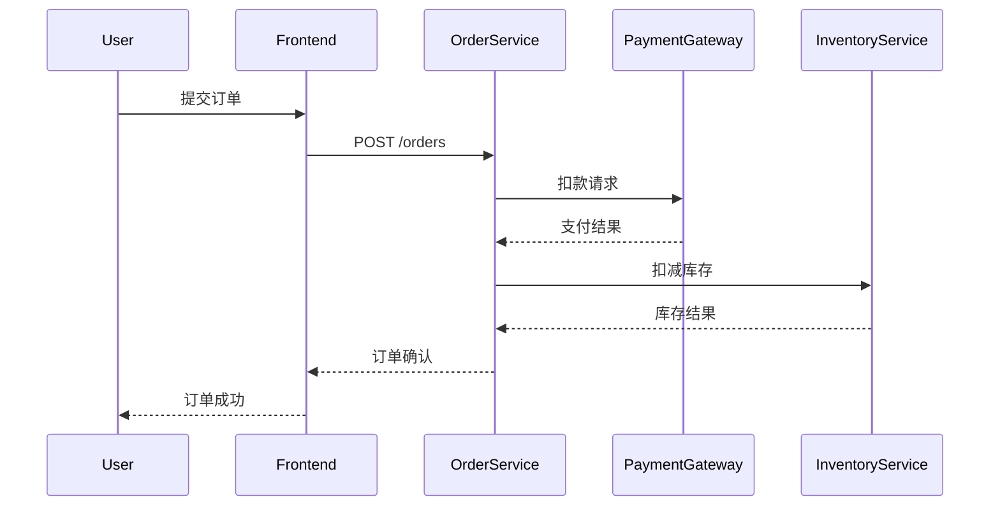

# 第三方服务追踪

## 介绍

在微服务架构中，一个用户请求可能跨越多个服务，甚至涉及第三方API（如支付网关、地图服务等）。Zipkin通过分布式追踪技术，帮助开发者可视化这些跨服务的调用链，快速定位延迟或故障点。本节将重点讲解如何追踪涉及第三方服务的请求。

:::note 关键概念
- **Span**：代表一个独立的工作单元（如一次HTTP调用）。
- **Trace**：由多个Span组成的调用树，表示完整的请求路径。
- **B3 Propagation**：Zipkin使用的HTTP头标准，用于传递追踪上下文。
:::

## 为什么需要追踪第三方服务？

1. **性能分析**：识别第三方服务是否成为系统瓶颈
2. **故障排查**：当错误发生在第三方服务时快速定位
3. **SLA监控**：验证第三方服务是否满足承诺的响应时间

## 实现步骤

### 1. 配置Zipkin客户端

以Spring Boot为例，添加依赖和基础配置：

```java
// build.gradle
implementation 'org.springframework.cloud:spring-cloud-starter-zipkin:3.1.1'
```

```yaml
# application.yml
spring:
  zipkin:
    base-url: http://localhost:9411
  sleuth:
    sampler:
      probability: 1.0 # 100%采样率（生产环境应降低）
```

### 2. 传播追踪上下文

当调用第三方服务时，需要手动传递B3头：

```java
@RestController
public class OrderController {
    
    @Autowired
    private RestTemplate restTemplate;

    @GetMapping("/order")
    public String createOrder() {
        // 自动注入的Tracer对象
        Span thirdPartySpan = tracer.nextSpan().name("call-payment-gateway");
        
        try (SpanInScope ws = tracer.withSpanInScope(thirdPartySpan.start())) {
            HttpHeaders headers = new HttpHeaders();
            // 手动注入追踪头
            headers.add("X-B3-TraceId", thirdPartySpan.context().traceId());
            headers.add("X-B3-SpanId", thirdPartySpan.context().spanId());
            
            ResponseEntity<String> response = restTemplate.exchange(
                "https://payment-gateway.com/charge",
                HttpMethod.POST,
                new HttpEntity<>("payload", headers),
                String.class
            );
            
            return response.getBody();
        } finally {
            thirdPartySpan.end();
        }
    }
}
```

### 3. 处理第三方服务的响应

如果第三方服务也支持Zipkin，你会看到完整的调用链。否则，至少能记录从你的服务到第三方调用的边界。

## 实际案例：电商支付流程



在Zipkin UI中，这个流程会显示为：
1. 一个Trace包含5个Span
2. 可以清晰看到支付网关的耗时
3. 如果支付失败，能立即识别是网络问题还是网关返回错误

## 高级技巧

:::tip 处理不支持Zipkin的第三方服务
对于不兼容B3协议的第三方服务，可以通过以下方式增强追踪：
1. 在日志中记录Trace ID
2. 使用Zipkin的`Annotation`标记关键事件
3. 创建人工Span包装第三方调用
:::

```java
// 示例：添加自定义注解
thirdPartySpan.tag("payment.gateway", "stripe");
thirdPartySpan.event("payment.submitted");
```

## 总结

通过Zipkin追踪第三方服务：
- 需要显式传播B3头
- 即使第三方不支持Zipkin，也能记录调用边界
- 关键业务路径应添加详细标记

## 扩展练习

1. 在你的项目中集成一个Mock支付网关，观察Zipkin中的调用链
2. 尝试在第三方调用超时时，通过Trace ID快速定位问题
3. 比较同步调用和异步调用第三方服务时的追踪差异

## 附加资源

- [Zipkin B3 Propagation文档](https://github.com/openzipkin/b3-propagation)
- [Spring Cloud Sleuth配置指南](https://docs.spring.io/spring-cloud-sleuth/docs/current/reference/html/)