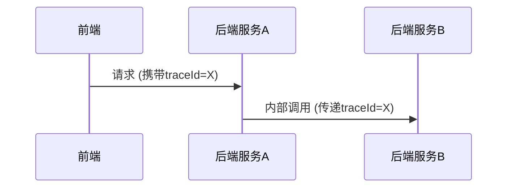
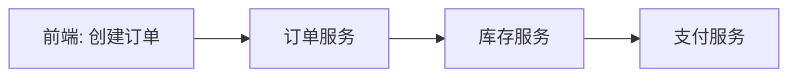

## 介绍

在现代分布式系统中，前端与后端的交互通常涉及多个服务调用。Zipkin的分布式追踪能力可以帮助开发者可视化这些跨服务请求的完整路径，快速定位性能瓶颈或错误源头。本节将展示如何在前端JavaScript应用和后端服务中集成Zipkin追踪。

## 基础概念

### 追踪上下文传播
前端与后端集成追踪的核心是**上下文传播**（Context Propagation）。当用户发起请求时：
1. 前端生成唯一的`traceId`并注入HTTP头
2. 后端接收请求并继续传播该`traceId`
3. 所有相关服务将共享相同的追踪上下文



## 前端集成示例

### 浏览器端配置
使用`zipkin-js`库在React/Vue等前端框架中集成：

```javascript
import { Tracer, BatchRecorder, jsonEncoder } from 'zipkin';
import { HttpLogger } from 'zipkin-transport-http';

// 初始化追踪器
const tracer = new Tracer({
  ctxImpl: new ExplicitContext(),
  recorder: new BatchRecorder({
    logger: new HttpLogger({
      endpoint: 'http://localhost:9411/api/v2/spans',
      jsonEncoder: jsonEncoder.JSON_V2
    })
  }),
  localServiceName: 'frontend-webapp' 
});

// 包装fetch请求
const zipkinFetch = require('zipkin-instrumentation-fetch').fetch;

// 发起请求时自动注入追踪头
fetch('/api/data', { 
  method: 'GET',
  headers: tracer.createChildId().toHeaders()
});
```

:::note
前端需要确保CORS配置允许`b3`（Zipkin标准头）的传播：
```http
Access-Control-Allow-Headers: b3,x-b3-traceid,x-b3-spanid,x-b3-parentspanid
```
:::

## 后端集成示例

### Spring Boot配置示例
Java后端通过Spring Cloud Sleuth自动集成：

```java
// application.properties
spring.zipkin.base-url=http://localhost:9411
spring.sleuth.sampler.probability=1.0 // 100%采样率

// Controller示例
@RestController
public class DataController {
    
    @GetMapping("/api/data")
    public ResponseEntity<String> getData(@RequestHeader HttpHeaders headers) {
        // Sleuth会自动处理b3头的传播
        return ResponseEntity.ok("Response with tracing");
    }
}
```

## 实际案例：电商订单流程

追踪一个完整的用户下单流程：
1. 前端发起`POST /orders`请求
2. 订单服务调用库存服务
3. 库存服务调用支付服务

在Zipkin UI中看到的追踪图：



## 常见问题排查

:::caution 上下文丢失场景
如果发现追踪链断裂，检查：
1. 网关是否过滤了`b3`头
2. 异步调用是否手动传播了上下文
3. 跨域请求是否配置正确
:::

## 总结与练习

### 关键要点
- 前后端需要统一`traceId`的传播方式
- 浏览器端需要显式初始化追踪器
- 后端框架通常提供自动集成方案

### 扩展练习
1. 尝试在Vue应用中手动注入追踪头
2. 模拟一个跨服务错误，观察Zipkin中的错误标记
3. 比较有/无追踪时的请求性能差异

### 附加资源
- [Zipkin JavaScript客户端文档](https://github.com/openzipkin/zipkin-js)
- [Spring Cloud Sleuth采样配置](https://spring.io/projects/spring-cloud-sleuth)