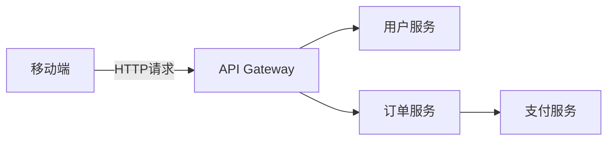

# 移动应用追踪

## 介绍

移动应用追踪是分布式追踪技术在移动端的具体应用，它帮助开发者监控和分析移动应用中跨服务、跨网络的请求链路。通过Zipkin，你可以追踪从移动端发起的API调用、数据库操作或第三方服务请求，快速定位延迟或错误问题。

:::note 为什么需要移动应用追踪？
现代移动应用通常依赖后端服务和第三方API，一个用户操作可能触发多个分布式调用。没有追踪工具时，调试性能问题如同"盲人摸象"。
:::

## 核心概念

### 1. 追踪模型
移动端追踪通常包含以下元素：
- **Trace**: 代表一个完整的用户操作链路（如"提交订单"）
- **Span**: 每个服务调用的独立片段（如"验证支付"、"更新库存"）
- **Annotation**: 关键时间点标记（如"请求开始"）



### 2. 移动端特殊考量
- 网络不稳定性
- 设备性能差异
- 离线操作处理

## 实现步骤

### 1. 客户端集成
在移动应用中添加Zipkin客户端库：

```kotlin
// Android示例 (Kotlin)
dependencies {
    implementation("io.zipkin.reporter2:zipkin-sender-okhttp3:2.16.3")
    implementation("io.zipkin.brave:brave:5.13.2")
}
```

### 2. 配置追踪
初始化追踪器并创建Span：

```swift
// iOS示例 (Swift)
import Zipkin

let tracer = Tracer(
    serviceName: "MobileApp",
    reporter: URLReporter(endpoint: URL(string: "http://zipkin:9411/api/v2/spans")!)
)

func fetchUserProfile() {
    let span = tracer.startSpan(name: "fetchProfile")
    span.tag(key: "http.method", value: "GET")
    
    // 执行网络请求...
    span.finish()
}
```

### 3. 典型工作流
1. 用户点击按钮触发操作
2. 创建根Span
3. 记录网络请求
4. 传播Trace ID到后端
5. 聚合所有Span到Zipkin

## 实际案例

### 电商应用场景
**问题现象**：用户抱怨"支付流程太慢"

**追踪发现**：
1. 移动端到API网关延迟200ms
2. 支付服务响应时间波动大（300ms-2s）
3. 风控服务同步调用阻塞主线程

**优化方案**：
- 压缩移动端请求数据
- 支付服务添加缓存
- 风控检查改为异步

## 最佳实践

:::tip 移动端追踪技巧
1. 采样率控制：生产环境建议10-20%采样
2. 敏感数据：避免记录PII(个人身份信息)
3. 错误处理：捕获并记录网络异常
4. 批处理上报：减少电量消耗
:::

## 总结

移动应用追踪通过可视化跨服务调用链路，帮助开发者：
- 定位性能瓶颈
- 分析错误根源
- 优化用户体验

## 延伸学习

1. [Zipkin官方文档 - Android集成](https://zipkin.io/pages/instrumenting.html)
2. Brave库源码分析
3. 尝试在Demo应用中添加追踪并分析结果

**练习任务**：
1. 实现一个记录HTTP请求耗时的Span
2. 对比不同网络环境下的追踪数据
3. 创建一个包含错误标记的Span