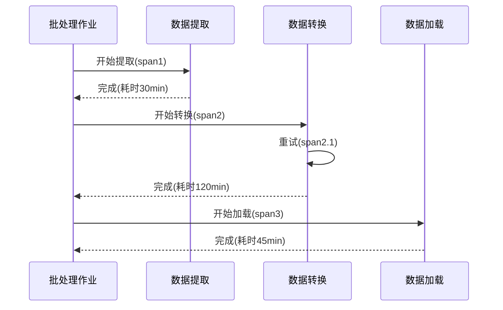

# 批处理系统追踪

批处理系统是现代数据处理中常见的模式，通常用于处理大量离线数据（如ETL任务、报表生成等）。由于批处理作业通常涉及多个步骤和分布式组件，追踪其执行流程和性能问题可能非常复杂。Zipkin的分布式追踪能力可以帮助开发者可视化批处理作业的调用链，定位延迟或故障的根本原因。

## 批处理系统为什么需要追踪？

批处理系统通常有以下特点：
- **长时间运行**：作业可能持续数分钟甚至数小时
- **多阶段处理**：数据需要经过多个处理步骤
- **分布式执行**：任务可能分布在多个节点上
- **容错需求**：需要处理失败和重试的情况

没有追踪系统时，开发者很难：
1. 理解整个批处理作业的端到端流程
2. 识别哪个处理阶段最耗时
3. 诊断跨服务边界的故障
4. 比较不同批次的执行性能

## Zipkin 在批处理系统中的实现方式

### 基本概念

在批处理系统中实现Zipkin追踪，通常需要：

1. **批处理作业ID**：作为Trace ID的高位部分
2. **处理阶段ID**：作为Span ID
3. **步骤间关系**：使用Parent Span ID表示


### 代码示例

以下是一个简单的Python批处理作业示例，使用`py_zipkin`库添加追踪：

```python
from py_zipkin import zipkin
from py_zipkin.util import generate_random_64bit_string
import time

def extract_data():
    with zipkin.zipkin_span(
        service_name='batch-processor',
        span_name='extract',
        transport_handler=print,
        sample_rate=100.0,
    ):
        time.sleep(0.5)
        return ["data1", "data2", "data3"]

def transform_data(data):
    with zipkin.zipkin_span(
        service_name='batch-processor',
        span_name='transform',
        transport_handler=print,
        sample_rate=100.0,
    ):
        time.sleep(1.2)
        return [d.upper() for d in data]

def load_data(data):
    with zipkin.zipkin_span(
        service_name='batch-processor',
        span_name='load',
        transport_handler=print,
        sample_rate=100.0,
    ):
        time.sleep(0.8)
        print("Data loaded:", data)

# 主批处理作业
def run_batch_job():
    trace_id = generate_random_64bit_string()
    with zipkin.zipkin_span(
        service_name='batch-processor',
        span_name='batch_job',
        transport_handler=print,
        sample_rate=100.0,
        trace_id=trace_id,
    ):
        data = extract_data()
        transformed = transform_data(data)
        load_data(transformed)

if __name__ == "__main__":
    run_batch_job()
```

:::note
在实际应用中，你应该将追踪数据发送到Zipkin服务器，而不是仅仅打印到控制台。示例中使用`print`仅用于演示目的。
:::

## 实际应用场景

### 案例1：ETL管道性能优化

一个电商公司使用批处理系统每天凌晨处理用户行为数据：
1. 从Kafka提取原始数据（耗时30分钟）
2. 清洗和转换数据（耗时1小时）
3. 加载到数据仓库（耗时45分钟）

通过Zipkin追踪发现：
- 转换阶段中某个特定规则处理异常缓慢
- 90%的时间花在了5%的数据记录上
- 优化后整体处理时间减少了40%

### 案例2：故障诊断

一个金融机构的日终结算系统突然变慢：
- 没有追踪时：只能看到"系统变慢"，无法定位具体原因
- 使用Zipkin后：发现是由于某个外部API调用超时导致的级联延迟
- 解决方案：为该外部调用添加适当的超时和重试机制

## 高级主题

### 批处理系统中的特殊考虑

1. **长跨度处理**：批处理作业可能运行数小时，需要考虑Zipkin的存储和采样策略
2. **批量操作追踪**：单个Span可能代表对百万条记录的处理
3. **资源使用关联**：将CPU、内存指标与追踪数据关联
4. **重试机制追踪**：记录失败和重试情况



## 总结

Zipkin为批处理系统提供了宝贵的可见性，帮助开发者：

- 可视化复杂的多阶段处理流程
- 识别性能瓶颈和异常情况
- 比较不同批次间的执行差异
- 诊断跨服务/组件的故障

## 附加资源

1. **进一步学习**：
   - [Zipkin官方批处理示例](https://github.com/openzipkin/zipkin/tree/master/zipkin-examples)
   - [Spring Batch与Zipkin集成](https://spring.io/projects/spring-cloud-sleuth)

2. **实践练习**：
   - 修改上面的Python示例，将数据实际发送到Zipkin服务器
   - 创建一个包含错误处理的批处理作业，观察Zipkin如何显示失败情况
   - 尝试将批处理作业分解为多个微服务，并追踪跨服务调用

3. **工具推荐**：
   - 使用Zipkin的依赖关系图分析批处理系统的组件交互
   - 结合Prometheus指标和Zipkin追踪数据进行分析