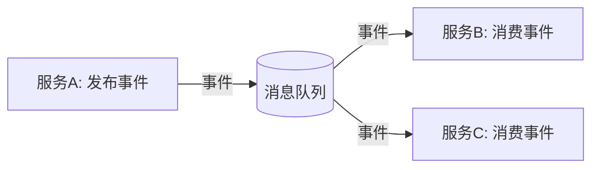

# 事件驱动架构追踪

## 介绍

事件驱动架构（Event-Driven Architecture, EDA）是一种基于事件的生产、检测和消费的软件设计模式。在这种架构中，服务通过异步事件进行通信，而不是直接调用彼此的API。虽然这种架构提高了系统的松耦合性和可扩展性，但也带来了追踪事件流的复杂性。Zipkin作为分布式追踪系统，可以帮助开发者可视化事件在服务间的流转路径，快速定位性能瓶颈或故障点。

## 核心概念

在事件驱动架构中，Zipkin通过以下方式实现追踪：

1. **事件生产者与消费者**：每个事件的生产和消费都会生成独立的Span（追踪单元）。
2. **事件上下文传递**：通过消息头（如Kafka的headers或RabbitMQ的属性）传递Trace ID和Span ID。
3. **异步关联**：Zipkin将不同服务中的Span通过共享的Trace ID关联起来。



## 代码示例

以下是一个使用Spring Cloud Sleuth（Zipkin的Java客户端）和Kafka的示例：

### 生产者端
```java
@RestController
public class EventController {
  @Autowired
  private KafkaTemplate<String, String> kafkaTemplate;

  @PostMapping("/event")
  public void sendEvent() {
    // 自动注入Trace信息到Kafka headers
    kafkaTemplate.send("user-events", "user.created", "payload");
  }
}
```

### 消费者端
```java
@KafkaListener(topics = "user-events")
public void handleEvent(String payload, @Header("traceId") String traceId) {
  // Sleuth会自动从headers提取Trace上下文
  System.out.println("Processing event with trace: " + traceId);
}
```

## 实际案例

### 电商订单流程
在一个电商系统中，订单创建事件可能触发以下操作：
1. 库存服务扣减库存
2. 支付服务发起支付
3. 物流服务准备发货

使用Zipkin追踪时，你会看到：
- 所有操作共享同一个Trace ID
- 每个服务的处理时间清晰可见
- 可以识别哪个服务导致了延迟

```mermaid
gantt
  title 订单事件追踪
  dateFormat  X
  axisFormat %s
  section 订单服务
  创建订单 :a1, 0, 100
  section 库存服务
  扣减库存 :a2, after a1, 150
  section 支付服务
  处理支付 :a3, after a1, 200
```



## 总结

通过Zipkin追踪事件驱动架构：
- 可视化异步事件流
- 识别跨服务的性能问题
- 无需修改业务逻辑即可实现追踪

:::tip 最佳实践
1. 为事件类型添加自定义标签（如 `event.type=user.created`）
2. 在消息中间件配置中启用头信息传播
3. 对高吞吐量事件考虑采样策略
:::

## 延伸学习

1. 尝试在本地搭建Zipkin服务器并运行上述示例
2. 比较同步调用和事件驱动的追踪差异
3. 探索如何将业务指标（如订单量）与追踪数据关联

:::note 附加资源
- [Zipkin官方文档 - Brave（Java客户端）](https://github.com/openzipkin/brave)
- [Spring Cloud Sleuth文档](https://spring.io/projects/spring-cloud-sleuth)
- 《分布式系统观测》第五章 - 事件追踪模式
:::