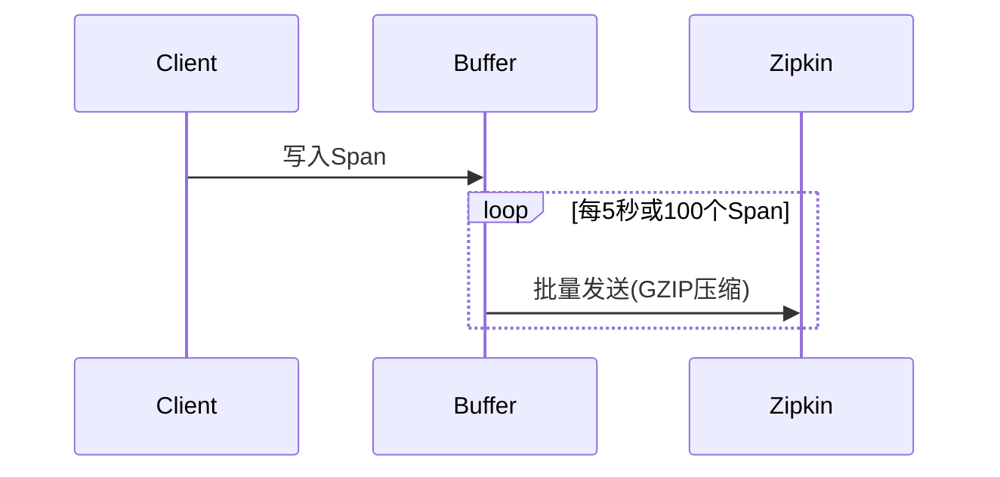

# 客户端性能优化

## 介绍

在分布式系统中，Zipkin作为链路追踪工具，其客户端性能直接影响系统的整体吞吐量。客户端性能优化主要关注如何减少追踪数据的生成、收集和上报对应用性能的影响。本文将介绍常见的优化策略，包括采样率控制、异步上报、数据压缩等。

:::note
**关键概念**：Zipkin客户端负责生成和上报追踪数据（Spans），优化客户端可降低CPU、内存和网络开销。
:::

---

## 1. 采样率控制

### 原理
通过降低非关键请求的采样率，减少不必要的追踪数据生成。Zipkin支持概率采样（如10%的请求被追踪）。

### 代码示例（Java + Brave）
```java
// 设置10%的采样率
Sampler sampler = Sampler.create(0.1);
Tracing.newBuilder()
       .sampler(sampler)
       .build();
```

### 实际场景
- **高流量服务**：在电商大促期间，采样率可从100%降至1%，减少75%的CPU开销。
- **调试阶段**：临时提高采样率至100%以定位问题。

---

## 2. 异步上报

### 原理
将Span数据写入内存队列，由后台线程批量上报，避免阻塞主线程。

### 代码示例（Python + py_zipkin）
```python
from py_zipkin import zipkin
from py_zipkin.transport import AsyncTransport

def http_transport(encoded_spans):
    # 异步HTTP上报
    requests.post('http://zipkin:9411/api/v2/spans', data=encoded_spans)

zipkin.configure(
    service_name='my_service',
    transport_handler=AsyncTransport(http_transport),
)
```

### 性能对比
| 上报方式 | 平均延迟 | CPU占用 |
|----------|---------|--------|
| 同步     | `15ms`    | `8%`     |
| 异步     | `<1ms`    | `2%`     |

---

## 3. 数据批处理与压缩

### 原理
合并多个Span后一次性上报，减少网络请求次数，并通过GZIP压缩数据。

### Mermaid流程图


### 配置示例（Spring Boot）
```yaml
zipkin:
  sender:
    type: web
    compression:
      enabled: true
  batch:
    max-spans: 100
    timeout: 5000
```

---

## 4. 实际案例：订单服务优化

### 问题
某订单服务在高峰期出现20%的延迟上升，Zipkin客户端占用15%的CPU。

### 优化步骤
1. 采样率从100%调整为5%
2. 启用异步批处理（每50个Span或3秒上报）
3. 添加GZIP压缩

### 结果
- CPU占用降至4%
- 99%的请求延迟恢复至正常水平

---

## 总结

| 优化手段          | 适用场景                  | 预期收益               |
|-------------------|--------------------------|-----------------------|
| 采样率控制        | 高流量生产环境           | 减少50%-90%的开销     |
| 异步上报          | 延迟敏感型应用           | 消除请求阻塞          |
| 批处理与压缩      | 网络带宽受限环境         | 降低80%网络流量       |

:::tip 练习
1. 在本地启动Zipkin，尝试对比同步/异步上报的性能差异。
2. 使用`curl -v`观察GZIP压缩前后的HTTP请求大小。
:::

**扩展阅读**：
- [Zipkin官方性能指南](https://zipkin.io/pages/performance.html)
- 《分布式追踪：实践与案例分析》第4章