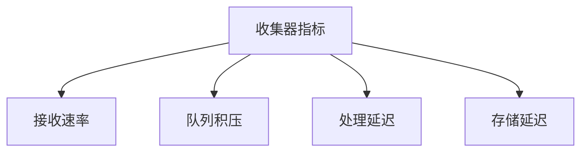

# 收集器性能优化

## 介绍

Zipkin的收集器（Collector）是分布式追踪系统的核心组件，负责接收、处理和存储追踪数据。随着系统规模扩大，收集器可能成为性能瓶颈。本章将介绍如何通过配置优化、存储策略调整和资源管理提升收集器的吞吐量与稳定性。

## 关键优化策略

### 1. 线程池与队列配置

Zipkin收集器默认使用异步处理模型，调整线程池参数可显著影响性能：

```properties
# 示例：Spring Boot配置（application.properties）
zipkin.collector.scribe.enabled=false
zipkin.collector.rabbitmq.concurrency=4      # 工作线程数
zipkin.collector.rabbitmq.queue-size=10000  # 任务队列容量
```

:::tip
根据服务器CPU核心数设置`concurrency`，通常建议为CPU核心数的1-2倍。
:::

### 2. 存储后端优化

#### Elasticsearch 批量写入
```java
// 示例：ES存储配置（通过Zipkin Server参数）
STORAGE_TYPE=elasticsearch
ES_HTTP_LOGGING=BASIC
ES_INDEX_SHARDS=3           // 分片数
ES_INDEX_REPLICAS=1         // 副本数
ES_BULK_SIZE=100            // 批量写入条数
ES_BULK_CONCURRENCY=2       // 并发批量请求数
```

#### MySQL 优化建议
```sql
-- 添加追踪数据表索引
ALTER TABLE zipkin_spans ADD INDEX (trace_id_high, trace_id);
ALTER TABLE zipkin_annotations ADD INDEX (trace_id_high, trace_id, span_id);
```

### 3. 采样率控制

通过采样减少数据量（适合高流量场景）：
```yaml
# 在Zipkin服务端配置采样率（10%采样）
zipkin.collector.sample-rate=0.1
```

## 性能监控与调优

### 监控指标


关键指标阈值建议：
- 队列使用率 >80% 需扩容
- 99%处理延迟 >500ms 需优化

## 实战案例

**电商平台优化案例**：
1. 问题：大促期间收集器CPU饱和，丢失20%数据
2. 解决方案：
   - 将ES批量写入从50调整到200
   - 增加收集器实例数（2→4）
   - 启用10%采样率
3. 结果：吞吐量提升3倍，零数据丢失

## 总结

优化收集器性能的关键步骤：
1. 合理配置线程池和队列
2. 根据存储后端特性调整批量操作
3. 实施适当的采样策略
4. 建立监控告警机制

## 扩展练习

1. 使用Docker部署Zipkin时，尝试通过环境变量调整`ES_BULK_SIZE`并观察性能变化
2. 使用JMeter模拟高负载，测试不同采样率下的系统表现

## 附加资源

- [Zipkin官方性能调优指南](https://zipkin.io/pages/performance.html)
- 《分布式系统观测》第5章（存储优化技巧）