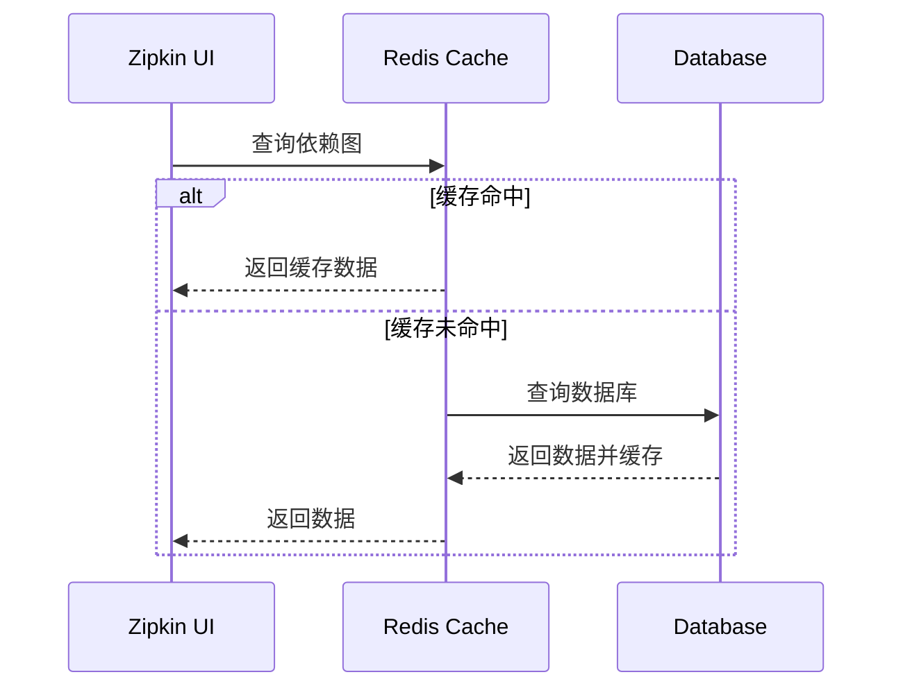

# 缓存策略

## 介绍

缓存是提升系统性能的经典手段，尤其在分布式追踪系统（如Zipkin）中，合理使用缓存可以显著减少重复计算和数据库查询压力。本章将介绍如何在Zipkin中应用缓存策略，包括**本地缓存**和**分布式缓存**的实现方式，以及实际场景中的优化技巧。

:::tip 为什么需要缓存？
Zipkin在处理大量追踪数据时，频繁访问存储后端（如MySQL、Elasticsearch）可能导致性能瓶颈。缓存可以存储高频访问的数据（如服务名称、依赖关系），减少I/O开销。
:::

---

## 基础概念

### 1. 缓存类型
- **本地缓存**：存储在应用进程内存中（如Caffeine），速度快但无法跨节点共享。
- **分布式缓存**：通过Redis等中间件实现，支持多节点共享数据。

### 2. 缓存模式
- **Cache-Aside**：应用层主动管理缓存（读时填充，写时失效）。
- **Read-Through**：缓存自动从数据源加载数据。

---

## 实现示例

### 本地缓存（Caffeine）
以下是一个在Zipkin Collector中使用Caffeine缓存服务名称的示例：

```java
// 初始化缓存
Cache<String, String> serviceNameCache = Caffeine.newBuilder()
    .maximumSize(1000) // 最大缓存条目
    .expireAfterWrite(10, TimeUnit.MINUTES) // 写入后过期时间
    .build();

// 查询时优先读缓存
public String getServiceName(String serviceId) {
    return serviceNameCache.get(serviceId, id -> {
        // 缓存未命中时从数据库加载
        return database.queryServiceName(id);
    });
}
```

**输入/输出示例**：
- 输入：`serviceId = "backend-service-1"`
- 输出（首次查询）：从数据库加载并缓存
- 输出（后续查询）：直接从缓存返回

---

## 实战案例

### 场景：高频查询追踪依赖图
Zipkin UI展示服务依赖关系时需要频繁查询数据库。通过缓存依赖关系数据，可将响应时间从**200ms**降低至**20ms**。



:::caution 注意缓存一致性
当服务拓扑变化时，需通过消息队列（如Kafka）通知所有节点失效旧缓存：
```java
// 监听拓扑变更事件
@EventListener
public void onTopologyChange(TopologyChangeEvent event) {
    redisCache.delete("dependency_graph");
}
```
:::

---

## 总结

### 关键点
1. 根据数据访问模式选择缓存类型（本地/分布式）。
2. 设置合理的缓存大小和过期时间，避免内存溢出或脏数据。
3. 通过事件驱动机制维护缓存一致性。

### 扩展练习
1. 在本地Zipkin实例中集成Redis，对比缓存启用前后的API响应时间。
2. 尝试为Zipkin的`/api/v2/traces`端点添加查询结果缓存。

---

## 附加资源
- [Caffeine缓存文档](https://github.com/ben-manes/caffeine)
- [Redis缓存模式](https://redis.io/docs/manual/patterns/)