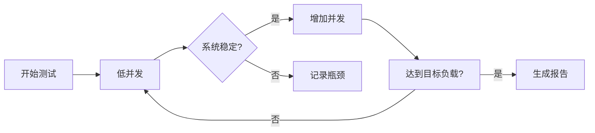

# 性能测试与基准

## 介绍

性能测试与基准是优化分布式追踪系统（如Zipkin）的关键步骤。通过模拟真实负载并测量系统响应，开发者可以识别瓶颈、验证优化效果，并确保系统在高并发场景下的稳定性。本章将介绍性能测试的基本概念、常用工具（如JMeter、Gatling），以及如何为Zipkin设计基准测试。

:::note 关键术语
- **性能测试**：模拟用户请求以评估系统行为。
- **基准（Benchmark）**：标准化测试，用于比较不同配置或版本的性能。
:::

---

## 为什么需要性能测试？

Zipkin作为分布式追踪系统，可能面临以下性能挑战：
1. **高吞吐量**：海量追踪数据的收集与存储。
2. **低延迟**：查询追踪链路时的响应速度。
3. **资源竞争**：CPU、内存或I/O成为瓶颈。

性能测试帮助开发者量化这些问题，并为优化提供数据支持。

---

## 性能测试工具

### 1. JMeter
Apache JMeter是开源的负载测试工具，适合模拟HTTP请求（如Zipkin的API）。

**示例：测试Zipkin查询接口**
```java
// JMeter脚本示例（通过HTTP Request采样器）
// 目标：模拟查询追踪链路的GET请求
HTTP Request:
- Server Name: localhost
- Port: 9411
- Path: /api/v2/trace/{traceId}
- Method: GET
```

### 2. Gatling
Gatling基于Scala的高性能工具，适合复杂场景测试。

**示例：模拟并发用户**
```scala
// Gatling脚本片段
setUp(
  scenario("Query Traces")
    .exec(http("Get Trace")
      .get("/api/v2/trace/123"))
    .inject(atOnceUsers(100)) // 模拟100并发用户
)
```

---

## 设计基准测试

### 步骤1：定义指标
- **吞吐量（TPS）**：每秒处理的请求数。
- **延迟（Latency）**：请求从发起到响应的耗时。
- **错误率**：失败请求的占比。

### 步骤2：配置测试环境
确保测试环境与生产环境一致（硬件、网络、Zipkin存储后端等）。

### 步骤3：执行测试
- **逐步增加负载**：观察系统性能拐点。
- **持续监控**：使用Prometheus或Zipkin自身收集数据。



---

## 实际案例：优化Zipkin存储层

**问题**：某团队发现Zipkin查询延迟随数据量增长而升高。<br />
**测试过程**：
1. 使用JMeter模拟1000次/秒的查询请求。
2. 对比不同存储后端（Elasticsearch vs MySQL）的延迟。
3. 发现Elasticsearch在数据量>1TB时延迟激增。

**优化方案**：
- 调整Elasticsearch分片策略。
- 添加缓存层（如Redis）。

**结果**：P99延迟从2s降至200ms。

---

## 总结

性能测试与基准是Zipkin优化的核心实践：
1. 选择合适工具（JMeter/Gatling）。
2. 明确指标（吞吐量、延迟、错误率）。
3. 模拟真实场景，逐步验证优化效果。

:::tip 附加练习
1. 使用JMeter测试Zipkin的`/api/v2/spans`接口的写入性能。
2. 对比内存存储（如In-Memory）与持久化存储的性能差异。
:::

**延伸阅读**：
- [Zipkin官方性能指南](https://zipkin.io/pages/performance.html)
- 《分布式系统：概念与设计》中的性能测试章节