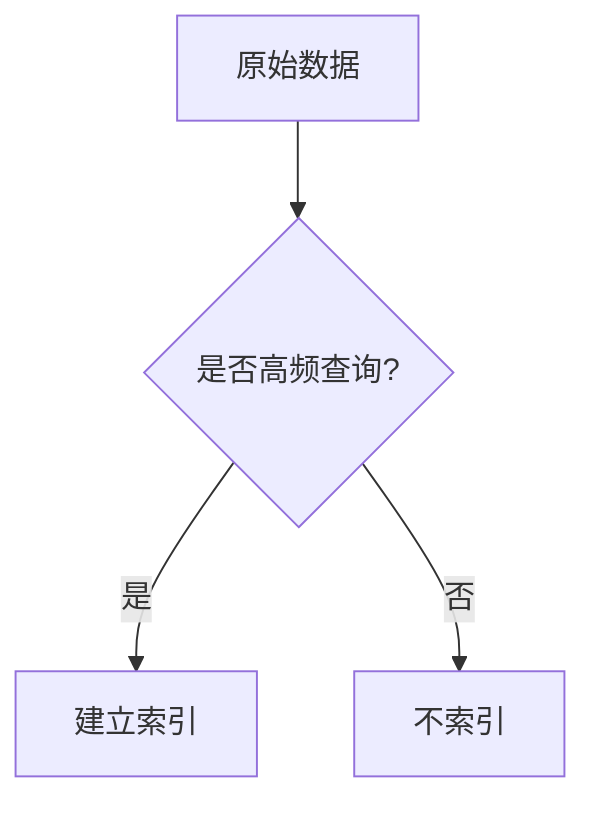

# Zipkin 存储性能优化

## 介绍

Zipkin是一个分布式跟踪系统，用于收集和可视化微服务架构中的请求链路数据。随着数据量的增长，存储性能可能成为瓶颈。本章将介绍如何优化Zipkin的存储性能，确保系统在高负载下仍能高效运行。

## 为什么需要存储性能优化？

Zipkin默认使用内存存储（In-Memory Storage），适合开发和测试环境。但在生产环境中，数据量可能迅速增长，导致：
- 查询延迟增加
- 存储空间不足
- 系统响应变慢

优化存储性能可以显著提升Zipkin的稳定性和查询效率。

---

## 存储后端选择

Zipkin支持多种存储后端，每种都有其优缺点：

### 1. 内存存储（默认）
```java
// 示例：Spring Boot配置内存存储
@Bean
public StorageComponent storage() {
    return InMemoryStorage.newBuilder().build();
}
```
**适用场景**：开发/测试环境，数据量小且无需持久化。

### 2. Elasticsearch
```yaml
# 示例：Zipkin服务器配置Elasticsearch
STORAGE_TYPE=elasticsearch
ES_HOSTS=http://localhost:9200
```
**优势**：
- 支持水平扩展
- 强大的全文搜索能力
- 适合大规模生产环境

### 3. Cassandra
```yaml
STORAGE_TYPE=cassandra
CASSANDRA_KEYSPACE=zipkin
CASSANDRA_CONTACT_POINTS=localhost
```
**优势**：
- 高写入吞吐量
- 线性可扩展性
- 适合高写入场景

:::tip 选择建议
- 中小规模：MySQL/PostgreSQL
- 大规模高写入：Cassandra
- 需要复杂查询：Elasticsearch
:::

---

## 性能优化策略

### 1. 数据分片与索引优化

对于Elasticsearch/Cassandra：
- **按时间分片**：将数据按天/周分片，便于冷热数据分离
- **优化索引字段**：只为常用查询字段建立索引



### 2. TTL（Time-To-Live）配置

设置合理的数据过期时间，避免存储无限增长：
```yaml
# Elasticsearch示例：设置30天过期
ES_INDEX_TTL=30d
```

### 3. 批量写入优化

调整批量写入参数（以Elasticsearch为例）：
```yaml
ES_PIPELINE=zipkin
ES_MAX_REQUESTS=50  # 并发请求数
ES_BULK_SIZE=100     # 每批文档数
```

---

## 实际案例

### 案例：电商平台优化追踪数据存储

**问题**：
- 日均1亿条span数据
- 查询延迟超过5秒
- 存储成本每月$3000+

**解决方案**：
1. 从MySQL迁移到Elasticsearch集群（3节点）
2. 按天分片索引
3. 设置15天TTL
4. 优化索引字段（仅索引traceId/serviceName）

**结果**：
- 查询延迟降至200ms内
- 存储成本降低60%
- 系统稳定性显著提升

---

## 总结

优化Zipkin存储性能的关键点：
1. **选择合适的存储后端**：根据数据规模和查询需求
2. **合理配置TTL**：平衡历史数据需求和存储成本
3. **优化索引策略**：提升查询效率
4. **调整批量写入参数**：提高写入吞吐量

---

## 延伸学习

### 推荐练习
1. 在本地Docker环境部署Zipkin+Elasticsearch
2. 使用JMeter模拟高负载，观察不同配置下的性能差异
3. 尝试为你的业务场景设计分片策略

### 进一步阅读
- [Zipkin官方存储文档](https://zipkin.io/pages/storage.html)
- [Elasticsearch性能调优指南](https://www.elastic.co/guide)
- [Cassandra数据建模最佳实践](https://cassandra.apache.org/doc/)