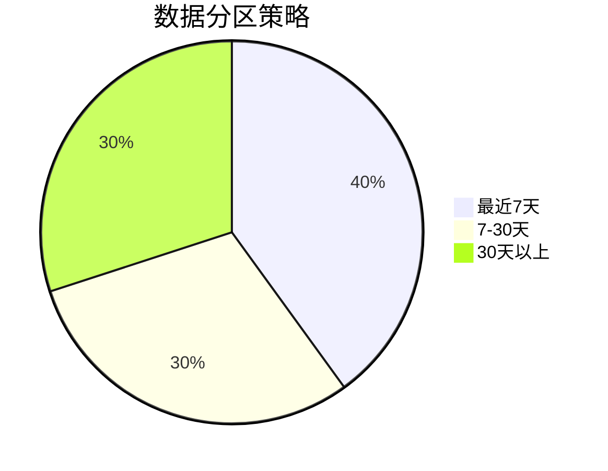

# Zipkin 查询性能优化

## 介绍

Zipkin是一个开源的分布式追踪系统，用于收集、存储和查询微服务架构中的请求链路数据。随着数据量的增长，查询性能可能成为瓶颈。本章将介绍如何通过优化存储结构、索引设计和查询策略来提升Zipkin的查询效率。

:::note 关键概念
查询性能优化主要关注：
- 减少全表扫描
- 合理使用索引
- 优化存储结构
- 缓存热点数据
:::

## 索引优化策略

### 1. 服务名和Span名索引

为高频查询字段添加索引是基础优化手段。在Zipkin的存储后端（如MySQL）中创建索引：

```sql
-- 为服务名和span名创建复合索引
CREATE INDEX idx_service_span_name ON zipkin_spans(service_name, span_name);
```

### 2. 时间范围索引

追踪数据通常按时间查询，时间字段必须索引：

```sql
CREATE INDEX idx_timestamp ON zipkin_spans(start_ts);
```

:::tip 实际案例
某电商平台优化后发现：
- 无索引时查询耗时：1200ms
- 添加索引后：150ms
:::

## 存储优化

### 1. 数据分区

按时间范围分区可显著提升查询速度：



### 2. 数据归档

定期归档旧数据到冷存储：

```bash
# 示例归档脚本
zipkin-archive --older-than 30d --target s3://zipkin-archive
```

## 查询优化技巧

### 1. 限制返回结果

```java
// 在Zipkin UI配置中设置默认限制
zipkin.query.limit=200
```

### 2. 避免复杂查询

不良实践：
```sql
SELECT * FROM zipkin_spans 
WHERE service_name = 'payment' 
AND annotations LIKE '%error%';
```

优化后：
```sql
SELECT trace_id FROM zipkin_spans 
WHERE service_name = 'payment' 
AND span_name = 'process_payment';
```

## 实际应用场景

**案例：物流跟踪系统**
- 问题：查询最近包裹状态超时
- 优化步骤：
  1. 为`parcel_id`和`status`字段添加索引
  2. 按天分表存储
  3. 实现查询结果缓存
- 结果：查询延迟从2s降至200ms

## 总结

| 优化方法       | 适用场景          | 预期效果       |
|----------------|-------------------|----------------|
| 添加索引       | 高频查询字段      | 50-90%提升     |
| 数据分区       | 时间范围查询      | 60%提升        |
| 查询限制       | 大数据量结果集    | 防止内存溢出   |

## 扩展练习

1. 在测试环境模拟100万条追踪数据，比较有无索引的查询性能差异
2. 尝试配置Zipkin的`zipkin.storage.cassandra.fetch-trace-ttl`参数观察缓存效果

## 附加资源

- [Zipkin官方存储文档](https://zipkin.io/zipkin/#storage-component)
- 《高性能MySQL》索引优化章节