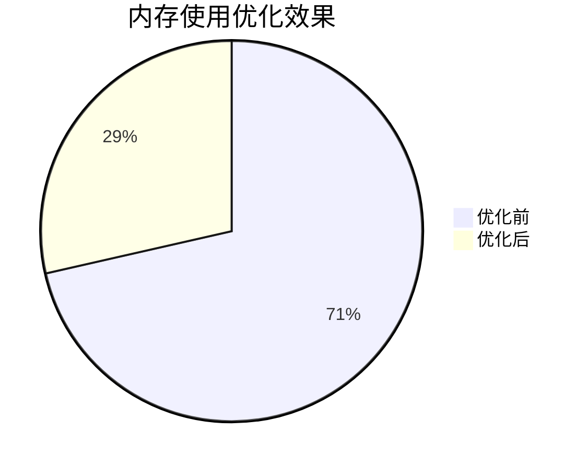

# Zipkin 内存使用优化

## 介绍

在分布式系统中，Zipkin 是一个广泛使用的追踪工具，用于收集、存储和分析请求链路数据。随着系统规模的扩大，Zipkin 的内存使用可能成为性能瓶颈。本章将介绍如何优化 Zipkin 的内存使用，确保其高效运行。

内存优化主要涉及以下几个方面：
1. **合理配置存储后端**：选择合适的存储后端（如 Elasticsearch、MySQL 或 Cassandra）以减少内存压力。
2. **调整采样率**：通过采样减少追踪数据的数量。
3. **优化 Span 数据**：减少单个 Span 的内存占用。
4. **垃圾回收调优**：优化 JVM 垃圾回收策略。

---

## 1. 合理配置存储后端

Zipkin 支持多种存储后端，不同的后端对内存的需求不同。以下是一些常见的选择：

- **Elasticsearch**：适合大规模数据，但需要合理配置分片和副本。
- **Cassandra**：适合高写入场景，但需要优化压缩策略。
- **MySQL**：适合小规模部署，但性能有限。

:::tip
对于生产环境，推荐使用 Elasticsearch 或 Cassandra，因为它们能够更好地处理高吞吐量的追踪数据。
:::

---

## 2. 调整采样率

采样是减少内存使用的有效方法。通过只收集部分请求的追踪数据，可以显著降低内存和存储压力。

### 示例：配置采样率
在 Zipkin 的配置文件中（如 `application.properties`），可以设置采样率：

```properties
# 设置采样率为 10%
spring.zipkin.sampler.rate=0.1
```

:::note
采样率需要根据实际业务需求调整。过高的采样率会增加内存压力，而过低的采样率可能导致重要数据丢失。
:::

---

## 3. 优化 Span 数据

Span 是 Zipkin 中的基本追踪单元，包含以下信息：
- Trace ID
- Span ID
- 操作名称
- 时间戳
- 标签（Tags）和日志（Logs）

通过减少 Span 中的冗余数据，可以降低内存占用。

### 示例：精简 Span 数据
以下是一个 Span 的 JSON 示例，展示了如何减少不必要的标签：

```json
{
  "traceId": "a1b2c3d4e5f6",
  "id": "1",
  "name": "get-user",
  "timestamp": 1620000000000,
  "duration": 100,
  "tags": {
    "http.method": "GET",
    "http.path": "/user/123"
  }
}
```

:::caution
避免在标签中添加大量冗余信息（如完整的请求体），这会显著增加内存使用。
:::

---

## 4. 垃圾回收调优

Zipkin 通常运行在 JVM 上，因此垃圾回收（GC）策略对内存使用有很大影响。以下是一些优化建议：

### 推荐 JVM 参数
```bash
# 使用 G1 垃圾回收器
JAVA_OPTS="-XX:+UseG1GC -Xms2g -Xmx2g -XX:MaxGCPauseMillis=200"
```

:::warning
根据实际内存需求调整 `-Xms` 和 `-Xmx` 参数。过小的堆内存会导致频繁 GC，而过大的堆内存可能引发长时间停顿。
:::

---

## 实际案例

### 案例：电商平台的 Zipkin 优化
某电商平台发现 Zipkin 内存使用过高，导致服务不稳定。通过以下优化措施，内存使用降低了 60%：
1. 将采样率从 100% 调整为 20%。
2. 将存储后端从 MySQL 迁移到 Elasticsearch。
3. 精简 Span 数据，移除不必要的标签。
4. 调整 JVM 参数，使用 G1 垃圾回收器。

优化前后对比：


---

## 总结

Zipkin 的内存优化是一个多方面的过程，涉及存储后端选择、采样率调整、Span 数据精简和 JVM 调优。通过合理配置，可以显著提升 Zipkin 的性能和稳定性。

### 附加资源
1. [Zipkin 官方文档](https://zipkin.io/)
2. [Elasticsearch 性能调优指南](https://www.elastic.co/guide/en/elasticsearch/reference/current/tune-for-indexing-speed.html)
3. [JVM 垃圾回收优化](https://docs.oracle.com/en/java/javase/11/gctuning/)

### 练习
1. 尝试在你的 Zipkin 实例中调整采样率，观察内存使用变化。
2. 使用 JVM 参数调优工具（如 `jstat`）监控 GC 行为。