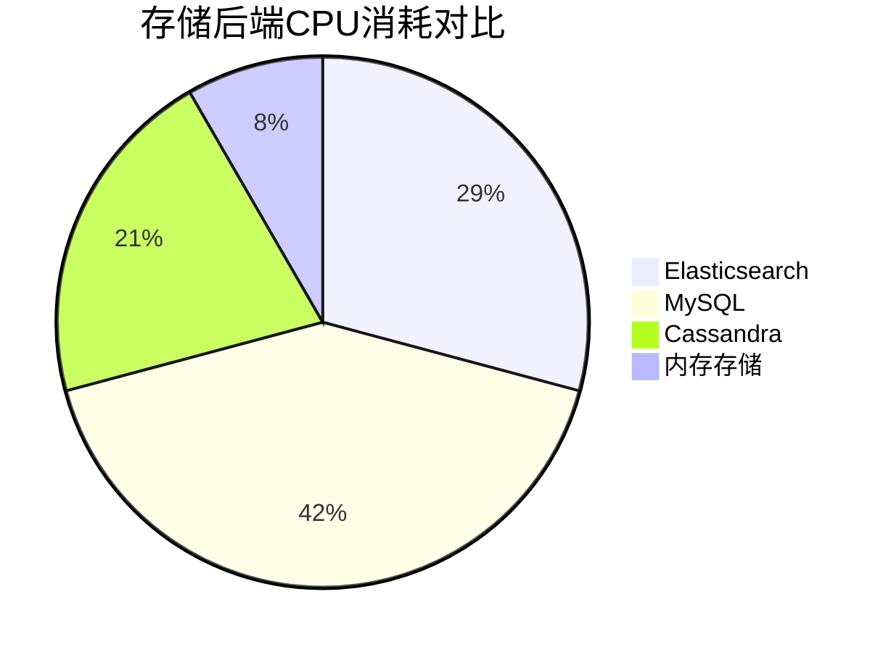

# CPU使用优化

## 简介

在分布式追踪系统中，Zipkin作为核心组件之一，其CPU使用率直接影响整体性能。当处理高吞吐量的追踪数据时，不合理的CPU配置可能导致响应延迟或资源浪费。本章将介绍如何通过配置调整、采样策略和代码优化来降低Zipkin的CPU负载，适合刚接触性能优化的开发者。

---

## 核心优化策略

### 1. 采样率调整
通过降低非关键路径的追踪数据采集频率，显著减少CPU计算压力。

```java
// 示例：在Spring Cloud Sleuth中设置采样率为10%
spring.sleuth.sampler.probability=0.1
```

:::tip
采样率选择建议：
- 生产环境：10%-30%
- 调试环境：100%
- 高压场景：动态采样（如根据请求QPS自动调整）
:::

### 2. 存储后端优化
不同的存储后端对CPU的影响差异显著：



### 3. 异步处理配置
启用异步Span处理避免阻塞主线程：

```yaml
# zipkin-server配置示例
zipkin:
  collector:
    worker:
      threads: 4  # 根据CPU核心数调整
      queue-size: 1000
```

---

## 实际案例

### 电商平台优化实践
某电商平台在促销期间出现Zipkin CPU满载问题，通过以下步骤解决：

1. **问题诊断**：
   - 使用 `top -H` 发现`SpanProcessor`线程CPU占用90%+
   - 日志显示每秒处理10,000+ spans

2. **解决方案**：
   ```java
   // 添加基于优先级的采样
   @Bean
   public Sampler smartSampler() {
     return new Sampler() {
       @Override
       public boolean isSampled(long traceId) {
         return traceId % 10 == 0; // 10%基础采样
       }
     };
   }
   ```

3. **效果**：
   - CPU使用率从95%降至40%
   - 关键业务链路仍保持100%采样

---

## 高级技巧

### JVM调优参数
```bash
# 推荐JVM启动参数
JAVA_OPTS="-XX:+UseG1GC \
           -XX:MaxGCPauseMillis=200 \
           -XX:ParallelGCThreads=4 \
           -XX:ConcGCThreads=2"
```

:::caution
避免过度配置GC线程：
- 建议GC线程数不超过物理核心的1/4
- 监控`jstat -gcutil`确认效果
:::

---

## 总结

关键优化手段：
1. 合理设置采样率平衡监控精度与性能
2. 选择CPU友好的存储后端
3. 利用异步处理机制分解计算压力
4. 配合JVM参数进行系统级调优

## 延伸练习
1. 使用`micrometer`监控Zipkin的CPU使用率
2. 对比不同采样策略对CPU的影响
3. 尝试用`async-profiler`生成火焰图分析热点

## 附加资源
- [Zipkin官方性能指南](https://zipkin.io/pages/performance.html)
- 《分布式系统观测》第5章
- OpenTelemetry采样策略白皮书