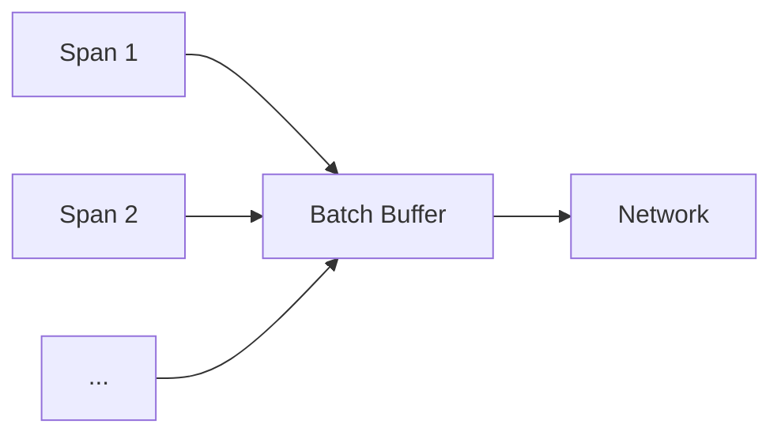

## 简介

在分布式系统中，Zipkin作为链路追踪工具，会收集大量跨度（Span）数据并通过网络传输。网络带宽是影响Zipkin性能的关键因素之一，尤其是在高流量场景下。本章将介绍如何通过采样、数据压缩和传输优化等技术减少网络带宽消耗。

:::note
**关键概念**：网络带宽优化旨在减少Zipkin数据传输量，同时确保关键追踪信息不丢失。
:::

---

## 1. 采样策略（Sampling）

### 基础原理
采样是减少数据传输量的最直接方式。Zipkin支持以下采样策略：
- **固定速率采样**：按固定比例（如10%）收集跨度。
- **动态采样**：根据系统负载或业务重要性调整采样率。

### 代码示例
通过`Brave`（Zipkin的Java客户端）配置采样率：

```java
// 设置10%的采样率
Sampler sampler = CountingSampler.create(0.1);
Tracing.newBuilder()
       .localServiceName("my-service")
       .sampler(sampler)
       .build();
```

:::tip
**实际场景**：在电商系统中，对支付链路使用100%采样，而对商品浏览链路使用1%采样。
:::

---

## 2. 数据压缩

### Gzip压缩
启用HTTP传输时的Gzip压缩，减少带宽占用。

#### 示例（Spring Boot配置）：
```yaml
# application.yml
spring:
  zipkin:
    sender:
      type: web
    compression:
      enabled: true  # 启用Gzip压缩
```

#### 压缩效果对比
| 数据量（原始） | 压缩后 | 节省带宽 |
|----------------|--------|----------|
| 1 MB           | 200 KB | 80%      |

---

## 3. 批量传输（Batching）

### 原理
将多个跨度合并为一个批次发送，减少HTTP请求次数。

#### Brave批量配置
```java
sender = OkHttpSender.create("http://zipkin:9411/api/v2/spans");
// 每10秒或积攒100个跨度时发送
sender = AsyncReporter.create(sender);
```



---

## 4. 元数据精简

### 优化建议
- **移除冗余标签**：如重复的环境变量。
- **缩短字段名**：将`user.session.id`改为`uid`（需确保团队共识）。

### 示例
优化前：
```json
{
  "tags": {
    "environment": "production",
    "user.session.id": "12345"
  }
}
```
优化后：
```json
{
  "tags": {
    "env": "prod",
    "uid": "12345"
  }
}
```

---

## 实际案例：在线游戏平台

### 问题
- 高峰期每日产生10亿条跨度，带宽成本激增。
- 关键战斗逻辑追踪被淹没在低优先级数据中。

### 解决方案
1. 对匹配服务启用**动态采样**（负载高时降至5%）。
2. 对战局服务启用**Gzip压缩**，节省70%带宽。
3. 移除玩家设备型号等非关键标签。

---

## 总结

| 技术            | 适用场景                  | 预期效果         |
|-----------------|---------------------------|------------------|
| 采样策略        | 高流量系统                | 减少50%-95%数据  |
| 数据压缩        | 所有HTTP传输              | 节省50%-80%带宽 |
| 批量传输        | 高频小跨度场景            | 降低请求次数     |
| 元数据精简      | 标签冗余严重的系统        | 减少10%-30%体积 |

---

## 扩展练习
1. 在本地Zipkin中配置Gzip压缩，对比传输前后的数据大小。
2. 尝试为不同服务设置差异化采样率（如核心服务100%，辅助服务1%）。

## 附加资源
- [Zipkin官方文档：性能调优](https://zipkin.io/pages/tuning.html)
- 《分布式系统观测》Chapter 7（带宽优化专题）