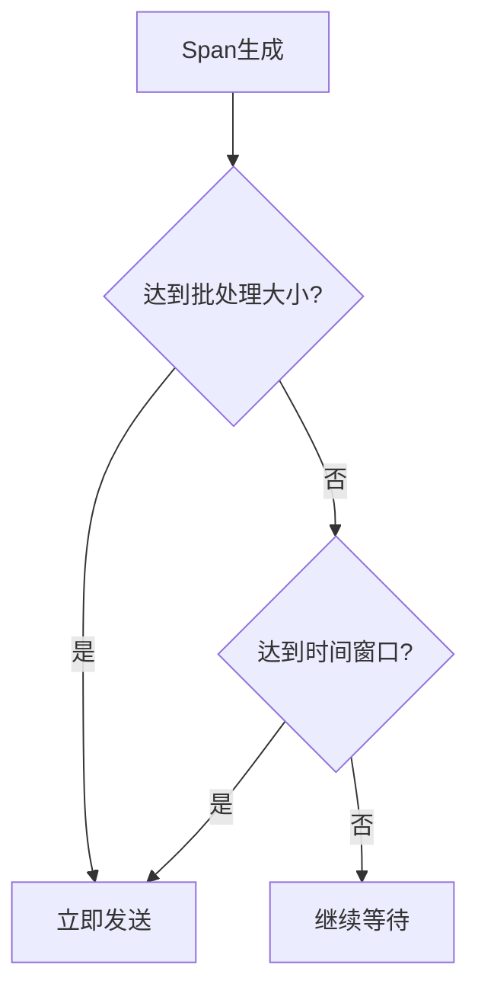

# 批处理策略优化

## 介绍

在分布式系统中，Zipkin作为链路追踪工具，会收集大量细粒度的追踪数据。如果每条数据都单独发送到Zipkin服务器，会导致高频的网络请求，增加系统负载并降低性能。批处理策略通过将多条追踪数据合并为单个请求发送，显著减少网络开销和服务器压力。

批处理的核心思想是：**将多个操作合并为一次批量操作**。在Zipkin中，这通常体现在以下场景：
1. 客户端将多个span数据打包后发送
2. 服务端批量存储接收到的数据
3. 批量压缩传输数据

## 基础原理

批处理策略主要涉及三个关键参数：

1. **批处理大小（Batch Size）**：每次批量发送的span数量
2. **时间窗口（Time Window）**：等待填充批次的最大时间
3. **并发限制（Concurrency Limit）**：并行发送的批处理请求数



## 实现方式

### 1. 使用Zipkin Reporter配置

Zipkin的Java客户端通常通过`Reporter`接口实现批处理。以下是使用`AsyncReporter`的示例：

```java
// 创建发送器（这里使用HTTP发送到Zipkin服务器）
Sender sender = OkHttpSender.create("http://localhost:9411/api/v2/spans");

// 配置异步批处理报告器
AsyncReporter<Span> reporter = AsyncReporter.builder(sender)
    .closeTimeout(5000, TimeUnit.MILLISECONDS) // 关闭超时
    .messageTimeout(1000, TimeUnit.MILLISECONDS) // 消息超时
    .queuedMaxSpans(1000) // 队列中最大span数
    .queuedMaxBytes(10 * 1024 * 1024) // 队列最大字节数(10MB)
    .build();
```

### 2. 关键参数调优

:::tip 参数建议
- **生产环境推荐值**：
  - 批处理大小：50-100个span
  - 时间窗口：1-5秒
  - 并发请求：不超过CPU核心数的2倍
:::

## 实际案例

### 电商系统优化案例

某电商平台在促销期间出现Zipkin服务器过载，通过以下批处理优化解决了问题：

1. **原始情况**：
   - 每秒10,000+ span
   - 每个span单独发送
   - Zipkin服务器CPU使用率90%+

2. **优化后**：
   ```java
   AsyncReporter.builder(sender)
       .queuedMaxSpans(200)
       .messageTimeout(2000, TimeUnit.MILLISECONDS)
       .build();
   ```
   - 批量大小设置为200
   - 超时时间2秒
   - 网络请求减少98%
   - CPU使用率降至40%

## 高级优化技巧

### 1. 动态批处理大小

根据系统负载动态调整批处理大小：

```java
// 伪代码示例
int dynamicBatchSize = calculateDynamicBatchSize(currentSystemLoad);
reporter.updateBatchSize(dynamicBatchSize);
```

### 2. 优先级批次

对关键业务span设置更高优先级，减少其批处理等待时间：

```java
// 使用Brave的优先级支持
reporter.addPrioritySampler(
    span -> "checkout".equals(span.name()) ? 1 : 0
);
```

## 注意事项

:::caution 潜在问题
1. **数据延迟**：批处理会导致追踪数据有轻微延迟
2. **内存占用**：大批次会消耗更多客户端内存
3. **数据丢失风险**：进程崩溃时，未发送批次会丢失
:::

## 总结

批处理策略是优化Zipkin性能的重要手段，通过合理配置可以：
- 显著减少网络请求数量
- 降低服务器负载
- 提高整体系统吞吐量

关键是要根据实际业务场景找到批处理大小和时间窗口的最佳平衡点。

## 扩展练习

1. 在你的开发环境中配置不同的批处理参数，观察性能变化
2. 尝试实现一个简单的动态批处理大小调整算法
3. 模拟高负载场景，测试不同配置下的系统表现

## 附加资源

- [Zipkin官方性能调优指南](https://zipkin.io/pages/performance.html)
- [Brave异步报告器源码](https://github.com/openzipkin/brave/tree/master/brave)
- [分布式追踪系统设计模式](https://microservices.io/patterns/observability/distributed-tracing.html)