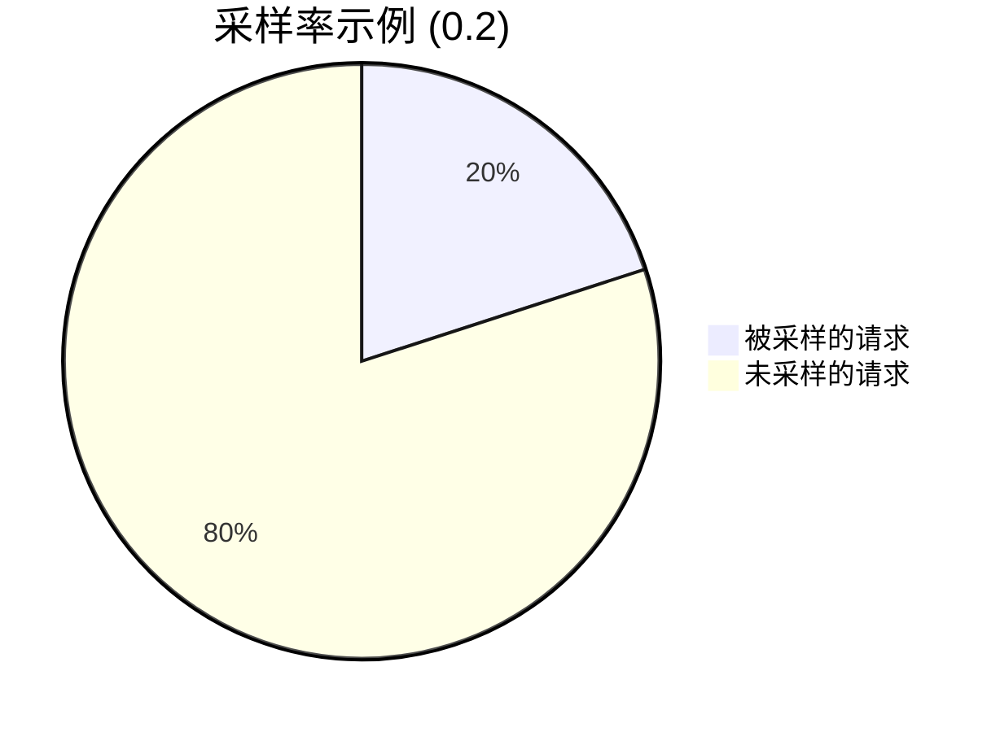
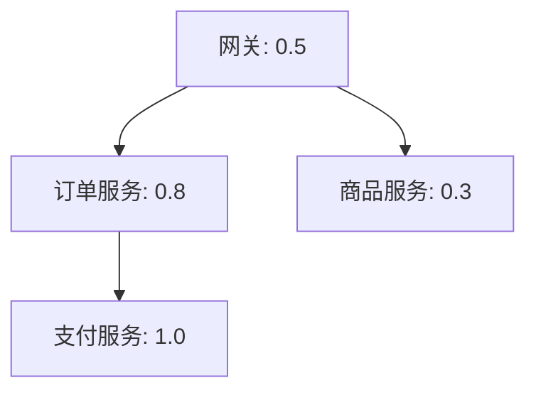

## 介绍

采样率调优是分布式追踪系统中的关键性能优化手段。在Zipkin中，采样率决定了哪些请求的追踪数据会被收集和存储。合理设置采样率可以：

- 减少不必要的资源消耗（CPU、内存、存储）
- 在高流量场景下保持系统稳定
- 同时仍能保留有代表性的追踪数据

## 采样率基础概念

采样率是一个介于0和1之间的值：
- `1.0` 表示收集100%的请求数据
- `0.1` 表示收集10%的请求数据



## 采样策略类型

Zipkin支持多种采样策略：

1. **恒定采样**：固定比例采样
2. **速率限制采样**：基于每秒请求数的采样
3. **自适应采样**：根据系统负载动态调整

## 配置示例

### 1. 恒定采样配置

在Spring Boot应用中配置恒定采样率：

```java
@Configuration
public class ZipkinConfig {
    @Bean
    public Sampler defaultSampler() {
        // 设置采样率为50%
        return Sampler.create(0.5);
    }
}
```

### 2. 环境变量配置

通过环境变量设置采样率：
```bash
export SPRING_ZIPKIN_SAMPLER_RATE=0.1
```

:::note
采样率设置应在所有服务间保持一致，否则可能导致追踪链路不完整。
:::

## 采样率调优实践

### 调优步骤

1. **基准测试**：在测试环境监控不同采样率下的性能表现
2. **逐步调整**：从高采样率(如1.0)开始，逐步降低
3. **监控效果**：观察存储用量和系统负载变化
4. **验证数据**：确保关键业务请求仍被充分采样

### 实际案例

某电商平台在促销期间采用以下采样策略：

```java
Sampler createDynamicSampler() {
    // 平时采样率30%，大促期间降为5%
    return isPromotionPeriod() ? Sampler.create(0.05) : Sampler.create(0.3);
}
```

:::tip
对于关键业务路径(如支付流程)，可考虑保持较高采样率，而静态资源请求可设置更低采样率。
:::

## 高级技巧

### 分层采样

对不同服务设置不同采样率：



### 基于错误率的采样

自动提高错误请求的采样率：

```java
Sampler createErrorAwareSampler() {
    return new Sampler() {
        @Override
        public boolean isSampled(long traceId) {
            if (currentErrorRate() > 0.1) {
                return Math.random() < 0.8; // 错误率高时增加采样
            }
            return Math.random() < 0.2;
        }
    };
}
```

## 总结

采样率调优需要在数据完整性和系统性能间寻找平衡点。关键要点：

- 从保守的采样率开始(如0.1)，逐步调整
- 对关键业务路径保持较高采样率
- 监控采样效果，确保不会遗漏重要问题
- 考虑实现动态采样策略以适应不同场景

## 延伸学习

- Zipkin官方文档中的采样率配置指南
- 分布式追踪系统中的自适应采样论文
- 实践练习：在本地环境测试不同采样率下的系统表现

:::caution
采样率过低可能导致问题排查困难，建议生产环境不低于0.01(1%)。
:::