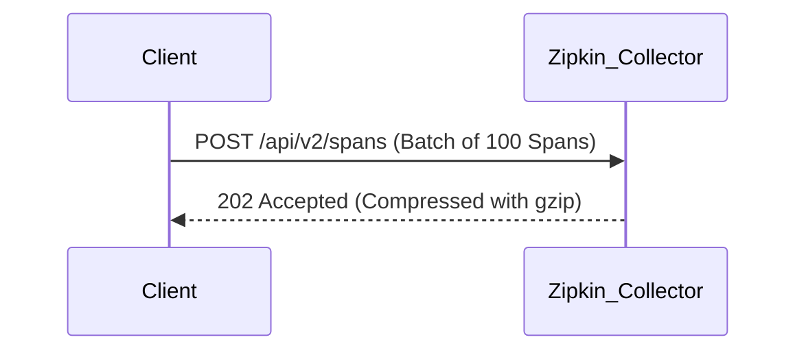

# 数据压缩策略

## 介绍

在分布式追踪系统（如Zipkin）中，数据压缩是优化性能的关键策略之一。通过压缩追踪数据，可以减少网络传输带宽占用、降低存储成本，并提升系统整体吞吐量。本文将介绍Zipkin中常用的数据压缩方法、实现原理及实际应用场景。

:::note 为什么需要数据压缩？
- **网络传输**：减少跨服务通信的数据量。
- **存储效率**：降低Span数据在数据库中的占用空间。
- **查询性能**：压缩后的数据能更快地被检索和处理。
:::

---

## 基础压缩技术

### 1. 通用压缩算法
Zipkin支持通过HTTP请求头（如`Content-Encoding: gzip`）启用通用压缩算法。以下是常见算法的对比：

| 算法      | 压缩率 | 速度  | 适用场景               |
|-----------|--------|-------|------------------------|
| `gzip`    | 中高   | 中等  | HTTP传输、日志存储     |
| `deflate` | 中     | 快    | 实时数据传输          |
| `zstd`    | 高     | 快    | 高吞吐量系统          |

**示例：在Spring Boot中启用Gzip压缩**
```java
// application.yml
server:
  compression:
    enabled: true
    mime-types: application/json
    min-response-size: 1KB
```

---

### 2. Span数据专用优化
Zipkin的Span数据通常是JSON格式，可通过以下方式优化：

#### a) 字段裁剪
移除冗余字段（如重复的`serviceName`）：
```json
// 压缩前
{"traceId": "a1b2", "name": "query", "localEndpoint": {"serviceName": "frontend"}}

// 压缩后（通过Zipkin Collector处理）
{"traceId": "a1b2", "name": "query", "localEndpoint": "frontend"}
```

#### b) 数值编码
将字符串类型的ID（如`traceId`）转换为数值：
```python
# Python示例：将16进制traceId转为整数
trace_id = int("a1b2c3d4", 16)  # 输出: 2712847316
```

---

## 高级策略

### 3. 批量压缩
通过批量发送Span数据减少请求次数，结合`gzip`压缩效果更佳：



**Kafka传输配置示例**：
```yaml
# Zipkin Kafka配置
zipkin:
  collector:
    kafka:
      topic: zipkin
      compression: gzip
      max-request-size: 1MB
```

---

## 实际案例

### 案例：电商平台的追踪优化
一个日均处理10亿Span的电商平台通过以下步骤降低30%存储成本：
1. **启用字段裁剪**：移除`kind`、`shared`等非必要字段。
2. **采用zstd压缩**：Kafka消息压缩算法从`snappy`切换到`zstd`。
3. **批量提交**：将单次提交的Span数量从50提升到200。

---

## 总结与练习

### 总结
- **基础压缩**：优先启用HTTP层的`gzip/deflate`。
- **数据优化**：裁剪字段、数值编码减少体积。
- **批量处理**：结合消息队列（如Kafka）批量压缩传输。

### 练习
1. 在本地Zipkin中启用`gzip`压缩并对比传输前后的数据大小。
2. 尝试用Python脚本将Span JSON中的`traceId`转换为数值存储。
3. （高级）配置Kafka Producer使用`zstd`压缩并监控CPU开销变化。

:::tip 扩展阅读
- [Zipkin官方文档：数据存储优化](https://zipkin.io/pages/storage.html)
- 《数据压缩入门》Chapter 4: JSON压缩技术
:::