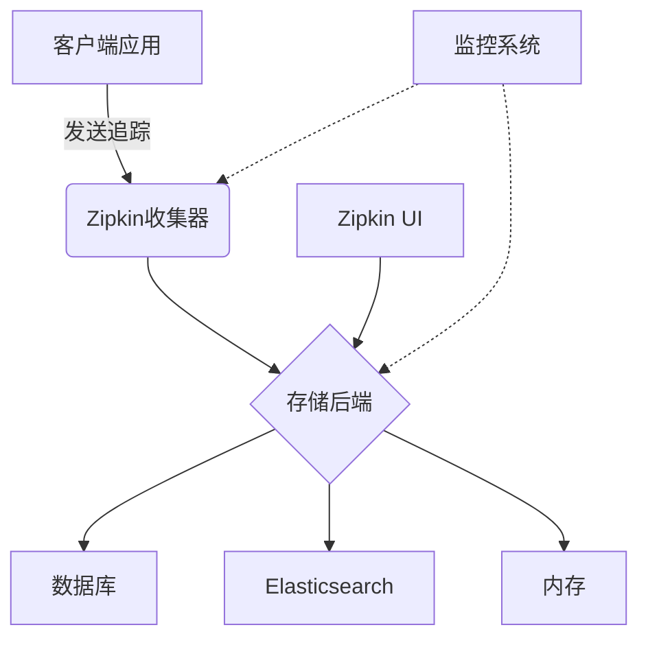

# Zipkin 服务器故障排除

## 介绍

Zipkin 是一个分布式追踪系统，用于收集和分析微服务架构中的请求链路数据。当 Zipkin 服务器出现问题时，可能导致追踪数据丢失或无法访问。本指南将帮助你识别和解决常见的服务器故障。

## 常见问题及解决方案

### 1. Zipkin 服务器无法启动

**症状**：执行启动命令后，服务器立即退出或报错。

**可能原因**：
- 端口被占用
- 依赖服务（如数据库）未运行
- 配置错误

**检查步骤**：

1. 检查端口占用情况：
```bash
# Linux/macOS
lsof -i :9411

# Windows
netstat -ano | findstr 9411
```

2. 验证存储后端连接：
```bash
# 示例：检查MySQL连接
mysql -h your_mysql_host -u zipkin_user -p
```

3. 查看日志获取详细错误：
```bash
# 默认日志位置
tail -f zipkin-server.log
```

**解决方案**：
- 释放被占用的端口或修改 Zipkin 监听端口
- 确保依赖服务正常运行
- 检查 `application.yml` 或环境变量配置

### 2. 数据收集失败

**症状**：客户端应用显示追踪数据已发送，但 Zipkin UI 中无数据显示。

**诊断方法**：

1. 检查 Zipkin 收集器状态：
```bash
curl -X GET http://localhost:9411/health
```

2. 验证客户端配置：
```properties
# Spring Boot 示例配置
spring.zipkin.base-url=http://your-zipkin-host:9411
spring.zipkin.sender.type=web
```

3. 检查网络连接：
```bash
telnet your-zipkin-host 9411
```

### 3. 性能问题

**症状**：UI 响应缓慢，查询超时。

**优化建议**：

1. 调整存储配置：
```yaml
# 示例：Elasticsearch 配置
zipkin.storage.type: elasticsearch
zipkin.storage.elasticsearch.hosts: http://es-host:9200
zipkin.storage.elasticsearch.index-shards: 5
zipkin.storage.elasticsearch.index-replicas: 1
```

2. 增加 JVM 内存：
```bash
java -jar zipkin-server.jar --zipkin.collector.rabbitmq.addresses=amqp://localhost \
     -Xms2g -Xmx2g
```

## 实际案例

**案例**：某电商平台在促销期间 Zipkin 服务器崩溃

**问题分析**：
- 高峰时段追踪数据量激增
- 默认内存配置不足
- Elasticsearch 查询超时

**解决方案**：
1. 增加 Zipkin 服务器资源
2. 优化 Elasticsearch 索引配置
3. 实施采样率控制：
```java
// Brave 采样率配置
Sampler sampler = CountingSampler.create(0.5f); // 50%采样
tracingBuilder.sampler(sampler);
```

## 监控与告警

建议设置以下监控指标：
- 存储后端连接状态
- 请求处理延迟
- JVM 内存使用情况
- 收集的追踪数量



## 总结

Zipkin 服务器故障通常涉及：
1. 配置问题
2. 资源不足
3. 依赖服务故障
4. 网络连接问题

通过系统化的排查方法，可以快速定位和解决问题。

## 附加资源

- [Zipkin 官方故障排除指南](https://zipkin.io/pages/troubleshooting.html)
- [Spring Cloud Sleuth 常见问题](https://docs.spring.io/spring-cloud-sleuth/docs/current/reference/html/)
- [分布式追踪最佳实践](https://opentracing.io/docs/best-practices/)

**练习**：
1. 模拟端口冲突场景并解决
2. 配置一个高可用 Zipkin 集群
3. 实现自动化的健康检查脚本