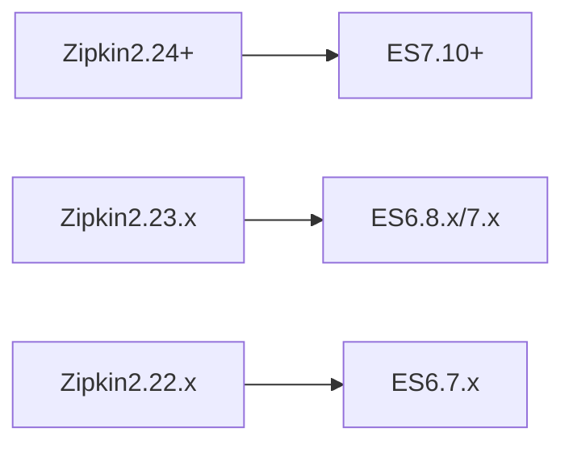

# 版本兼容性问题

## 介绍

在分布式系统中，Zipkin 作为链路追踪工具，需要与多种组件（如 Spring Boot、OpenTelemetry、Kafka 等）协同工作。不同版本之间的兼容性问题可能导致追踪数据丢失、服务崩溃或功能异常。本章将帮助你理解版本兼容性的核心问题，并提供实用的排查和解决方法。

:::note 为什么版本兼容性重要？
Zipkin 的客户端库（如 Brave）、存储后端（如 Elasticsearch）和传输方式（如 HTTP/Kafka）的版本必须相互兼容，否则系统可能无法正常工作。
:::

---

## 常见兼容性问题场景

### 1. 客户端与服务器版本不匹配
当 Zipkin 客户端（如 `brave-instrumentation-http`）的版本远高于或低于 Zipkin 服务器时，可能出现数据格式解析错误。

**示例错误日志**：
```
java.lang.IllegalArgumentException: Expected a string but was BEGIN_OBJECT at line 1 column 55
```

**解决方案**：
检查客户端和服务器的版本对应关系。例如：
- Zipkin 服务器 `2.23.x` → Brave 客户端 `5.13.x`
- Zipkin 服务器 `2.24+` → Brave 客户端 `5.14+`

---

### 2. 存储后端兼容性
Zipkin 支持的存储后端（如 Elasticsearch）有严格的版本要求。

**Elasticsearch 兼容表**：


:::warning 注意
如果使用 Elasticsearch 8.x，必须配置 `ZIPKIN_ES_HTTPS=true` 并启用 TLS。
:::

---

### 3. 传输协议变更
Kafka 传输从 Zipkin 2.23 开始使用新格式，旧版消费者可能无法解析。

**配置示例**：
```properties
# Zipkin 2.23+ 的 Kafka 生产者配置
spring.kafka.producer.value-serializer=org.apache.kafka.common.serialization.ByteArraySerializer
zipkin.kafka.topic=zipkin
zipkin.kafka.message.max.bytes=1000000
```

---

## 实际案例

### 案例：Spring Cloud Sleuth 版本冲突
一个 Spring Boot 2.6 项目使用 `spring-cloud-starter-sleuth:3.1.0`（依赖 Brave 5.13.x），但 Zipkin 服务器版本为 2.24.0，导致 Span 数据无法显示。

**解决方法**：
1. 升级 Sleuth 版本以匹配 Zipkin：
```xml
<dependency>
    <groupId>org.springframework.cloud</groupId>
    <artifactId>spring-cloud-starter-sleuth</artifactId>
    <version>3.1.3</version> <!-- 包含 Brave 5.14.x -->
</dependency>
```

2. 或在 Zipkin 服务器端启用旧版数据解析：
```bash
java -jar zipkin-server.jar --STORAGE_TYPE=elasticsearch --ES_HTTP_LOGGING=BODY
```

---

## 排查工具

1. **依赖树检查**：
```bash
mvn dependency:tree | grep brave
# 或
gradle dependencies --configuration runtimeClasspath
```

2. **Zipkin 健康端点**：
访问 `http://your-zipkin-server:9411/health` 检查组件状态。

---

## 总结

- 始终查阅 [Zipkin 官方发布说明](https://github.com/openzipkin/zipkin/releases) 了解版本变更。
- 在升级前，先在测试环境验证兼容性。
- 使用 `docker-compose` 固定版本号以避免意外升级。

**附加练习**：
1. 尝试故意配置不兼容的 Brave 和 Zipkin 版本，观察错误现象。
2. 使用 Zipkin 的 `/api/v2/dependencies` 端点验证数据是否正常入库。

:::tip 扩展阅读
- [Zipkin 版本支持策略](https://zipkin.io/pages/releases.html)
- [Spring Cloud Sleuth 兼容性矩阵](https://spring.io/projects/spring-cloud-sleuth)
:::