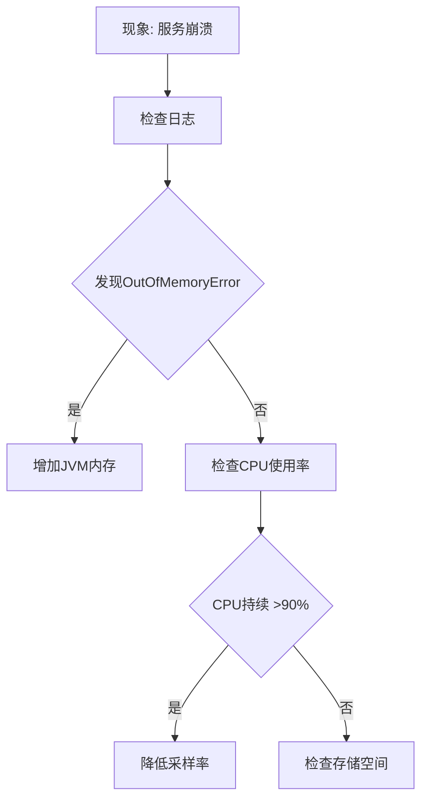

# 资源不足分析

## 介绍

在运行Zipkin分布式追踪系统时，资源不足是常见的性能瓶颈之一。资源不足可能表现为内存耗尽、CPU过载或存储空间不足，导致服务响应变慢甚至崩溃。本指南将帮助初学者识别这些问题，并提供解决方案。

## 常见资源不足场景

### 1. 内存不足
Zipkin服务在高负载下可能因内存不足而崩溃，尤其是在处理大量追踪数据时。

**症状**：
- 频繁的垃圾回收（GC）日志
- 服务响应时间变长
- JVM抛出 `OutOfMemoryError`

**解决方案**：
- 调整JVM堆内存参数：
  ```bash
  JAVA_OPTS="-Xms1g -Xmx2g -XX:+UseG1GC"
  ```
- 减少内存中保留的追踪数据量（通过 `zipkin.collector.mem.max-spans` 配置）

:::note
对于生产环境，建议至少分配2GB堆内存。可通过 `jstat -gc <pid>` 监控内存使用情况。
:::

### 2. CPU过载
当Zipkin处理大量追踪数据或运行复杂查询时，CPU可能成为瓶颈。

**症状**：
- CPU使用率持续高于80%
- 查询响应时间显著增加

**优化策略**：
- 启用采样率减少处理量（示例配置）：
  ```properties
  # 只收集50%的请求
  zipkin.collector.sample-rate=0.5
  ```
- 对Elasticsearch后端添加索引优化：
  ```json
  PUT /zipkin-*/_settings
  {
    "index" : {
      "number_of_replicas" : 1,
      "refresh_interval" : "30s"
    }
  }
  ```

### 3. 存储空间不足
Zipkin的存储后端（如MySQL、Elasticsearch）可能因数据积累过快而耗尽空间。

**解决方案**：
- 设置数据保留策略（以Elasticsearch为例）：
  ```bash
  # 自动删除7天前的索引
  curl -X PUT "localhost:9200/_ilm/policy/zipkin_policy" -H 'Content-Type: application/json' -d'
  {
    "policy": {
      "phases": {
        "delete": {
          "min_age": "7d",
          "actions": {
            "delete": {}
          }
        }
      }
    }
  }'
  ```
- 定期执行存储清理：
  ```bash
  # Zipkin 自带的清理命令（使用CLI）
  java -jar zipkin.jar --logging.level.zipkin2=INFO --zipkin.storage.type=elasticsearch --zipkin.storage.elasticsearch.hosts=localhost:9200 --zipkin.storage.elasticsearch.index-shards=5 --zipkin.storage.elasticsearch.index-replicas=1 --zipkin.storage.elasticsearch.max-requests=64 --zipkin.storage.elasticsearch.timeout=10000 --zipkin.collector.rabbitmq.addresses=localhost --zipkin.collector.rabbitmq.username=guest --zipkin.collector.rabbitmq.password=guest --zipkin.collector.rabbitmq.queue=zipkin --zipkin.collector.rabbitmq.concurrency=1 --zipkin.collector.rabbitmq.connection-timeout=60000 --zipkin.collector.rabbitmq.virtual-host=/ --zipkin.collector.rabbitmq.use-ssl=false --zipkin.collector.rabbitmq.heartbeat=30 --zipkin.collector.rabbitmq.prefetch=1 --zipkin.collector.rabbitmq.concurrent-consumers=1 --zipkin.collector.rabbitmq.max-concurrent-consumers=1 --zipkin.collector.rabbitmq.recovery-interval=10000 --zipkin.collector.rabbitmq.requeue-rejected=false --zipkin.collector.rabbitmq.metrics-enabled=true --management.metrics.export.prometheus.enabled=true --management.endpoints.web.exposure.include=prometheus,metrics,health,info --management.endpoint.health.show-details=always --management.endpoint.metrics.enabled=true --management.endpoint.prometheus.enabled=true --management.metrics.export.prometheus.step=1m --management.metrics.export.prometheus.descriptions=true --management.metrics.export.prometheus.enabled=true --spring.config.additional-location=optional:file:/etc/zipkin/application.yml
  ```

## 实际案例

### 案例：电商平台的高峰期问题
某电商平台在双11期间发现Zipkin服务频繁崩溃。通过分析发现：



**最终解决方案**：
1. 将JVM堆内存从1GB提升到4GB
2. 设置采样率为0.3（仅收集30%请求）
3. 配置Elasticsearch自动删除15天前的索引

## 监控与预警

建议配置以下监控指标：
- JVM内存使用率
- 存储后端磁盘空间
- 请求处理延迟（P99值）
- 每秒处理span数

示例Prometheus查询：
```promql
# 内存使用率
sum(jvm_memory_used_bytes{area="heap"}) by (instance) / sum(jvm_memory_max_bytes{area="heap"}) by (instance)

# 存储剩余空间
elasticsearch_filesystem_data_available_bytes / elasticsearch_filesystem_data_size_bytes
```

## 总结

资源不足问题需要系统性的分析和优化：
1. 通过监控识别瓶颈类型（内存/CPU/存储）
2. 调整配置参数优化资源使用
3. 建立自动化清理和扩展机制

## 附加资源

- [Zipkin官方调优指南](https://zipkin.io/pages/tuning.html)
- [JVM内存优化白皮书](https://www.oracle.com/technical-resources/articles/java/g1gc.html)
- [Elasticsearch索引管理最佳实践](https://www.elastic.co/guide/en/elasticsearch/reference/current/tune-for-indexing-speed.html)

**练习**：
1. 使用 `jcmd <pid> VM.flags` 检查你的Zipkin实例内存配置
2. 尝试在测试环境模拟高负载，观察哪些资源首先达到瓶颈
3. 配置一个自动清理7天前数据的策略