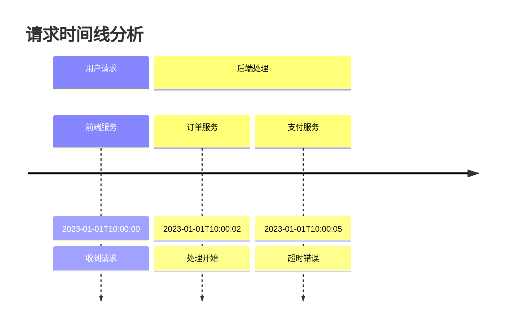

# 日志分析技巧

日志分析是排查Zipkin问题的核心手段之一。通过系统地检查日志，你可以快速定位分布式追踪链路中的异常节点、性能瓶颈或配置错误。本指南将介绍Zipkin日志分析的关键技巧，帮助你从初学者成长为高效的问题诊断者。

## 为什么需要日志分析？

在分布式系统中，一个请求可能涉及多个服务，Zipkin通过收集各服务的追踪数据（spans）来重建完整调用链。当出现以下情况时，日志分析尤为重要：

- 追踪数据缺失或断链
- 高延迟请求
- 错误的依赖关系图
- 存储后端数据异常

## 基础日志分析步骤

### 1. 确定日志来源

Zipkin相关日志通常来自三处：

```bash
# Zipkin Server日志（默认输出到控制台）
docker logs zipkin-server

# 客户端库日志（如Spring Cloud Sleuth）
cat /var/log/application.log | grep sleuth

# 存储后端日志（如Elasticsearch）
journalctl -u elasticsearch --since "1 hour ago"
```

### 2. 关键日志模式识别

关注这些常见日志模式：

| 日志级别 | 模式示例 | 可能原因 |
|---------|---------|---------|
| ERROR   | `Failed to store span` | 存储后端连接问题 |
| WARN    | `Retrying send of spans` | 网络波动 |
| DEBUG   | `Dropped span due to timeout` | 客户端配置不当 |

### 3. 时间关联分析

使用时间戳关联不同系统的日志：



## 实战案例分析

### 案例：缺失的追踪数据

**现象**：UI显示部分服务调用链路断裂<br />
**分析步骤**：

1. 检查客户端日志发现警告：
   ```
   WARN [sleuth,] - Span dropped due to sampling decision
   ```

2. 确认采样率配置：
   ```properties
   # application.properties
   spring.sleuth.sampler.probability=0.1 # 仅10%的请求被记录
   ```

3. 解决方案：临时提高采样率进行调试
   ```java
   // 调试配置
   @Bean
   public Sampler alwaysSampler() {
       return Sampler.ALWAYS_SAMPLE;
   }
   ```

### 案例：异常延迟

**现象**：某个服务调用持续显示高延迟<br />
**分析步骤**：

1. 在Zipkin UI中定位慢请求的Trace ID：`7f0f6ab3a2e8c4b1`

2. 在服务日志中搜索该ID：
   ```bash
   grep "7f0f6ab3a2e8c4b1" /var/log/service.log
   ```

3. 发现数据库查询日志：
   ```
   DEBUG - Executing SQL (total time: 4500ms): SELECT * FROM large_table
   ```

4. 解决方案：优化SQL或添加数据库索引

## 高级技巧

### 日志关联工具

使用工具自动化分析：
```bash
# 使用jq分析JSON日志
cat zipkin.log | jq 'select(.level == "ERROR") | .traceId'
```

### 结构化日志最佳实践

配置日志格式包含追踪信息：
```json
// 理想日志格式示例
{
  "timestamp": "2023-01-01T12:00:00Z",
  "level": "INFO",
  "traceId": "7f0f6ab3a2e8c4b1",
  "spanId": "d3e2b1a0f5e6d7c8",
  "service": "payment-service",
  "message": "Processed payment"
}
```

## 总结与练习

**关键要点**：
- 始终从Trace ID开始调查
- 跨系统关联时间戳
- 合理配置日志级别和采样率

**练习任务**：
1. 在你的开发环境中故意制造以下场景并分析日志：
   - 关闭存储服务观察Zipkin Server日志
   - 在客户端设置错误的Zipkin端点URL
2. 尝试使用`jq`或`grep`从日志中提取所有ERROR级别的Trace ID

**延伸阅读**：
- [Zipkin官方故障排除指南](https://zipkin.io/pages/troubleshooting.html)
- [Spring Cloud Sleuth日志配置文档](https://docs.spring.io/spring-cloud-sleuth/docs/current/reference/html/)