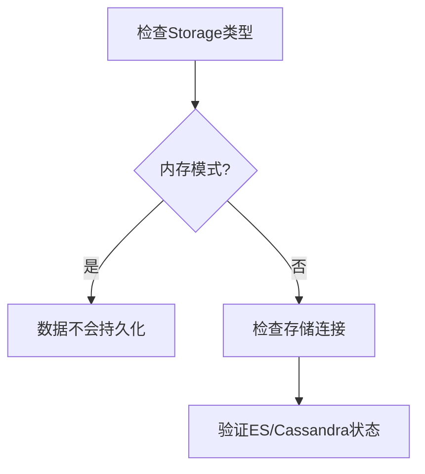

# Zipkin 故障恢复步骤

## 介绍

当使用Zipkin进行分布式系统追踪时，可能会遇到数据收集异常、存储问题或UI显示错误等情况。本指南将逐步介绍如何诊断和恢复Zipkin的常见故障，帮助初学者快速定位问题。

:::tip 关键概念
Zipkin的故障恢复通常涉及四个核心组件：
1. **Instrumentation**（应用埋点）
2. **Collector**（数据收集）
3. **Storage**（存储后端）
4. **UI**（查询界面）
:::

## 常见故障场景与恢复步骤

### 场景1：应用未上报追踪数据

**症状**：UI界面查不到任何追踪数据。

**诊断步骤**：
1. 检查应用配置中的Zipkin服务器地址：
   ```properties
   # Spring Boot示例配置
   spring.zipkin.base-url=http://your-zipkin-server:9411
   ```
2. 验证网络连通性：
   ```bash
   curl -v http://your-zipkin-server:9411/api/v2/services
   ```
3. 检查应用日志中的错误信息（如连接超时、认证失败等）

**恢复方案**：
- 修正错误的服务器地址
- 开放防火墙规则
- 检查SDK版本兼容性

### 场景2：Collector接收数据但未存储

**症状**：UI显示"最近请求"但无法查询历史数据。

**诊断步骤**：


**恢复方案**：
1. 对于Elasticsearch后端：
   ```bash
   # 检查ES健康状态
   curl -XGET 'http://elasticsearch:9200/_cluster/health?pretty'
   ```
2. 调整Zipkin存储配置：
   ```yaml
   # zipkin-server配置示例
   storage:
     type: elasticsearch
     elasticsearch:
       hosts: http://elasticsearch:9200
       index: zipkin
   ```

### 场景3：UI显示数据不完整

**症状**：追踪树缺失部分span。

**诊断步骤**：
1. 验证采样率配置：
   ```java
   // Brave采样率设置
   Sampler sampler = Sampler.create(0.5f); // 50%采样
   ```
2. 检查跨服务传播：
   - 确保所有服务使用相同的Trace ID
   - 验证B3 Propagation头是否正确传递

**恢复方案**：
- 统一各服务的采样配置
- 检查网关是否丢弃追踪头

## 实际案例：电商系统追踪中断

**背景**：订单服务与支付服务间的调用链突然消失。

**排查过程**：
1. 发现支付服务的Docker容器内存限制过低，导致Span上报失败
2. 检查Zipkin Collector日志发现大量`413 Payload Too Large`错误
3. 支付服务使用的SDK未配置合理的span压缩

**解决方案**：
```java
// 调整Span上报配置
sender = OkHttpSender.newBuilder()
    .endpoint("http://zipkin:9411/api/v2/spans")
    .compressionEnabled(true)  // 启用压缩
    .build();
```

## 总结与最佳实践

1. **监控先行**：部署Zipkin自身的健康检查端点
   ```bash
   curl http://zipkin:9411/health
   ```
2. **日志分析**：定期检查各组件日志
3. **配置标准化**：统一所有服务的追踪配置

:::warning 注意事项
- 生产环境避免使用内存存储
- 高负载系统需要调整Collector的队列大小
- 不同语言SDK的配置方式可能有差异
:::

## 扩展资源

1. [Zipkin官方故障排除指南](https://zipkin.io/pages/troubleshooting.html)
2. 练习：在本地部署中故意制造以下故障并修复：
   - 关闭存储后端观察UI行为
   - 修改采样率为0验证数据收集
   - 模拟网络延迟测试超时处理