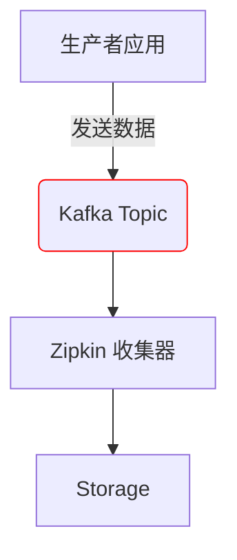

# 收集器故障排除

## 介绍

Zipkin 收集器（Collector）是分布式追踪系统的核心组件，负责接收、处理和存储追踪数据。当收集器出现故障时，可能导致数据丢失或链路断裂。本章将指导初学者识别常见问题，并通过日志分析、配置调整和工具验证来解决问题。

## 常见问题与解决方案

### 1. 收集器未启动
**症状**：应用发送的追踪数据未被存储，Zipkin UI 无数据显示。

**排查步骤**：
1. 检查收集器进程状态：
   ```bash
   ps aux | grep zipkin-collector
   ```
2. 查看日志（默认日志路径）：
   ```bash
   tail -f /var/log/zipkin/collector.log
   ```

**典型错误**：
```
ERROR [zipkin.collector] - Failed to bind to 0.0.0.0/0.0.0.0:9411
```
**解决方案**：端口被占用时，修改配置或终止冲突进程：
```bash
netstat -tulnp | grep 9411
kill -9 <PID>
```

---

### 2. 数据接收失败
**症状**：应用日志显示 `Failed to send spans to Zipkin`。

**验证收集器接口**：
```bash
curl -X POST -H "Content-Type: application/json" \
  http://localhost:9411/api/v2/spans -d @sample-span.json
```
**成功响应**：HTTP 202 Accepted

**配置检查**：
确保应用配置指向正确的收集器地址：
```yaml
# 应用配置示例（Spring Boot）
spring:
  zipkin:
    base-url: http://localhost:9411/
    sender.type: web
```

---

### 3. 存储后端连接问题
**症状**：收集器日志显示 `StorageException`。

**MySQL 连接示例**：
```properties
# zipkin-collector.properties
STORAGE_TYPE=mysql
MYSQL_HOST=localhost
MYSQL_USER=zipkin
MYSQL_PASS=zipkin
```

**测试数据库连接**：
```bash
mysql -u zipkin -p -h localhost -e "SHOW DATABASES;"
```

---

## 实际案例

### 案例：Kafka 收集器数据积压
**场景**：使用 Kafka 传输追踪数据时，发现延迟高。

**排查工具**：


**解决步骤**：
1. 检查 Kafka 消费者滞后：
   ```bash
   kafka-consumer-groups --bootstrap-server localhost:9092 \
     --describe --group zipkin-collector
   ```
2. 调整收集器并行度：
   ```properties
   KAFKA_STREAMS=4
   ```

---

## 总结

| 问题类型       | 关键检查点                  | 工具/命令                |
|----------------|----------------------------|-------------------------|
| 进程未启动     | 端口占用、日志错误          | `netstat`, `ps`         |
| 数据接收异常   | 网络连通性、配置一致性      | `curl`, 应用配置检查    |
| 存储连接失败   | 凭证正确性、服务可用性      | 数据库客户端, 日志分析  |

## 延伸资源
- [Zipkin 官方故障排除指南](https://zipkin.io/pages/troubleshooting.html)
- 练习：使用 `docker-compose` 部署 Zipkin 并模拟网络分区，观察收集器行为。

:::tip
启用调试日志可获取更详细的信息：
```properties
logging.level.zipkin2=DEBUG
