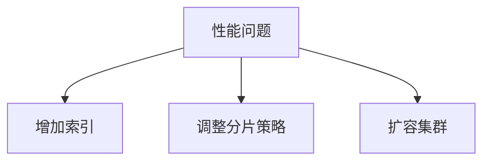

# Zipkin 存储故障排除

## 介绍

Zipkin作为分布式追踪系统，依赖后端存储（如MySQL、Elasticsearch或Cassandra）持久化追踪数据。当存储组件出现问题时，可能导致数据丢失、查询失败或性能下降。本章将指导初学者识别典型存储问题并提供解决方案。

## 常见存储问题模式

### 1. 连接失败
当Zipkin服务器无法连接配置的存储后端时，会出现以下症状：
- 应用日志中出现连接超时错误
- `/health`端点返回非200状态码
- 追踪数据未被持久化

**检查步骤：**
1. 验证存储服务是否运行：
   ```bash
   # 示例：检查Elasticsearch状态
   curl -X GET "localhost:9200/_cluster/health?pretty"
   ```
2. 确认Zipkin配置中的存储连接参数：
   ```properties
   # application.properties示例
   spring.datasource.url=jdbc:mysql://localhost:3306/zipkin
   spring.datasource.username=zipkin
   spring.datasource.password=zipkin
   ```

### 2. 架构不匹配
当存储schema与Zipkin版本不兼容时会出现：
- 启动时抛出`TableNotFoundException`
- 数据写入失败但连接正常

**解决方案：**
使用Zipkin提供的初始化脚本：
```sql
-- MySQL示例
SOURCE /path/to/zipkin/zipkin-storage/mysql/src/main/resources/mysql.sql
```

:::note
不同存储类型需要对应的初始化脚本：
- Elasticsearch: 自动创建索引
- Cassandra: 使用`schema.cql`文件
:::

### 3. 性能问题
表现为：
- 查询响应缓慢
- UI界面加载超时
- 存储服务高负载

**优化建议：**


## 实际案例研究

### 案例：Elasticsearch索引只读
**现象**：Zipkin UI显示"Failed to fetch traces"错误，日志中出现`ClusterBlockException`。

**根本原因**：Elasticsearch磁盘空间超过阈值（默认95%），触发只读模式。

**解决步骤：
1. 检查磁盘状态：
   ```bash
   curl -X GET "localhost:9200/_cat/allocation?v"
   ```
2. 临时解决方案（生产环境慎用）：
   ```bash
   curl -X PUT "localhost:9200/_all/_settings" -H 'Content-Type: application/json' -d'
   {"index.blocks.read_only_allow_delete": null}
   '
   ```
3. 长期方案：清理旧索引或扩容存储

## 调试工具与技术

### 存储健康检查
Zipkin提供内置端点检查存储状态：
```bash
# 检查存储健康状态
curl -s http://localhost:9411/health | jq .
```

### 日志分析
关键日志模式：
```
ERROR [zipkin-server,,,] 12345 --- [or-http--12345] c.l.a.s.SpanConsumer 
: Cannot store spans [....] due to StorageException(...)
```

## 总结与最佳实践

- ✅ **定期验证**：通过`/health`端点监控存储状态
- ✅ **版本对齐**：确保Zipkin与存储组件版本兼容
- ✅ **容量规划**：监控存储空间使用趋势
- ✅ **备份策略**：对重要追踪数据实施定期备份

## 扩展学习

**推荐练习：**
1. 故意错误配置存储连接参数，观察错误现象
2. 模拟磁盘空间不足场景，实践恢复流程
3. 对比不同存储后端的性能特征

**深入阅读：**
- [Zipkin存储组件文档](https://zipkin.io/pages/storage.html)
- [Elasticsearch磁盘阈值配置](https://www.elastic.co/guide/en/elasticsearch/reference/current/disk-allocator.html)