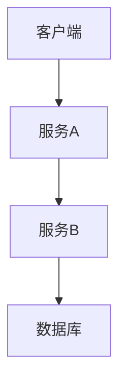

# 性能下降诊断

## 介绍

在分布式系统中，性能下降是一个常见但复杂的问题。Zipkin作为分布式追踪工具，能够帮助你定位请求链路中的性能瓶颈。本章将指导你如何使用Zipkin分析性能下降的根本原因，并通过实际案例演示诊断流程。

## 核心概念

### 1. 关键指标解读
Zipkin提供以下关键性能指标：
- **延迟（Latency）**：请求从发起到完成的时间
- **跨度（Span）持续时间**：单个操作的处理时间
- **依赖关系**：服务之间的调用关系



### 2. 常见性能问题模式
- **扇出问题**：单个服务调用过多下游服务
- **长尾延迟**：少数请求异常缓慢
- **级联故障**：一个服务的延迟导致整个链路变慢

## 诊断步骤

### 步骤1：识别异常轨迹
在Zipkin UI中：
1. 按服务名称过滤
2. 按延迟时间排序
3. 查找异常长的轨迹

```json
// 示例轨迹数据
{
  "traceId": "abc123",
  "spans": [
    {
      "name": "GET /api/data",
      "duration": 4500,
      "tags": {"error": "false"}
    }
  ]
}
```

### 步骤2：分析关键跨度
:::note
重点关注：
- 数据库查询
- 外部API调用
- 消息队列操作
:::

### 步骤3：比较健康与异常轨迹
使用Zipkin的比较功能，查看相同端点在不同时间的表现差异。

## 实战案例

**场景**：电商系统下单流程变慢

1. **现象**：下单API平均响应时间从200ms升至1500ms
2. **诊断过程**：
   - 发现支付服务调用耗时增加
   - 进一步检查显示数据库查询变慢
3. **根本原因**：支付服务的数据库索引缺失

```java
// 问题代码示例（未使用索引的查询）
@Query("SELECT * FROM payments WHERE user_id = ?1 AND status = 'PENDING'")
List<Payment> findPendingPayments(Long userId);
```

## 工具技巧

### 1. 使用Zipkin的依赖图


### 2. 高级查询语法
```
minDuration=1000&serviceName=checkout-service
```

## 总结

通过Zipkin诊断性能问题的关键步骤：
1. 识别异常轨迹模式
2. 定位高延迟跨度
3. 比较历史数据
4. 结合系统变更分析

## 延伸练习

1. 在你的测试环境中人为制造一个性能问题（如添加`sleep`调用）
2. 使用Zipkin定位这个问题
3. 尝试添加自定义标签来标记性能关键路径

## 附加资源

- [Zipkin官方文档 - 性能分析](https://zipkin.io/pages/performance.html)
- 《分布式系统观测》第三章：追踪分析