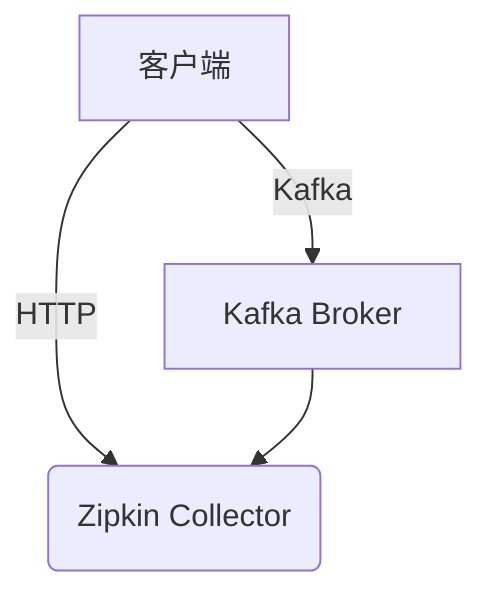

# 配置错误检查

## 介绍

在Zipkin的部署和使用过程中，配置错误是最常见的问题之一。这些错误可能导致服务无法启动、追踪数据丢失或显示异常。本文档将帮助你系统地检查Zipkin配置中的常见问题，并提供解决方案。

## 基础配置检查

### 1. 服务端配置验证

首先检查Zipkin服务端的基础配置是否正确：

```properties
# 示例：Zipkin服务端application.properties关键配置
zipkin.collector.rabbitmq.addresses=amqp://localhost:5672
zipkin.storage.type=elasticsearch
zipkin.storage.elasticsearch.hosts=http://localhost:9200
```

常见错误包括：
- 存储类型拼写错误（如 `elastcisearch` 代替 `elasticsearch`）
- 协议头缺失（如 `localhost:9200` 而不是 `http://localhost:9200`）
- 端口号不正确

:::tip
使用环境变量时，确保名称正确。例如 `ZIPKIN_STORAGE_TYPE` 而不是 `ZIPKIN_STORAGE_TYPE`。
:::

### 2. 客户端配置验证

客户端库（如Spring Cloud Sleuth）需要正确配置才能发送数据到Zipkin：

```yaml
# Spring Boot示例配置
spring:
  zipkin:
    base-url: http://localhost:9411/
    sender:
      type: web
  sleuth:
    sampler:
      probability: 1.0
```

常见问题：
- `base-url` 缺少末尾斜杠
- 采样率设置为0（不会发送任何追踪数据）
- 使用了错误的sender类型（如kafka但未配置kafka）

## 高级配置检查

### 1. 存储后端配置

不同存储后端的配置要求不同。以MySQL为例：

```properties
zipkin.storage.type=mysql
zipkin.storage.mysql.host=localhost
zipkin.storage.mysql.port=3306
zipkin.storage.mysql.username=zipkin
zipkin.storage.mysql.password=zipkin
zipkin.storage.mysql.db=zipkin
```

:::caution
注意 `zipkin.storage.mysql.db` 和 `zipkin.storage.mysql.schema` 的区别：
- MySQL 5.x使用 `schema`
- MySQL 8.x使用 `db`
:::

### 2. 传输协议配置

根据使用的传输协议（HTTP、Kafka、RabbitMQ等），检查对应配置：



确保：
- Kafka/RabbitMQ地址正确
- Topic名称匹配（默认是 `zipkin`）
- 网络连通性

## 实际案例

### 案例1：数据未显示在UI中

**症状**：应用显示发送了追踪数据，但Zipkin UI中看不到。

**检查步骤**：
1. 确认采样率不为0
2. 检查Zipkin服务端日志是否有错误
3. 验证网络连接：
   ```bash
   curl -v http://zipkin-server:9411/api/v2/services
   ```
4. 检查存储后端是否可访问

**解决方案**：发现是Elasticsearch集群证书配置错误，更新存储配置：
```properties
zipkin.storage.elasticsearch.hosts=https://es-cluster:9200
zipkin.storage.elasticsearch.ssl.no-verify=true
```

### 案例2：高延迟问题

**症状**：追踪数据显示但延迟很高。

**检查步骤**：
1. 确认不是应用性能问题
2. 检查消息队列积压
3. 验证批量发送配置：
   ```yaml
   spring.zipkin.sender.kafka.bootstrap-servers=kafka:9092
   spring.zipkin.sender.kafka.message-timeout=5000
   ```

**解决方案**：调整Kafka生产者配置并增加批量大小。

## 总结

配置错误检查是Zipkin故障排除的第一步。关键点包括：

1. 验证基础服务端和客户端配置
2. 检查存储后端连接
3. 确认传输协议设置
4. 监控日志获取详细错误信息

## 附加资源

- [Zipkin官方配置文档](https://zipkin.io/pages/configuration.html)
- [Spring Cloud Sleuth配置参考](https://docs.spring.io/spring-cloud-sleuth/docs/current/reference/html/)
- 练习：设置一个故意错误的配置并尝试根据错误日志修复它

:::note
遇到问题时，始终先检查日志！Zipkin服务端和客户端日志通常包含解决配置问题的关键线索。
:::