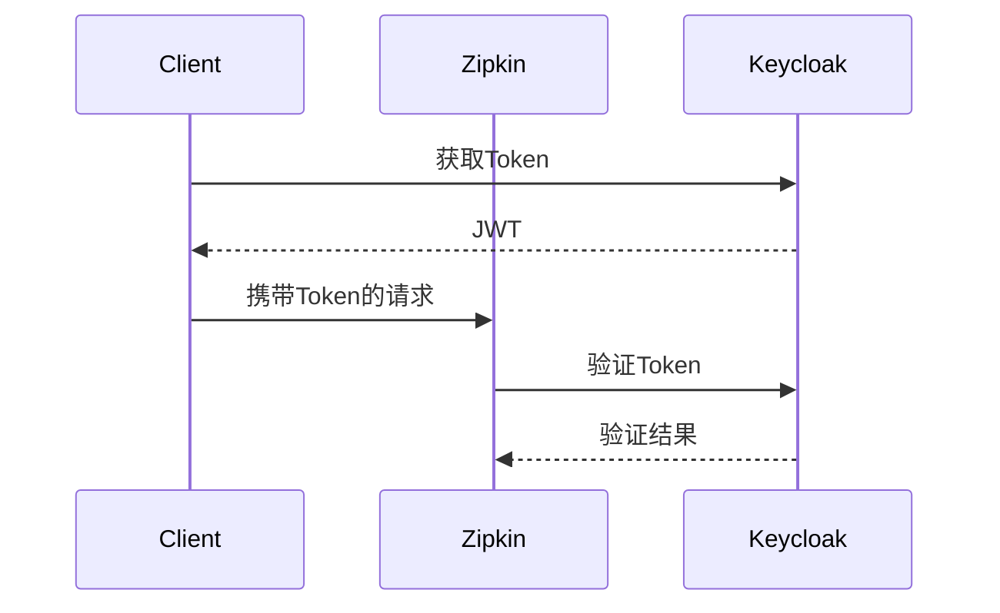

# 安全部署考虑

## 介绍

Zipkin是一个开源的分布式追踪系统，用于收集、存储和可视化微服务架构中的请求链路数据。在生产环境中部署Zipkin时，安全性是不可忽视的关键环节。本章将介绍如何通过合理的配置和最佳实践来保护Zipkin服务，防止未授权访问和数据泄露。

## 核心安全措施

### 1. 网络隔离与访问控制
将Zipkin服务部署在内部网络或私有子网中，仅允许可信IP访问。例如，在Kubernetes中可以通过`NetworkPolicy`限制入口流量：

```yaml
apiVersion: networking.k8s.io/v1
kind: NetworkPolicy
metadata:
  name: zipkin-allow
spec:
  podSelector:
    matchLabels:
      app: zipkin
  ingress:
  - from:
    - ipBlock:
        cidr: 192.168.1.0/24
```

:::tip
结合云服务商的防火墙规则（如AWS Security Groups）实现多层防护。
:::

### 2. 传输层加密（TLS）
为Zipkin服务端和客户端启用HTTPS。使用自签名证书或Let's Encrypt的示例配置：

```properties
# Spring Boot应用配置示例
server.ssl.enabled=true
server.ssl.key-store=classpath:keystore.p12
server.ssl.key-store-password=changeit
```

### 3. 认证与授权
#### 基础认证
通过Spring Security添加HTTP Basic认证：

```java
@Configuration
@EnableWebSecurity
public class SecurityConfig extends WebSecurityConfigurerAdapter {
    @Override
    protected void configure(HttpSecurity http) throws Exception {
        http.authorizeRequests()
            .anyRequest().authenticated()
            .and()
            .httpBasic();
    }
}
```

#### OAuth2集成
与Keycloak等身份提供商集成：



### 4. 数据存储安全
- **Elasticsearch安全配置**：启用X-Pack安全模块
- **MySQL访问控制**：创建专用数据库用户并限制权限

```sql
CREATE USER 'zipkin'@'%' IDENTIFIED BY 'complex-password';
GRANT SELECT, INSERT ON zipkin.* TO 'zipkin'@'%';
```

## 实际案例：电商平台部署

某电商平台采用以下安全架构：
1. Zipkin部署在私有VPC
2. 通过API Gateway进行访问代理
3. 所有微服务通过mTLS与Zipkin通信
4. 审计日志记录所有查询操作

## 总结

安全部署Zipkin需要多层次的防护策略：

1. 网络层：限制访问来源
2. 传输层：启用加密通信
3. 应用层：实现身份验证
4. 数据层：保护存储系统

## 延伸资源

- [Zipkin官方安全建议](https://zipkin.io/pages/security.html)
- [OWASP传输安全指南](https://cheatsheetseries.owasp.org/cheatsheets/Transport_Layer_Protection_Cheat_Sheet.html)
- 练习：在本地Docker环境配置HTTPS并测试追踪数据上报