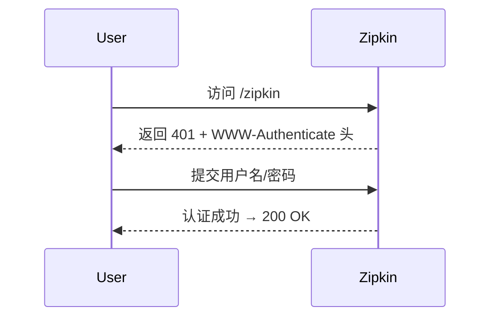

# Zipkin 安全性：认证配置

## 介绍

在分布式系统中，Zipkin 作为链路追踪工具会收集敏感的服务间调用数据。默认情况下，Zipkin 不启用任何认证机制，这可能暴露内部系统架构或业务逻辑。通过**基础认证（Basic Authentication）**，您可以限制对 Zipkin UI 和 API 的访问。

:::note 什么是基础认证？
一种通过用户名/密码验证身份的 HTTP 协议标准，凭证会以 Base64 编码形式在请求头中传递。
:::

## 前置条件

- 已部署 Zipkin 服务（独立 Jar 或 Docker 容器）
- 管理员权限（用于修改配置）

---

## 配置步骤

### 1. 生成密码文件

使用 `htpasswd` 工具创建密码文件（若使用 Apache Utils）：

```bash
htpasswd -c /path/to/users.htpasswd admin
# 输入两次密码后生成文件
```

:::caution 生产环境注意
避免在代码仓库中直接存储密码文件，建议通过环境变量或密钥管理工具注入。
:::

### 2. 启动 Zipkin 时启用认证

#### 方式一：通过 Java 参数（独立 Jar）

```bash
java -jar zipkin.jar \
  --zipkin.ui.security.basic.enabled=true \
  --zipkin.ui.security.basic.realm="Zipkin" \
  --zipkin.ui.security.basic.username="admin" \
  --zipkin.ui.security.basic.password="securepassword"
```

#### 方式二：Docker 环境变量

```dockerfile
docker run -d \
  -e ZIPKIN_UI_SECURITY_BASIC_ENABLED=true \
  -e ZIPKIN_UI_SECURITY_BASIC_USERNAME="admin" \
  -e ZIPKIN_UI_SECURITY_BASIC_PASSWORD="securepassword" \
  -p 9411:9411 \
  openzipkin/zipkin
```

### 3. 验证配置

访问 `http://localhost:9411` 将看到登录弹窗：



---

## 实际案例：Spring Cloud Sleuth 集成

当应用使用 Spring Cloud Sleuth 上报数据时，需在 `application.yml` 中配置认证：

```yaml
spring:
  zipkin:
    base-url: http://your-zipkin-server:9411
    username: admin
    password: securepassword
```

:::warning 安全建议
1. 始终使用 HTTPS 加密通信
2. 定期轮换密码
3. 为不同团队创建独立账号
:::

---

## 总结

通过基础认证，您已为 Zipkin 添加了第一层安全防护。虽然这不能替代全面的安全方案（如 OAuth2 或 JWT），但对于内部系统的基础保护已经足够。

### 扩展学习
- [Zipkin 官方安全文档](https://zipkin.io/security/)
- [Spring Security 集成方案](https://spring.io/projects/spring-security)
- [使用 Nginx 作为认证代理](https://docs.nginx.com/nginx/admin-guide/security-controls/configuring-http-basic-authentication/)

### 练习建议
1. 尝试通过 curl 带认证头访问 Zipkin API
2. 测试错误密码时的系统行为
3. 探索如何禁用未认证的 `/health` 端点
