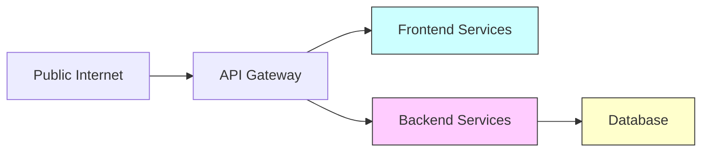
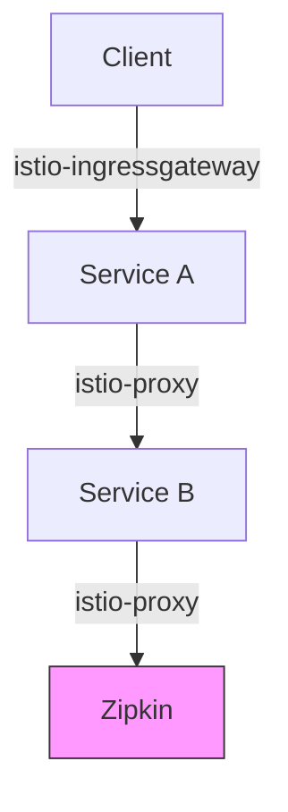

# 网络隔离策略

## 介绍

网络隔离策略是分布式追踪系统（如Zipkin）安全性的核心组成部分。它通过限制服务间的网络通信范围，降低潜在攻击面。对于初学者来说，理解这一概念就像为公寓楼安装门禁系统——只有授权的住户（服务）才能进入特定区域（网络段）。

## 为什么需要网络隔离？

在微服务架构中：
- 服务数量可能达到数百个
- 敏感数据（如追踪信息）在网络上传输
- 攻击者可能利用服务间通信漏洞

网络隔离通过以下方式提供保护：
1. 限制横向移动（服务间跳转）
2. 减少暴露给公网的端点
3. 隔离敏感数据流

## 基础隔离策略

### 1. 服务分组隔离



关键配置示例（使用Docker Compose）：
```yaml
services:
  frontend:
    networks:
      - frontend-net
  backend:
    networks:
      - backend-net
  zipkin:
    networks:
      - backend-net

networks:
  frontend-net:
    internal: true
  backend-net:
    internal: true
```

### 2. 端口级隔离

:::note 最佳实践
Zipkin默认使用9411端口，生产环境中应：
- 禁用未使用的端口
- 修改默认端口
- 仅开放必要的API端点
:::

配置示例（Spring Boot应用）：
```properties
# 修改默认管理端口
management.server.port=9443
management.endpoints.web.exposure.include=health,info
```

## 高级隔离技术

### 1. 服务网格集成（以Istio为例）



网络策略示例：
```yaml
apiVersion: networking.k8s.io/v1
kind: NetworkPolicy
metadata:
  name: zipkin-access
spec:
  podSelector:
    matchLabels:
      app: zipkin
  ingress:
  - from:
    - podSelector:
        matchLabels:
          tracing: enabled
    ports:
    - protocol: TCP
      port: 9411
```

### 2. 零信任架构

实施步骤：
1. 为每个服务分配独立身份
2. 每次通信都需要显式授权
3. 加密所有传输数据

示例（使用SPIFFE ID）：
```text
spiffe://example.org/ns/production/sa/zipkin
```

## 实际案例

**电商平台安全加固**：
1. 原始架构：所有服务在扁平网络中
2. 问题：支付服务可被任意服务访问
3. 解决方案：
   - 创建 `payment-net` 隔离网络
   - 仅允许订单服务通过特定端口访问
   - Zipkin仅接收来自授权服务的追踪数据

配置片段：
```bash
# iptables规则示例
iptables -A FORWARD -i eth0 -o eth1 -p tcp --dport 9411 -j ACCEPT
iptables -A FORWARD -i eth1 -o eth0 -j DROP
```

## 常见错误

:::caution 注意避免
1. 过度隔离导致追踪数据不完整
2. 忘记隔离管理接口（如Zipkin UI）
3. 未在隔离边界配置适当的日志记录
:::

## 总结

网络隔离策略实施要点：
- 从最小权限原则出发
- 结合服务重要性分级隔离
- 定期审计网络规则有效性

## 延伸学习

推荐练习：
1. 在本地Docker环境创建两个隔离网络
2. 配置Zipkin只能被其中一个网络访问
3. 使用telnet验证隔离效果

附加资源：
- [Zipkin官方安全建议](https://zipkin.io/security)
- Kubernetes Network Policies文档
- Istio安全最佳实践指南